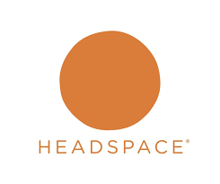

  
  
  
Universidad Peruana de Ciencias Aplicadas  
  
Carrera: Ingeniería de Software  
  
Ciclo: 2024-02  
  
Curso: Aplicaciones Web  
  
Sección: SW52  
  
Profesor: Juan Carlos Tinoco Licas  
  
Informe del Trabajo Final  
  
Startup: TechOps  
  
Producto: ZenFlicks  

| Member                                | Code       |
|---------------------------------------|------------|
| Avila Palacios, Aaron         | u201823654 |
| Lastra Trinidad, Georgina       | u201822503 |
| Pilares Pocohuanca, Maria        | u202215528 |
| Miranda Sinarahua, Piero     | u20181g752 |
| Quispe Erasmo, Raúl Ronaldo          | u20211b682 |
| Ramirez Ortega, Diego Miguel          | u202123548 |

  
**Agosto del 2024**

  
---  
# Registro de Versiones del Informe  
  
  
---  
# Project Report Collaboration Insights  
  
  
---  
# Student Outcome  
El curso contribuye al cumplimiento del Student Outcome ABET: **ABET – EAC - Student Outcome 5**   Criterio: *Capacidad de comunicarse efectivamente con un rango de audiencias.*  
  
En el siguiente cuadro se describe las acciones realizadas y enunciados de conclusiones por parte del grupo, que permiten sustentar el haber alcanzado el logro del ABET – EAC - Student Outcome 5.  
  
| Criterio específico | Acciones realizadas | Conclusiones |  
| - | - | - |  
| Comunica oralmente sus ideas y/o resultados con objetividad a público de diferentes especialidades y niveles jerarquicos, en el marco del desarrollo de un proyecto en ingeniería. | **Apellido Apellido Nombre Nombre**   ***TB1:*** Morbi vel tortor id eros dictum venenatis id ut dui.Mauris quis tellus sed nunc hendrerit vehicula ac id mauris.   ***TP:*** Morbi vel tortor id eros dictum venenatis id ut dui.Mauris quis tellus sed nunc hendrerit vehicula ac id mauris.   ***TB2:*** Morbi vel tortor id eros dictum venenatis id ut dui.Mauris quis tellus sed nunc hendrerit vehicula ac id mauris.   ***TF:*** Morbi vel tortor id eros dictum venenatis id ut dui.Mauris quis tellus sed nunc hendrerit vehicula ac id mauris.    **Apellido Apellido Nombre Nombre**   ***TB1:*** Morbi vel tortor id eros dictum venenatis id ut dui.Mauris quis tellus sed nunc hendrerit vehicula ac id mauris.   ***TP:*** Morbi vel tortor id eros dictum venenatis id ut dui.Mauris quis tellus sed nunc hendrerit vehicula ac id mauris.   ***TB2:*** Morbi vel tortor id eros dictum venenatis id ut dui.Mauris quis tellus sed nunc hendrerit vehicula ac id mauris.   ***TF:*** Morbi vel tortor id eros dictum venenatis id ut dui.Mauris quis tellus sed nunc hendrerit vehicula ac id mauris.    | ***TB1:*** Fusce cursus dolor et nulla suscipit, sit amet ullamcorper nibh vestibulum.    ***TP:*** Fusce cursus dolor et nulla suscipit, sit amet ullamcorper nibh vestibulum.    ***TB2:*** Fusce cursus dolor et nulla suscipit, sit amet ullamcorper nibh vestibulum.    ***TF:*** Fusce cursus dolor et nulla suscipit, sit amet ullamcorper nibh vestibulum. | | Comunica en forma escrita ideas y/o resultados con objetividad a público de diferentes especialidades y niveles jerarquicos, en el marco del desarrollo de un proyecto en ingeniería. | ***Apellido Apellido Nombre Nombre***   ***TB1:*** Cras sed diam suscipit, malesuada ex rutrum, fringilla orci. Vestibulum in nunc quis elit suscipit sollicitudin.   ***TP:*** Cras sed diam suscipit, malesuada ex rutrum, fringilla orci. Vestibulum in nunc quis elit suscipit sollicitudin.   ***TB2:*** Cras sed diam suscipit, malesuada ex rutrum, fringilla orci. Vestibulum in nunc quis elit suscipit sollicitudin.   ***TF:*** Cras sed diam suscipit, malesuada ex rutrum, fringilla orci. Vestibulum in nunc quis elit suscipit sollicitudin.    ***Apellido Apellido Nombre Nombre***   ***TB1:*** Cras sed diam suscipit, malesuada ex rutrum, fringilla orci. Vestibulum in nunc quis elit suscipit sollicitudin.   ***TP:*** Cras sed diam suscipit, malesuada ex rutrum, fringilla orci. Vestibulum in nunc quis elit suscipit sollicitudin.   ***TB2:*** Cras sed diam suscipit, malesuada ex rutrum, fringilla orci. Vestibulum in nunc quis elit suscipit sollicitudin.   ***TF:*** Cras sed diam suscipit, malesuada ex rutrum, fringilla orci. Vestibulum in nunc quis elit suscipit sollicitudin. | ***TB1:*** FEtiam imperdiet quam condimentum velit tempor porttitor.    ***TP:*** FEtiam imperdiet quam condimentum velit tempor porttitor.    ***TB2:*** FEtiam imperdiet quam condimentum velit tempor porttitor.    ***TF:*** FEtiam imperdiet quam condimentum velit tempor porttitor. |  
  
---  
# Contenido  
## Tabla de contenidos  
  
### [Capítulo I: Introducción]()  
- [1.1. Startup Profile]()  
  - [1.1.1 Descripción de la Startup]()  
  - [1.1.2 Perfiles de integrantes del equipo]()  
- [1.2 Solution Profile]()  
  - [1.2.1 Antecedentes y problemática]()  
  - [1.2.2 Lean UX Process]()  
      - [1.2.2.1. Lean UX Problem Statements]()  
      - [1.2.2.2. Lean UX Assumptions]()  
      - [1.2.2.3. Lean UX Hypothesis Statements]()  
      - [1.2.2.4. Lean UX Canvas]()  
- [1.3. Segmentos objetivo]()  
  
### [Capítulo II: Requirements Elicitation & Analysis]()  
- [2.1. Competidores]()  
  - [2.1.1. Análisis competitivo]()  
  - [2.1.2. Estrategias y tácticas frente a competidores]()  
- [2.2. Entrevistas]()  
  - [2.2.1. Diseño de entrevistas]()  
  - [2.2.2. Registro de entrevistas]()  
  - [2.2.3. Análisis de entrevistas]()  
- [2.3. Needfinding]()  
  - [2.3.1. User Personas]()  
  - [2.3.2. User Task Matrix]()  
  - [2.3.3. User Journey Mapping]()  
  - [2.3.4. Empathy Mapping]()  
  - [2.3.5. As-is Scenario Mapping]()  
- [2.4. Ubiquitous Language]()

  
### [Capítulo III: Requirements Specification]()  
- [3.1. To-Be Scenario Mapping]()  
- [3.2. User Stories]()  
- [3.3. Impact Mapping]()  
- [3.4. Product Backlog]()  
  
  
### [Capítulo IV: Product Design]()  
- [4.1. Style Guidelines]()  
  - [4.1.1. General Style Guidelines]()  
  - [4.1.2. Web Style Guidelines]()  
- [4.2. Information Architecture]()  
  - [4.2.1. Organization Systems]()  
  - [4.2.2. Labeling Systems]()  
  - [4.2.3. SEO Tags and Meta Tags]()  
  - [4.2.4. Searching Systems]()  
  - [4.2.5. Navigation Systems]()  
- [4.3. Landing Page UI Design]()  
  - [4.3.1. Landing Page Wireframe]()  
  - [4.3.2. Landing Page Mock-up]()  
- [4.4. Web Applications UX/UI Design]()  
  - [4.4.1. Web Applications Wireframes]()  
  - [4.4.2. Web Applications Wireflow Diagrams]()  
  - [4.4.3. Web Applications Mock-ups]()  
  - [4.4.4. Web Applications User Flow Diagrams]()  
- [4.5. Web Applications Prototyping]()  
- [4.6. Domain-Driven Software Architecture]()  
  - [4.6.1. Software Architecture Context Diagram]()  
  - [4.6.2. Software Architecture Container Diagrams]()  
  - [4.6.3. Software Architecture Components Diagrams]()  
- [4.7. Software Object-Oriented Design]()  
  - [4.7.1. Class Diagrams]()  
  - [4.7.2. Class Dictionary]()  
- [4.8. Database Design]()  
  - [4.8.1. Database Diagram]()  
  
  
### [Capítulo V: Product Implementation, Validation & Deployment]()  
- [5.1. Software Configuration Management]()  
  - [5.1.1. Software Development Environment Configuration]()  
  - [5.1.2. Source Code Management]()  
  - [5.1.3. Source Code Style Guide & Conventions]()  
  - [5.1.4. Software Deployment Configuration]()  
- [5.2. Landing Page, Services & Applications Implementation]()  
  - [5.2.1. Sprint 1]()  
      - [5.2.1.1. Sprint Planning 1]()  
      - [5.2.1.2. Sprint Backlog 1]()  
      - [5.2.1.3. Development Evidence for Sprint Review]()  
      - [5.2.1.4. Testing Suite Evidence for Sprint Review]()  
      - [5.2.1.5. Execution Evidence for Sprint Review]()  
      - [5.2.1.6. Services Documentation Evidence for Sprint Review]()  
      - [5.2.1.7. Software Deployment Evidence for Sprint Review]()  
      - [5.2.1.8. Team Collaboration Insights during Sprint]()  
  - [5.2.2. Sprint 2]()  
      - [5.2.2.1. Sprint Planning 2]()  
      - [5.2.2.2. Sprint Backlog 2]()  
      - [5.2.2.3. Development Evidence for Sprint Review]()  
      - [5.2.2.4. Testing Suite Evidence for Sprint Review]()  
      - [5.2.2.5. Execution Evidence for Sprint Review]()  
      - [5.2.2.6. Services Documentation Evidence for Sprint Review]()  
      - [5.2.2.7. Software Deployment Evidence for Sprint Review]()  
      - [5.2.2.8. Team Collaboration Insights during Sprint]()  
  - [5.2.3. Sprint 3]()  
      - [5.2.3.1. Sprint Planning 3]()  
      - [5.2.3.2. Sprint Backlog 3]()  
      - [5.2.3.3. Development Evidence for Sprint Review]()  
      - [5.2.3.4. Testing Suite Evidence for Sprint Review]()  
      - [5.2.3.5. Execution Evidence for Sprint Review]()  
      - [5.2.3.6. Services Documentation Evidence for Sprint Review]()  
      - [5.2.3.7. Software Deployment Evidence for Sprint Review]()  
      - [5.2.3.8. Team Collaboration Insights during Sprint]()  
  - [5.2.4. Sprint 4]()  
      - [5.2.4.1. Sprint Planning 4]()  
      - [5.2.4.2. Sprint Backlog 4]()  
      - [5.2.4.3. Development Evidence for Sprint Review]()  
      - [5.2.4.4. Testing Suite Evidence for Sprint Review]()  
      - [5.2.4.5. Execution Evidence for Sprint Review]()  
      - [5.2.4.6. Services Documentation Evidence for Sprint Review]()  
      - [5.2.4.7. Software Deployment Evidence for Sprint Review]()  
      - [5.2.4.8. Team Collaboration Insights during Sprint]()  
- [5.3. Validation Interviews]()  
  - [5.3.1. Diseño de Entrevistas]()  
  - [5.3.2. Registro de Entrevistas]()  
  - [5.3.3. Evaluaciones según heurísticas]()  
- [5.4. Video About-the-Product]()  
  
---  
# Capítulo I: Introducción  
## 1.1. Startup Profile  
### 1.1.1 Descripción de la Startup  
### 1.1.2 Perfiles de integrantes del equipo  
## 1.2 Solution Profile  
### 1.2.1 Antecedentes y problemática  
### 1.2.2 Lean UX Process  
#### 1.2.2.1. Lean UX Problem Statements  
#### 1.2.2.2. Lean UX Assumptions  
#### 1.2.2.3. Lean UX Hypothesis Statements  
#### 1.2.2.4. Lean UX Canvas  
## 1.3. Segmentos objetivo  
# Capítulo II: Requirements Elicitation & Analysis  
## 2.1 Competidores  

|EMPRESA|DESCRIPCIÓN|IMAGEN|
|-----|-----|----|
|**Calm**| Calm es una aplicación de bienestar que incluye contenido audiovisual, como historias para dormir y videos relajantes, que contribuyen al alivio del estrés y la mejora del bienestar. ||
|**Headspace**| Headspace es una aplicación que ofrece series y documentales enfocados en el bienestar mental, lo que podría hacerla un competidor indirecto. ||
|**Happify**| Happify es una plataforma dedicada al bienestar emocional y mental que utiliza actividades científicamente respaldadas, juegos y contenido multimedia para ayudar a los usuarios a reducir el estrés y mejorar su bienestar. ||

### 2.1.1. Análisis Competitivo  

<table>
<tr>
<th colspan="7">Competitive Analysis Landscape</th>
</tr>
<tr>
<td colspan="2" rowspan="2">¿Por qué llevar a cabo este análisis?</td>
<td colspan="5">Escriba en el recuadro la pregunta que busca responder o el objetivo de este análisis.</td>
</tr>
<tr>
<td colspan="5"></td>
</tr>
<tr>
<td colspan="3">(En la cabecera colocar por cada competidor nombre y logo)</td>
<td>ZenFlicks  </td>
<td>Calm  </td>
<td>Headspace  </td>
<td>Happify  </td>
</tr>
<tr>
<td rowspan="2">PERFIL</td>
<td colspan="2">Overview</td>
<td>Es una aplicación que combina el entretenimiento y el bienestar mental, proporcionando recomendaciones personalizadas de películas, series y documentales para aliviar el estrés. Además, ofrece una plataforma para que los creadores de contenido promuevan sus obras relacionadas con la salud mental y el bienestar. </td>
<td>Es una aplicación líder en meditación y sueño que ofrece una amplia gama de herramientas para mejorar la salud mental, incluyendo meditaciones guiadas, historias para dormir, música relajante y ejercicios de respiración. </td>
<td>Es una aplicación de meditación y bienestar que ofrece una amplia gama de recursos para ayudar a los usuarios a reducir el estrés, mejorar su concentración y dormir mejor, a través de meditaciones guiadas y contenido audiovisual. </td>
<td>Es una plataforma de bienestar emocional que ofrece actividades, juegos y programas basados en la ciencia para ayudar a los usuarios a reducir el estrés, mejorar su estado de ánimo y desarrollar resiliencia. </td>
</tr>
<tr>
<td colspan="2">Ventaja competitiva ¿Qué valor ofrece a los clientes?</td>
<td>Ofrece una combinación única de entretenimiento y bienestar, centrada en contenido audiovisual que no solo entretiene, sino que también promueve la salud mental. Esto lo diferencia de otras plataformas de streaming tradicionales. </td>
<td>Ofrece amplia variedad de contenido orientado al bienestar, con un enfoque particular en mejorar el sueño, lo que lo diferencia de otros competidores en el mercado. </td>
<td>Es pionera en el mercado de meditación digital, con una marca bien establecida y una extensa biblioteca de contenido diseñado por expertos. </td>
<td>Ofrece de acuerdo a la ciencia del comportamiento y la psicología positiva para crear actividades interactivas que promuevan el bienestar emocional de una manera entretenida y accesible. </td>
</tr>
<tr>
<td rowspan="2">PERFIL DE MARKETING</td>
<td colspan="2">Mercado objetivo</td>
<td>Usuarios que buscan reducir el estrés y mejorar su bienestar mental a través del entretenimiento, así como creadores de contenido que producen obras relacionadas con el bienestar mental. </td>
<td>Usuarios que buscan mejorar su salud mental y calidad de sueño, desde principiantes en meditación hasta aquellos que desean reducir la ansiedad y el estrés. </td>
<td>Usuarios interesados en mejorar su bienestar mental a través de la meditación y el mindfulness, desde principiantes hasta practicantes avanzados. </td>
<td>Usuarios que buscan mejorar su bienestar emocional y reducir el estrés mediante métodos interactivos y basados en la ciencia. </td>
</tr>
<tr>
<td colspan="2">Estrategias de marketing</td>
<td>Marketing digital a través de redes sociales y blogs especializados. </td>
<td>Publicidad en plataformas digitales, colaboraciones con celebridades, promociones en eventos relacionados con la salud y el bienestar. </td>
<td>Colaboraciones con empresas para ofrecer Headspace a empleados, campañas de marketing digital, publicidad en medios de comunicación relacionados con la salud y el bienestar. </td>
<td>Campañas de marketing digital, colaboraciones con profesionales de la salud mental, programas de bienestar corporativo. </td>
</tr>
<tr>
<td rowspan="3">PERFIL DE PRODUCTO</td>
<td colspan="2">Productos & Servicios</td>
<td>Recomendaciones personalizadas de películas, series y documentales centrados en el bienestar mental.</td>
<td>Meditaciones guiadas, historias para dormir, música para relajación, programas de mindfulness. </td>
<td>Meditaciones guiadas, programas de mindfulness, contenido para mejorar el sueño y series audiovisuales sobre bienestar mental. </td>
<td>Actividades interactivas, juegos y programas personalizados de bienestar emocional. </td>
</tr>
<tr>
<td colspan="2">Precios & Costos</td>
<td>Suscripción 3.99, 5.99 y 9.99 dólares como estándar, premium y platinum respectivamente. Para las funciones adicionales, eventos personalizables y acceso a foros. </td>
<td>Suscripción mensual o anual, con opciones gratuitas limitadas. </td>
<td>Suscripción mensual o anual, con opciones de prueba gratuita. </td>
<td>Modelo freemium con opciones de suscripción para acceder a contenido premium. </td>
</tr>
<tr>
<td colspan="2">Canales de distribución (Web y/o Móvil)</td>
<td>Plataforma web y aplicación móvil.</td>
<td>Plataforma web y aplicación móvil.</td>
<td>Plataforma web y aplicación móvil.</td>
<td>Sitio web y aplicación móvil.</td>
</tr>
<tr>
<td rowspan="5">ANÁLISIS SWOT</td>
<td colspan="6">Realice esto para su startup y sus competidores. Sus fortalezas deberían apoyar sus oportunidades y contribuir a lo que ustedes definen como su posible ventaja competitiva.</td>
</tr>
<tr>
<td colspan="2">Fortalezas</td>
<td>Interfaz amigable y fácil de usar.</td>
<td>Variedad de contenido enfocado en mejorar el sueño y reducir el estrés; colaboraciones con celebridades que aumentan la visibilidad de la marca. </td>
<td>Marca fuerte y reconocida; contenido creado por expertos en meditación; amplia base de usuarios. </td>
<td>Uso de la psicología positiva y el enfoque basado en la ciencia; alta interactividad y personalización. </td>
</tr>
<tr>
<td colspan="2">Debilidades</td>
<td>Competencia fuerte en el mercado de streaming; dependencia de la percepción de los usuarios sobre la efectividad del contenido en el bienestar.</td>
<td>Competencia directa con otras aplicaciones de bienestar; costos de suscripción pueden ser una barrera para algunos usuarios. </td>
<td>Dependencia de un modelo de suscripción; competencia creciente en el mercado de bienestar digital. </td>
<td>Puede ser percibido como más orientado a la gamificación que al bienestar profundo; competencia en el mercado de bienestar emocional. </td>
</tr>
<tr>
<td colspan="2">Oportunidades</td>
<td>Aumento en la demanda de soluciones de bienestar mental; posibilidad de expandir la oferta de contenido.</td>
<td>Expansión en nuevos mercados y segmentos demográficos; integración con dispositivos inteligentes para un seguimiento más personalizado. </td>
<td>Expansión en mercados internacionales; integración con wearables y dispositivos de salud. </td>
<td>Expansión en el sector corporativo como herramienta de bienestar para empleados; desarrollo de nuevas funcionalidades basadas en avances en psicología y neurociencia. </td>
</tr>
<tr>
<td colspan="2">Amenazas</td>
<td>Nuevos entrantes en el mercado de bienestar digital; cambios en las preferencias de los consumidores.</td>
<td>Aumento en la competencia en el mercado de bienestar digital; cambios en las preferencias de los consumidores hacia nuevas tecnologías de bienestar. </td>
<td>Nuevos competidores en el espacio de bienestar digital; cambios en las tendencias de meditación y mindfulness. </td>
<td>Competencia creciente en el mercado de aplicaciones de bienestar; posible saturación del mercado con soluciones similares. </td>
</tr>
</table>

### 2.1.2. Estrategias y táticas frente a competidores

Nuestras principales estrategias y tácticas que lanzaríamos como startup, estarían:

<li>Ofrecer recomendaciones de contenido audiovisual que fomentan el bienestar mental, a diferencia de sus competidores que se enfocan en meditación o técnicas específicas para el manejo del estrés. Su estrategia se centra en destacar cómo la plataforma combina entretenimiento con salud mental. Las campañas publicitarias promoverán cómo series, películas y documentales pueden ayudar a los usuarios a desconectarse, reducir el estrés y mejorar su bienestar. Además, se incluirán testimonios de usuarios que han experimentado beneficios al integrar el entretenimiento con prácticas de bienestar.</li>

<li>Competidores como Headspace, Calm y Happify destacan en meditación, mindfulness y seguimiento del bienestar mental. ZenFlicks busca diferenciarse ofreciendo una experiencia centrada en entretenimiento. La estrategia incluye proporcionar recomendaciones de contenido personalizadas basadas en el estado de ánimo, hábitos de visualización y objetivos de bienestar del usuario. Además, se desarrollará una biblioteca exclusiva con contenido relacionado con la salud mental, que incluirá documentales y películas seleccionadas por expertos en bienestar.</li>

<li>Abordar las debilidades como ofertas limitadas centrada principalmente en meditación y terapias breves, y una falta de conexión emocional con usuarios que buscan entretenimiento relajante, ofreciendo una gama variada de contenido audiovisual que trate el bienestar mental desde perspectivas diversas, como comedia, ficción y documentales. La táctica será incluir películas y series sobre salud mental, junto con otros géneros como comedias y aventuras para proporcionar relajación y entretenimiento. Además, se buscarán colaboraciones con creadores de contenido especializados en salud mental, ofreciendo un espacio exclusivo en ZenFlicks para sus trabajos.</li>

## 2.2. Entrevistas  

En esta sección se aborda la investigación tomando como base la recolección de información en base a entrevistas a representantes de los segmentos objetivo. Es decir, entrevistaremos a nuestro público objetivo para asi tener más de cerca algunos testimonios y poder trabajar en base a ellos.

### 2.2.1. Diseño de entrevistas  

A continuación, encontrarás un diseño de una lista de preguntas principales y adicionales para las entrevistas, adaptadas a cada grupo identificado. Estas preguntas nos ayudarán a recopilar datos importantes sobre las características y comportamientos de las personas:

<strong>Preguntas Principales para Ciudadano Universitario/Trabajador Promedio:</strong>

<ul>
    <li><strong>Preguntas personales:</strong> 
        <ul>
            <li>¿Cuál es su nombre completo?</li>
            <li>¿Cuál es su edad?</li>
            <li>¿Dónde reside actualmente?</li>
            <li>¿Cuál es su estado civil?</li>
            <li>¿A qué se dedica profesionalmente o qué estudia?</li>
            <li>¿cómo estás emocionalmente en esta semana?</li>
        </ul>
    </li>
    <li><strong>Preguntas centrada al tema:</strong> 
        <ul>
            <li>¿Qué actividades realizas para aliviar el estrés y mejorar tu bienestar mental?</li>
            <li>¿Con qué frecuencia ves contenido audiovisual? (Ejemplo: películas, series, documentales, etc)</li>
            <li>¿Qué tipo de contenido te resulta más relajante o cómoda para tu bienestar mental?</li>
            <li>¿Has utilizado alguna aplicación o plataforma que ofrezca contenido enfocado en la salud mental? ¿Cuál?</li>
            <li>¿Cuáles son tus principales frustraciones al momento de buscar contenido que te ayude a reducir el estrés?</li>
            <li>¿Cómo prefieres consumir contenido audiovisual: en tu computadora, celular, o TV?</li>
            <li>¿Participarías en una comunidad online que te ofrezca recomendaciones personalizadas de contenido para mejorar tu bienestar mental?</li>
        </ul>
    </li>
</ul>

<strong>Preguntas Principales para Creador de Contenido de Salud Mental:</strong>

<ul>
    <li><strong>Preguntas personales:</strong> 
        <ul>
            <li>¿Cuál es su nombre completo?</li>
            <li>¿Cuál es su edad?</li>
            <li>¿Dónde reside actualmente?</li>
            <li>¿Cuál es su estado civil?</li>
            <li>¿A qué se dedica profesionalmente?</li>
            <li>¿Qué dispositivos utilizas principalmente para crear y distribuir tu contenido?</li>
        </ul>
    </li>
    <li><strong>Preguntas centrada al tema:</strong> 
        <ul>
            <li>¿Qué tipo de contenido relacionado con la salud mental creas? (Ejemplo: videos, artículos, podcasts, etc)</li>
            <li>¿Cuáles son los temas de salud mental que más te interesa promover y por qué?</li>
            <li>¿Qué desafíos enfrentas usualmente al dar tu contenido?</li>
            <li>Cuáles son las plataformas específicas para promocionar tu contenido?</li>
            <li>¿Qué tipo de apoyo o recursos consideras necesarios para mejorar la difusión de tu contenido?</li>
            <li>¿Cómo te beneficiarías de una plataforma que promueva contenido de bienestar mental entre su audiencia?</li>
            <li>¿Qué molestia te encontraste en tu experiencia de crear contenidos de salud mental y compartir a las personas que le interesa en ese tema?</li>
        </ul>
    </li>
</ul>

### 2.2.2. Registro de entrevistas  

Para cada segmento objetivo, se realizó 3 entrevistas, A continuación verás resúmenes de las entrevistas en cuadros:

<ul><strong>Entrevistado 1:</strong>
    <li><strong>Información del Entrevistado:</strong>
        <ul>
            <li>Nombre completo: Manuel Alexis Vargas Quispe. </li>
            <li>Edad: 20 años. </li>
            <li>Distrito de residencia: San Juan de Miraflores. </li>
            <li>Estado Civil: Soltero. </li>
            <li>Dedicación profesional o estudio: Ingeniería de Software. </li>
        </ul>
    </li>
    <li><strong>Registro en Video:</strong> 
        <ul>
            
            <a href="https://upcedupe-my.sharepoint.com/:v:/g/personal/u20211b682_upc_edu_pe/EeRCW6bXU9NFiei3vhTfiOoBl4XIOkhyLMBiDM3aIREuCQ?nav=eyJyZWZlcnJhbEluZm8iOnsicmVmZXJyYWxBcHAiOiJTdHJlYW1XZWJBcHAiLCJyZWZlcnJhbFZpZXciOiJTaGFyZURpYWxvZy1MaW5rIiwicmVmZXJyYWxBcHBQbGF0Zm9ybSI6IldlYiIsInJlZmVycmFsTW9kZSI6InZpZXcifX0%3D&e=QJfLvn">https://upcedupe-my.sharepoint.com/:v:/g/personal/u20211b682_upc_edu_pe/EeRCW6bXU9NFiei3vhTfiOoBl4XIOkhyLMBiDM3aIREuCQ?nav=eyJyZWZlcnJhbEluZm8iOnsicmVmZXJyYWxBcHAiOiJTdHJlYW1XZWJBcHAiLCJyZWZlcnJhbFZpZXciOiJTaGFyZURpYWxvZy1MaW5rIiwicmVmZXJyYWxBcHBQbGF0Zm9ybSI6IldlYiIsInJlZmVycmFsTW9kZSI6InZpZXcifX0%3D&e=QJfLvn</a>
            <li>00:00 minutos hasta 06:50 minutos.</li>
        </ul>
    </li>
    <li><strong>Resumen de la Entrevista:</strong> 
        <ul>
            <li>Manuel, en general, se siente bien aunque ha estado lidiando con estrés por sus actividades universitarias y personales, manteniendo una actitud positiva. Para aliviar el estrés, escucha música y sale a caminar, encontrando estas actividades efectivas. Dada su agenda ocupada, consume principalmente podcasts, y aunque le gustan películas y series, no las ve por más de una hora a la vez. Prefiere contenido auditivo como música y podcasts para relajarse, recomendándolos a su entorno cercano. Aunque no ha usado aplicaciones específicas para la salud mental, está interesado en explorarlas y cree que cada persona tiene diferentes necesidades para manejar el estrés. Su mayor frustración es encontrar contenido que le guste, ya que el contenido no adecuado puede ser contraproducente. Utiliza principalmente su computadora y celular para consumir contenido audiovisual y está interesado en unirse a comunidades online que ofrezcan recomendaciones personalizadas para mejorar el bienestar mental, dispuesto a compartir su experiencia.</li>
            <li>A pesar del estrés de su vida universitaria y personal, mantiene una actitud positiva y proactiva, buscando maneras efectivas de manejar el estrés y abierto a nuevas herramientas y plataformas. Su preferencia por podcasts y música indica una afinidad por plataformas de contenido auditivo de calidad, y su interés en aplicaciones para la salud mental muestra una disposición a explorar innovaciones en este campo. Utiliza principalmente su computadora y celular para consumir contenido, dado que estos dispositivos se adaptan bien a su rutina diaria. Manuel interactúa a través de plataformas de podcasts y servicios de música en línea y está interesado en explorar opciones que ofrezcan recomendaciones personalizadas para la salud mental. Aunque no se menciona un navegador específico, es probable que use navegadores comunes como Google Chrome o Safari.</li>
        </ul>
    </li>
</ul>

<ul><strong>Entrevistado 2:</strong>
    <li><strong>Información del Entrevistado:</strong>
        <ul>
            <li>Nombre completo: Sergio Licas</li>
            <li>Edad: 40 años</li>
            <li>Distrito de residencia: San Borja, Lima</li>
            <li>Estado Civil: Casado</li>
            <li>Dedicación profesional o estudio: Cocinero</li>
        </ul>
    </li>
    <li><strong>Registro en Video:</strong> 
        <ul>
            
            <a href="https://upcedupe-my.sharepoint.com/:v:/g/personal/u20211b682_upc_edu_pe/EeRCW6bXU9NFiei3vhTfiOoBl4XIOkhyLMBiDM3aIREuCQ?nav=eyJyZWZlcnJhbEluZm8iOnsicmVmZXJyYWxBcHAiOiJTdHJlYW1XZWJBcHAiLCJyZWZlcnJhbFZpZXciOiJTaGFyZURpYWxvZy1MaW5rIiwicmVmZXJyYWxBcHBQbGF0Zm9ybSI6IldlYiIsInJlZmVycmFsTW9kZSI6InZpZXcifX0%3D&e=QJfLvn">https://upcedupe-my.sharepoint.com/:v:/g/personal/u20211b682_upc_edu_pe/EeRCW6bXU9NFiei3vhTfiOoBl4XIOkhyLMBiDM3aIREuCQ?nav=eyJyZWZlcnJhbEluZm8iOnsicmVmZXJyYWxBcHAiOiJTdHJlYW1XZWJBcHAiLCJyZWZlcnJhbFZpZXciOiJTaGFyZURpYWxvZy1MaW5rIiwicmVmZXJyYWxBcHBQbGF0Zm9ybSI6IldlYiIsInJlZmVycmFsTW9kZSI6InZpZXcifX0%3D&e=QJfLvn</a>
            <li>07:05 hasta 12:30 minutos.</li>
        </ul>
    </li>
    <li><strong>Resumen de la Entrevista:</strong> 
        <ul>
            <li>Sergio disfruta de su empleo, aunque el trabajo en la cocina puede ser muy estresante, lo que le dificulta encontrar tiempo para desconectar y descansar. Para aliviar el estrés, le gusta ver películas, series o documentales, pero a veces le cuesta encontrar contenido que realmente le ayude debido a la abundancia de opciones en las plataformas. Aunque no ha usado aplicaciones específicas para la salud mental, considera que podrían ser beneficiosas, ya que cree que muchas personas no les dan la importancia que merecen. Su principal frustración es la dificultad para encontrar contenido adecuado entre la gran cantidad de opciones disponibles en las plataformas de streaming.</li>
            <li>Sergio, a pesar de disfrutar de su trabajo, enfrenta desafíos relacionados con el estrés y la falta de tiempo para relajarse. Busca aliviar el estrés a través de contenido audiovisual, aunque a veces se siente abrumado por la gran cantidad de opciones disponibles en las plataformas de streaming. Aunque no menciona marcas específicas, su interés en películas, series y documentales sugiere que está familiarizado con estos servicios y muestra apertura hacia plataformas enfocadas en la salud mental, considerando que podrían ser útiles. Utiliza plataformas de streaming para su contenido, pero encuentra difícil navegar entre la amplia oferta. No ha usado aplicaciones específicas para la salud mental, pero está dispuesto a explorar nuevas herramientas para el bienestar. Aunque no se especifica un navegador, es probable que utilice opciones comunes como Google Chrome o Firefox. Se infiere que usa dispositivos como computadora, tablet o smart TV para consumir contenido en streaming.</li>
        </ul>
    </li>
</ul>

<ul><strong>Entrevistado 3:</strong>
    <li><strong>Información del Entrevistado:</strong>
        <ul>
            <li>Nombre completo: Edery Abanto</li>
            <li>Edad: 24</li>
            <li>Distrito de residencia: Lima, San Martin de Porres</li>
            <li>Estado Civil: Soltero</li>
            <li>Dedicación profesional o estudio: Asistente administrativo</li>
        </ul>
    </li>
    <li><strong>Registro en Video:</strong> 
        <ul>
            
            <a href="https://upcedupe-my.sharepoint.com/:v:/g/personal/u20211b682_upc_edu_pe/EeRCW6bXU9NFiei3vhTfiOoBl4XIOkhyLMBiDM3aIREuCQ?nav=eyJyZWZlcnJhbEluZm8iOnsicmVmZXJyYWxBcHAiOiJTdHJlYW1XZWJBcHAiLCJyZWZlcnJhbFZpZXciOiJTaGFyZURpYWxvZy1MaW5rIiwicmVmZXJyYWxBcHBQbGF0Zm9ybSI6IldlYiIsInJlZmVycmFsTW9kZSI6InZpZXcifX0%3D&e=QJfLvn">https://upcedupe-my.sharepoint.com/:v:/g/personal/u20211b682_upc_edu_pe/EeRCW6bXU9NFiei3vhTfiOoBl4XIOkhyLMBiDM3aIREuCQ?nav=eyJyZWZlcnJhbEluZm8iOnsicmVmZXJyYWxBcHAiOiJTdHJlYW1XZWJBcHAiLCJyZWZlcnJhbFZpZXciOiJTaGFyZURpYWxvZy1MaW5rIiwicmVmZXJyYWxBcHBQbGF0Zm9ybSI6IldlYiIsInJlZmVycmFsTW9kZSI6InZpZXcifX0%3D&e=QJfLvn</a>
            <li>12:31 hasta 17:07 minutos.</li>
        </ul>
    </li>
    <li><strong>Resumen de la Entrevista:</strong> 
        <ul>
            <li>Edery se siente estresado por su trabajo, pero logra distraerse y liberar el estrés pasando tiempo con su familia. Para relajarse después del trabajo, disfruta ver películas, documentales de naturaleza y series, actividades que le ayudan a reducir el estrés. No está familiarizado con aplicaciones específicas para la salud mental y le resulta difícil encontrar herramientas útiles para este propósito. Su principal frustración es la dificultad para encontrar contenido específico que realmente le ayude a aliviar el estrés.</li>
            <li>Aunque estresado por su trabajo, busca maneras de relajarse y desconectar, valorando el tiempo con su familia y disfrutando de contenido audiovisual como películas, documentales de naturaleza y series. Aunque no menciona marcas específicas, su interés en estos contenidos sugiere que está familiarizado con plataformas de streaming que ofrecen una amplia variedad. Aunque está abierto a la tecnología, no ha explorado aplicaciones específicas para la salud mental y no ha encontrado herramientas útiles para reducir el estrés. Utiliza servicios de streaming para consumir contenido y se apoya en el tiempo familiar para aliviar el estrés. Es probable que use navegadores comunes como Google Chrome o Firefox para acceder a estas plataformas y dispositivos como computadora, tablet o smart TV para ver el contenido.</li>
        </ul>
    </li>
</ul>

<ul><strong>Entrevistado 4:</strong>
    <li><strong>Información del Entrevistado:</strong>
        <ul>
            <li>Nombre completo: Leonardo Lopez</li>
            <li>Edad: 32</li>
            <li>Distrito de residencia: Surquillo, Lima</li>
            <li>Estado Civil: Soltero</li>
            <li>Dedicación profesional o estudio: Creador de Contenido de salud mental</li>
        </ul>
    </li>
    <li><strong>Registro en Video:</strong> 
        <ul>
            
            <a href="https://upcedupe-my.sharepoint.com/:v:/g/personal/u20211b682_upc_edu_pe/EeRCW6bXU9NFiei3vhTfiOoBl4XIOkhyLMBiDM3aIREuCQ?nav=eyJyZWZlcnJhbEluZm8iOnsicmVmZXJyYWxBcHAiOiJTdHJlYW1XZWJBcHAiLCJyZWZlcnJhbFZpZXciOiJTaGFyZURpYWxvZy1MaW5rIiwicmVmZXJyYWxBcHBQbGF0Zm9ybSI6IldlYiIsInJlZmVycmFsTW9kZSI6InZpZXcifX0%3D&e=QJfLvn">https://upcedupe-my.sharepoint.com/:v:/g/personal/u20211b682_upc_edu_pe/EeRCW6bXU9NFiei3vhTfiOoBl4XIOkhyLMBiDM3aIREuCQ?nav=eyJyZWZlcnJhbEluZm8iOnsicmVmZXJyYWxBcHAiOiJTdHJlYW1XZWJBcHAiLCJyZWZlcnJhbFZpZXciOiJTaGFyZURpYWxvZy1MaW5rIiwicmVmZXJyYWxBcHBQbGF0Zm9ybSI6IldlYiIsInJlZmVycmFsTW9kZSI6InZpZXcifX0%3D&e=QJfLvn</a>
            <li>17:08 hasta 20:49 minutos.</li>
        </ul>
    </li>
    <li><strong>Resumen de la Entrevista:</strong> 
        <ul>
            <li>Leonardo crea videos educativos, podcasts y artículos sobre salud mental, abordando temas como la gestión del estrés, la prevención del burnout y el autocuidado, utilizando diversos dispositivos para desarrollar su contenido. Enfrenta desafíos como la saturación de información y la dificultad de tratar temas sensibles, que impactan la creación y difusión de su trabajo. Promociona su contenido a través de YouTube, Spotify, blogs e Instagram. Necesita apoyo en marketing digital, análisis de datos y colaboraciones con otros profesionales de la salud mental para mejorar su alcance y efectividad. Leonardo cree que una plataforma dedicada podría ayudarle a alcanzar una audiencia más amplia y enfocada, mejorando así la visibilidad y monetización de su trabajo.</li>
            <li>Leonardo es un profesional apasionado por la salud mental, comprometido con educar y apoyar a otros a través de su contenido. Consciente de los desafíos en su campo, busca mejorar la visibilidad y el impacto de su trabajo. Aunque no menciona marcas específicas, su actividad en plataformas como YouTube, Spotify y blogs indica una influencia significativa en el ámbito de la salud mental, y está al tanto de diversas tendencias y herramientas digitales. Utiliza varios dispositivos para crear y compartir contenido, mostrando su adaptabilidad a diferentes tecnologías y plataformas digitales. Promociona su trabajo a través de YouTube, Spotify, blogs e Instagram para llegar a audiencias variadas y formatos diversos. Aunque no se especifica un navegador, es probable que utilice opciones comunes como Google Chrome o Firefox. Su equipo incluye computadoras, cámaras, micrófonos y teléfonos inteligentes, adaptándose a las necesidades de cada tipo de contenido.</li>
        </ul>
    </li>
</ul>

<ul><strong>Entrevistado 5:</strong>
    <li><strong>Información del Entrevistado:</strong>
        <ul>
            <li>Nombre completo: Hernán Tapia</li>
            <li>Edad: 24 años</li>
            <li>Distrito de residencia: Barranco, Lima</li>
            <li>Estado Civil: Soltero</li>
            <li>Dedicación profesional o estudio: creador de Contenido de salud mental</li>
        </ul>
    </li>
    <li><strong>Registro en Video:</strong> 
        <ul>
            
            <a href="https://upcedupe-my.sharepoint.com/:v:/g/personal/u20211b682_upc_edu_pe/EeRCW6bXU9NFiei3vhTfiOoBl4XIOkhyLMBiDM3aIREuCQ?nav=eyJyZWZlcnJhbEluZm8iOnsicmVmZXJyYWxBcHAiOiJTdHJlYW1XZWJBcHAiLCJyZWZlcnJhbFZpZXciOiJTaGFyZURpYWxvZy1MaW5rIiwicmVmZXJyYWxBcHBQbGF0Zm9ybSI6IldlYiIsInJlZmVycmFsTW9kZSI6InZpZXcifX0%3D&e=QJfLvn">https://upcedupe-my.sharepoint.com/:v:/g/personal/u20211b682_upc_edu_pe/EeRCW6bXU9NFiei3vhTfiOoBl4XIOkhyLMBiDM3aIREuCQ?nav=eyJyZWZlcnJhbEluZm8iOnsicmVmZXJyYWxBcHAiOiJTdHJlYW1XZWJBcHAiLCJyZWZlcnJhbFZpZXciOiJTaGFyZURpYWxvZy1MaW5rIiwicmVmZXJyYWxBcHBQbGF0Zm9ybSI6IldlYiIsInJlZmVycmFsTW9kZSI6InZpZXcifX0%3D&e=QJfLvn</a>
            <li>20:50 hasta 24:40 minutos.</li>
        </ul>
    </li>
    <li><strong>Resumen de la Entrevista:</strong> 
        <ul>
            <li>Hernán enfrenta estrés relacionado con su trabajo y maneja esta situación realizando actividades como ejercicio, escuchando música y, especialmente, viendo contenido audiovisual. Su principal forma de relajación es ver películas y series casi a diario, con una preferencia por documentales sobre naturaleza y comedias ligeras. Aunque ha utilizado recursos de meditación en YouTube, no ha encontrado una plataforma que combine entretenimiento con salud mental de manera efectiva. Su mayor frustración es la dificultad para encontrar contenido que se ajuste a su estado de ánimo, y prefiere recibir recomendaciones personalizadas que se alineen mejor con sus necesidades emocionales. Hernán estaría dispuesto a unirse a una comunidad online que ofrezca recomendaciones personalizadas para mejorar su bienestar mental.</li>
            <li>Busca maneras efectivas de manejar el estrés relacionado con su trabajo. Valora el contenido audiovisual como su principal método de relajación y está en busca de soluciones personalizadas que se adapten a sus estados de ánimo. Aunque no menciona marcas específicas, su preferencia por documentales de naturaleza y comedias ligeras sugiere que sigue plataformas de streaming con una amplia oferta en estos géneros. Su interés en recursos de meditación en YouTube indica que está en contacto con contenido relacionado con la salud mental. Utiliza tecnología para acceder a contenido audiovisual y recursos de meditación, mostrando familiaridad con plataformas digitales y herramientas en línea para la gestión del estrés. Prefiere plataformas de streaming para ver películas y series, y ha utilizado YouTube para meditación, aunque busca una solución que combine entretenimiento y salud mental de manera más efectiva. Aunque no se menciona un navegador específico, es probable que utilice opciones comunes como Google Chrome o Safari. Hernán probablemente usa dispositivos como una computadora, tablet o smart TV para ver contenido, y posiblemente un teléfono inteligente para acceder a recursos de meditación en YouTube.</li>
        </ul>
    </li>
</ul>

<ul><strong>Entrevistado 6:</strong>
    <li><strong>Información del Entrevistado:</strong>
        <ul>
            <li>Nombre completo: Maricielo Mamani</li>
            <li>Edad: 24</li>
            <li>Distrito de residencia: Callao, Lima</li>
            <li>Estado Civil: Soltera</li>
            <li>Dedicación profesional o estudio: Psicóloga y creadora de Contenido de salud mental</li>
        </ul>
    </li>
    <li><strong>Registro en Video:</strong> 
        <ul>
            
            <a href="https://upcedupe-my.sharepoint.com/:v:/g/personal/u20211b682_upc_edu_pe/EeRCW6bXU9NFiei3vhTfiOoBl4XIOkhyLMBiDM3aIREuCQ?nav=eyJyZWZlcnJhbEluZm8iOnsicmVmZXJyYWxBcHAiOiJTdHJlYW1XZWJBcHAiLCJyZWZlcnJhbFZpZXciOiJTaGFyZURpYWxvZy1MaW5rIiwicmVmZXJyYWxBcHBQbGF0Zm9ybSI6IldlYiIsInJlZmVycmFsTW9kZSI6InZpZXcifX0%3D&e=QJfLvn">https://upcedupe-my.sharepoint.com/:v:/g/personal/u20211b682_upc_edu_pe/EeRCW6bXU9NFiei3vhTfiOoBl4XIOkhyLMBiDM3aIREuCQ?nav=eyJyZWZlcnJhbEluZm8iOnsicmVmZXJyYWxBcHAiOiJTdHJlYW1XZWJBcHAiLCJyZWZlcnJhbFZpZXciOiJTaGFyZURpYWxvZy1MaW5rIiwicmVmZXJyYWxBcHBQbGF0Zm9ybSI6IldlYiIsInJlZmVycmFsTW9kZSI6InZpZXcifX0%3D&e=QJfLvn</a>
            <li>24:41 hasta 28:29 minutos.</li>
        </ul>
    </li>
    <li><strong>Resumen de la Entrevista:</strong> 
        <ul>
            <li>Maricielo se dedica a la creación de contenido sobre salud mental, utilizando su teléfono móvil y laptop para desarrollar y distribuir material como podcasts, artículos sobre bienestar emocional y consejos validados por psicólogos. Sus temas clave incluyen el autocuidado, el manejo del estrés y la importancia de la terapia, con el objetivo de ofrecer información útil y basada en evidencia para mejorar el bienestar emocional de sus seguidores. Enfrenta desafíos como la competencia en redes sociales, donde la saturación de contenido puede dificultar la visibilidad, y la necesidad de transmitir mensajes con empatía para conectar efectivamente con su audiencia.</li>
            <li>Maricielo es una psicóloga comprometida con la salud mental, dedicada a crear contenido educativo y útil con un enfoque en la empatía y el bienestar emocional, reflejando su sensibilidad hacia las necesidades de su audiencia. Aunque no menciona marcas específicas, su trabajo en podcasts y artículos sobre salud mental muestra una influencia significativa en el ámbito de la psicología y el bienestar emocional, y está al tanto de las tendencias en la creación de contenido digital para la salud mental. Utiliza su teléfono móvil y laptop para crear y distribuir su contenido, adaptándose a herramientas digitales comunes en la creación de contenido multimedia y gestión de redes sociales. Maricielo emplea canales como podcasts y artículos en línea para ofrecer información detallada y accesible sobre temas de salud mental. Aunque no se especifica un navegador, es probable que use opciones comunes como Google Chrome o Safari. Sus dispositivos, un teléfono móvil y una laptop, le permiten combinar portabilidad con la funcionalidad necesaria para desarrollar y publicar su trabajo en diversas plataformas.</li>
        </ul>
    </li>
</ul>

### 2.2.3. Análisis de entrevistas  

|**`SEGMENTO OBJETIVO: Ciudadano Universitario/Trabajador Promedio`**|
|---|
|**`Manuel Vargas`**|
|Manuel Alexis Vargas Quispe, un estudiante de Ingeniería de Software de 20 años, enfrenta altos niveles de estrés debido a sus actividades universitarias y personales. Para aliviar el estrés, utiliza música y caminatas, y prefiere consumir podcasts por su conveniencia y capacidad para integrarse con otras actividades. Considera que la música y los podcasts son efectivos y recomendables para relajarse. Su principal frustración es la dificultad para encontrar contenido adecuado y está interesado en comunidades online que ofrezcan recomendaciones personalizadas para la salud mental. Manuel presenta una clara preferencia por actividades que permitan una desconexión activa y por contenido auditivo, indicando una necesidad de herramientas de recomendación más eficaces.|
|**`Sergio Licas`**|
|Sergio Licas, un trabajador de 40 años en el ámbito de la cocina, enfrenta un entorno laboral estresante y encuentra difícil encontrar tiempo para descansar. Para aliviar el estrés, prefiere ver películas y series, aunque a veces tiene dificultades para encontrar contenido adecuado. Aunque no ha utilizado aplicaciones específicas para la salud mental, está abierto a explorar estas herramientas. Sergio enfrenta frustraciones en la búsqueda de contenido útil para reducir el estrés, lo que sugiere una necesidad de plataformas más efectivas o personalizadas para la gestión del estrés.|
|**`Edery Abanto`**|
|Edery Abanto, un asistente administrativo con horarios ocupados, busca métodos rápidos para relajarse debido al estrés laboral. Su principal forma de alivio es ver contenido audiovisual, prefiriendo documentales de naturaleza y comedias. Aunque no está familiarizado con aplicaciones específicas para la salud mental, enfrenta dificultades para encontrar contenido adecuado que se ajuste a su estado de ánimo. Edery necesita recomendaciones personalizadas para mejorar su experiencia de relajación.|

|**`SEGMENTO OBJETIVO: Creador de Contenido de Salud Mental`**|
|---|
|**`Leonardo Lopez`**|
|Leonardo Lopez, un creador de contenido especializado en salud mental de 34 años, enfrenta desafíos relacionados con la saturación de información y la competencia en su campo. Utiliza plataformas como YouTube, Spotify, blogs e Instagram para promover su trabajo. Necesita apoyo en marketing digital y análisis de datos para mejorar la visibilidad y monetización de su contenido, y busca colaboraciones con otros profesionales de la salud mental. Enfrenta dificultades con la visibilidad y la competencia, lo que refuerza su necesidad de apoyo en marketing y colaboraciones para superar estos retos.|
|**`Hernán Tapia`**|
|Hernán Tapia, un arquitecto de 24 años, está estresado por su trabajo y busca métodos específicos para relajarse. Su principal forma de alivio es ver películas y series, especialmente documentales de naturaleza y comedias ligeras, casi todos los días. Aunque ha probado recursos de meditación en YouTube, no ha encontrado una plataforma que le satisfaga completamente. Hernán enfrenta dificultades para encontrar contenido que se ajuste a su estado de ánimo y está interesado en unirse a comunidades online que ofrezcan recomendaciones personalizadas para mejorar su relajación.|
|**`Maricielo Mamani`**|
|Maricielo Mamani Cuti, psicóloga y creadora de contenido de 24 años, está enfocada en mejorar la visibilidad y la calidad de su trabajo en salud mental. Utiliza su teléfono móvil y laptop para crear y distribuir contenido como podcasts, artículos sobre bienestar emocional y consejos validados por psicólogos. Enfrenta desafíos relacionados con la alta competencia en redes sociales y la necesidad de transmitir mensajes con empatía. Estos desafíos reflejan su compromiso con la calidad del contenido y la conexión efectiva con su audiencia.|

## 2.3. Needfinding  

En esta sección el equipo explica y presenta los artefactos resultantes del proceso de análisis de la información recolectada. Aquí se incluye secciones internas para User Personas, User Task Matrix, User Journey Maps, Empathy Mapping y As-Is Scenario Mapping:

### 2.3.1. User Personas  

Esta sección del informe presenta perfiles ficticios basados en grupos de interés entrevistados. Contienen información demográfica, personalidad, motivaciones, preferencias, objetivos, desafíos y patrones de comportamiento, respaldados por entrevistas previas y elaborados con UXPressia.

|**`USER PERSONA: Ana Paola Diaz Benavides`**|
|---|
||

|**`USER PERSONA: Jorge Samir Condor Vera`**|
|---|
||

### 2.3.2. User Task Matrix  

En User Task Matrix, hemos identificado las acciones realizadas por nuestros dos grupos y hemos analizado la importancia de cada una de estas actividades para cada grupo:

<table>
    <thead>
        <tr>
            <th>Segmento objetivo</th>
            <th colspan="2">Ana Paola Diaz Benavides - Ciudadano Universitario/Trabajador Promedio</th>
            <th colspan="2">Jorge Samir Condor Vera - Creador de Contenido de Salud Mental</th>
        </tr>
    </thead>
    <tbody>
        <tr>
            <th>Tareas</th>
            <th>Frecuencia</th>
            <th>Importancia</th>
            <th>Frecuencia</th>
            <th>Importancia</th>
        </tr>
        <tr>
            <td>Buscar formas de relajación y alivio del estrés</td>
            <td>A menudo</td>
            <td>Alta</td>
            <td>A veces</td>
            <td>Media</td>
        </tr>
        <tr>
            <td>Investigar sobre temas actuales de salud mental para crear contenido relevante</td>
            <td>Rara vez</td>
            <td>Media</td>
            <td>Siempre</td>
            <td>Alta</td>
        </tr>   
        <tr>
            <td>Seleccionar contenido audiovisual que mejore su bienestar mental</td>
            <td>A menudo</td>
            <td>Alta</td>
            <td>A veces</td>
            <td>Media</td>
        </tr>  
        <tr>
            <td>Producir contenido (videos, artículos, podcasts) sobre salud mental</td>
            <td>Nunca</td>
            <td>Baja</td>
            <td>Siempre</td>
            <td>Alta</td>
        </tr>  
        <tr>
            <td>Participar en actividades físicas o de meditación para reducir el estrés</td>
            <td>A menudo</td>
            <td>Alta</td>
            <td>A veces</td>
            <td>Media</td>
        </tr>  
        <tr>
            <td>Distribuir y promocionar su contenido en diversas plataformas digitales</td>
            <td>Nunca</td>
            <td>Baja</td>
            <td>Siempre</td>
            <td>Alta</td>
        </tr>  
        <tr>
            <td>Interactuar en redes sociales para desconectarse o relajarse</td>
            <td>Siempre</td>
            <td>Media</td>
            <td>A menudo</td>
            <td>Media</td>
        </tr>  
        <tr>
            <td>Ver comentarios y preguntas de la audiencia sobre el contenido interesado</td>
            <td>Nunca</td>
            <td>Baja</td>
            <td>A menudo</td>
            <td>Media</td>
        </tr>  
        <tr>
            <td>Evaluar su nivel de bienestar mental periódicamente</td>
            <td>A menudo</td>
            <td>Alta</td>
            <td>A veces</td>
            <td>Alta</td>
        </tr>      
    </tbody>
</table>  

### 2.3.3. User Journey Mapping  

|**`USER JOURNEY MAPPING: Ciudadano Universitario/Trabajador Promedio`**|
|---|
||

|**`USER JOURNEY MAPPING: Creador de Contenido de Salud Mental`**|
|---|
||

### 2.3.4. Empathy Mapping  

Esta sección presenta el mapeo de empatía para los segmentos de personas interesadas en agricultura y persona con experiencia en cuidado de plantas, ofreciendo una visión detallada de las necesidades, preocupaciones y beneficios desde la perspectiva del usuario.

|**`EMPATHY MAPPING: Ciudadano Universitario/Trabajador Promedio`**|
|---|
||

|**`EMPATHY MAPPING: Creador de Contenido de Salud Mental`**|
|---|
||

### 2.3.5. As-is Scenario Mapping  

En esta sección, el equipo presenta los As-Is Scenario Mapping para cada User Persona, destacando el proceso de preparación, lluvia de ideas individual, revisión y identificación de fases. Se incluyen las filas Phases, Doing, Thinking y Feeling, con áreas positivas, negativas y blank areas para usuarios. El objetivo es proporcionar una visualización detallada del proceso actual y áreas de mejora para cada persona del usuario.

|**`AS-IS SCENARIO MAPPING: Ciudadano Universitario/Trabajador Promedio`**|
|---|
||

|**`AS-IS SCENARIO MAPPING: Creador de Contenido de Salud Mental`**|
|---|
||

## 2.4. Ubiquitous Language  

#### Según Domain Driven Design (2019), The ubiquitous language es la descripción de conceptos y términos dentro del negocio para construir un lenguaje en común entre todos los implicados dentro del contexto del negocio. A continuación, se han identificado los siguientes conceptos que ayudarán a crear un nexo entre los usuarios y los desarrolladores:

# Capítulo III: Requirements Specification  
## 3.1. To-Be Scenario Mapping  
## 3.2. User Stories  
## 3.3. Impact Mapping  
## 3.4. Product Backlog  
# Capítulo IV: Product Design  
## 4.1. Style Guidelines  
## 4.2. Information Architecture  
## 4.3. Landing Page UI Design  
## 4.4. Web Applications UX/UI Design  
### 4.4.1. Web Applications Wireframes  
### 4.4.2. Web Applications Wireflow Diagrams  
### 4.4.3. Web Applications Mock-ups  
### 4.4.4. Web Applications User Flow Diagrams  
## 4.5. Web Applications Prototyping  
## 4.6. Domain-Driven Software Architecture  
### 4.6.1. Software Architecture Context Diagram  
### 4.6.2. Software Architecture Container Diagrams  
### 4.6.3. Software Architecture Components Diagrams  
## 4.7. Software Object-Oriented Design  
### 4.7.1. Class Diagrams  
### 4.7.2. Class Dictionary  
## 4.8. Database Design  
### 4.8.1. Database Diagram  
# Capítulo V: Product Implementation, Validation & Deployment  
## 5.1. Software Configuration Management  
### 5.1.1. Software Development Environment Configuration  
  
### 5.1.2. Source Code Management  
  
### 5.1.3. Source Code Style Guide & Conventions  
  
### 5.1.4. Software Deployment Configuration  
  
## 5.2. Landing Page, Services & Applications Implementation  
### 5.2.1. Sprint 1  
#### 5.2.1.1. Sprint Planning 1  
  
#### 5.2.1.2. Sprint Backlog 1  
  
#### 5.2.1.3. Development Evidence for Sprint Review  
  
#### 5.2.1.4. Testing Suite Evidence for Sprint Review  
  
#### 5.2.1.5. Execution Evidence for Sprint Review  
  
#### 5.2.1.6. Services Documentation Evidence for Sprint Review  
  
#### 5.2.1.7. Software Deployment Evidence for Sprint Review  
  
#### 5.2.1.8. Team Collaboration Insights during Sprint  
  
# Conclusiones  
### Conclusiones y recomendaciones  
### Video About-the-Team  
  
---  
# Bibliografía  
  
---  
# Anexos
