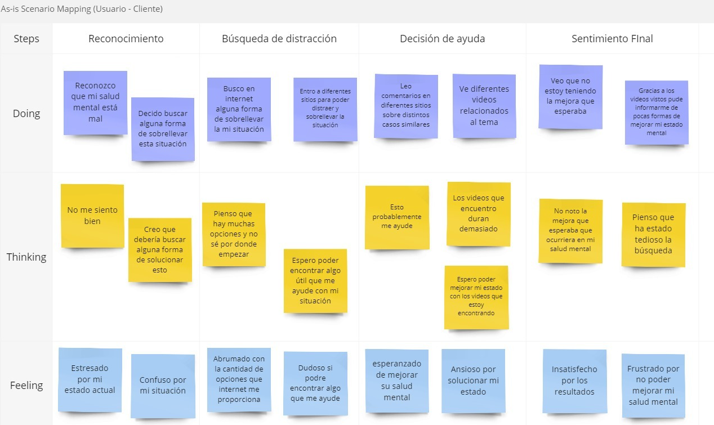

  
  
  
Universidad Peruana de Ciencias Aplicadas  
  
Carrera: Ingeniería de Software  
  
Ciclo: 2024-02  
  
Curso: Aplicaciones Web  
  
Sección: SW52  
  
Profesor: Juan Carlos Tinoco Licas  
  
Informe del Trabajo Final  
  
Startup: TechOps  
  
Producto: ZenFlicks  

| Member                                | Code       |
|---------------------------------------|------------|
| Avila Palacios, Aaron         | u201823654 |
| Lastra Trinidad, Georgina       | u201822503 |
| Pilares Pocohuanca, Maria        | u202215528 |
| Miranda Sinarahua, Piero     | u20181g752 |
| Quispe Erasmo, Raúl Ronaldo          | u20211b682 |
| Ramirez Ortega, Diego Miguel          | u202123548 |

  
**Agosto del 2024**

  
---  
# Registro de Versiones del Informe  
  
  
---  
# Project Report Collaboration Insights  
  
  
---  
# Student Outcome  
El curso contribuye al cumplimiento del Student Outcome ABET: **ABET – EAC - Student Outcome 5**   Criterio: *Capacidad de comunicarse efectivamente con un rango de audiencias.*  
  
En el siguiente cuadro se describe las acciones realizadas y enunciados de conclusiones por parte del grupo, que permiten sustentar el haber alcanzado el logro del ABET – EAC - Student Outcome 5.  
  
| Criterio específico | Acciones realizadas | Conclusiones |  
| - | - | - |  
| Comunica oralmente sus ideas y/o resultados con objetividad a público de diferentes especialidades y niveles jerarquicos, en el marco del desarrollo de un proyecto en ingeniería. | **Apellido Apellido Nombre Nombre**   ***TB1:*** Morbi vel tortor id eros dictum venenatis id ut dui.Mauris quis tellus sed nunc hendrerit vehicula ac id mauris.   ***TP:*** Morbi vel tortor id eros dictum venenatis id ut dui.Mauris quis tellus sed nunc hendrerit vehicula ac id mauris.   ***TB2:*** Morbi vel tortor id eros dictum venenatis id ut dui.Mauris quis tellus sed nunc hendrerit vehicula ac id mauris.   ***TF:*** Morbi vel tortor id eros dictum venenatis id ut dui.Mauris quis tellus sed nunc hendrerit vehicula ac id mauris.    **Apellido Apellido Nombre Nombre**   ***TB1:*** Morbi vel tortor id eros dictum venenatis id ut dui.Mauris quis tellus sed nunc hendrerit vehicula ac id mauris.   ***TP:*** Morbi vel tortor id eros dictum venenatis id ut dui.Mauris quis tellus sed nunc hendrerit vehicula ac id mauris.   ***TB2:*** Morbi vel tortor id eros dictum venenatis id ut dui.Mauris quis tellus sed nunc hendrerit vehicula ac id mauris.   ***TF:*** Morbi vel tortor id eros dictum venenatis id ut dui.Mauris quis tellus sed nunc hendrerit vehicula ac id mauris.    | ***TB1:*** Fusce cursus dolor et nulla suscipit, sit amet ullamcorper nibh vestibulum.    ***TP:*** Fusce cursus dolor et nulla suscipit, sit amet ullamcorper nibh vestibulum.    ***TB2:*** Fusce cursus dolor et nulla suscipit, sit amet ullamcorper nibh vestibulum.    ***TF:*** Fusce cursus dolor et nulla suscipit, sit amet ullamcorper nibh vestibulum. | | Comunica en forma escrita ideas y/o resultados con objetividad a público de diferentes especialidades y niveles jerarquicos, en el marco del desarrollo de un proyecto en ingeniería. | ***Apellido Apellido Nombre Nombre***   ***TB1:*** Cras sed diam suscipit, malesuada ex rutrum, fringilla orci. Vestibulum in nunc quis elit suscipit sollicitudin.   ***TP:*** Cras sed diam suscipit, malesuada ex rutrum, fringilla orci. Vestibulum in nunc quis elit suscipit sollicitudin.   ***TB2:*** Cras sed diam suscipit, malesuada ex rutrum, fringilla orci. Vestibulum in nunc quis elit suscipit sollicitudin.   ***TF:*** Cras sed diam suscipit, malesuada ex rutrum, fringilla orci. Vestibulum in nunc quis elit suscipit sollicitudin.    ***Apellido Apellido Nombre Nombre***   ***TB1:*** Cras sed diam suscipit, malesuada ex rutrum, fringilla orci. Vestibulum in nunc quis elit suscipit sollicitudin.   ***TP:*** Cras sed diam suscipit, malesuada ex rutrum, fringilla orci. Vestibulum in nunc quis elit suscipit sollicitudin.   ***TB2:*** Cras sed diam suscipit, malesuada ex rutrum, fringilla orci. Vestibulum in nunc quis elit suscipit sollicitudin.   ***TF:*** Cras sed diam suscipit, malesuada ex rutrum, fringilla orci. Vestibulum in nunc quis elit suscipit sollicitudin. | ***TB1:*** FEtiam imperdiet quam condimentum velit tempor porttitor.    ***TP:*** FEtiam imperdiet quam condimentum velit tempor porttitor.    ***TB2:*** FEtiam imperdiet quam condimentum velit tempor porttitor.    ***TF:*** FEtiam imperdiet quam condimentum velit tempor porttitor. |  
  
---  
# Contenido  
## Tabla de contenidos  
  
### [Capítulo I: Introducción]()  
- [1.1. Startup Profile]()  
  - [1.1.1 Descripción de la Startup]()  
  - [1.1.2 Perfiles de integrantes del equipo]()  
- [1.2 Solution Profile]()  
  - [1.2.1 Antecedentes y problemática]()  
  - [1.2.2 Lean UX Process]()  
      - [1.2.2.1. Lean UX Problem Statements]()  
      - [1.2.2.2. Lean UX Assumptions]()  
      - [1.2.2.3. Lean UX Hypothesis Statements]()  
      - [1.2.2.4. Lean UX Canvas]()  
- [1.3. Segmentos objetivo]()  
  
### [Capítulo II: Requirements Elicitation & Analysis]()  
- [2.1. Competidores]()  
  - [2.1.1. Análisis competitivo]()  
  - [2.1.2. Estrategias y tácticas frente a competidores]()  
- [2.2. Entrevistas]()  
  - [2.2.1. Diseño de entrevistas]()  
  - [2.2.2. Registro de entrevistas]()  
  - [2.2.3. Análisis de entrevistas]()  
- [2.3. Needfinding]()  
  - [2.3.1. User Personas]()  
  - [2.3.2. User Task Matrix]()  
  - [2.3.3. User Journey Mapping]()  
  - [2.3.4. Empathy Mapping]()  
  - [2.3.5. As-is Scenario Mapping]()  
- [2.4. Ubiquitous Language]()  
  
### [Capítulo III: Requirements Specification]()  
- [3.1. To-Be Scenario Mapping]()  
- [3.2. User Stories]()  
- [3.3. Impact Mapping]()  
- [3.4. Product Backlog]()  
  
  
### [Capítulo IV: Product Design]()  
- [4.1. Style Guidelines]()  
  - [4.1.1. General Style Guidelines]()  
  - [4.1.2. Web Style Guidelines]()  
- [4.2. Information Architecture]()  
  - [4.2.1. Organization Systems]()  
  - [4.2.2. Labeling Systems]()  
  - [4.2.3. SEO Tags and Meta Tags]()  
  - [4.2.4. Searching Systems]()  
  - [4.2.5. Navigation Systems]()  
- [4.3. Landing Page UI Design]()  
  - [4.3.1. Landing Page Wireframe]()  
  - [4.3.2. Landing Page Mock-up]()  
- [4.4. Web Applications UX/UI Design]()  
  - [4.4.1. Web Applications Wireframes]()  
  - [4.4.2. Web Applications Wireflow Diagrams]()  
  - [4.4.3. Web Applications Mock-ups]()  
  - [4.4.4. Web Applications User Flow Diagrams]()  
- [4.5. Web Applications Prototyping]()  
- [4.6. Domain-Driven Software Architecture]()  
  - [4.6.1. Software Architecture Context Diagram]()  
  - [4.6.2. Software Architecture Container Diagrams]()  
  - [4.6.3. Software Architecture Components Diagrams]()  
- [4.7. Software Object-Oriented Design]()  
  - [4.7.1. Class Diagrams]()  
  - [4.7.2. Class Dictionary]()  
- [4.8. Database Design]()  
  - [4.8.1. Database Diagram]()  
  
  
### [Capítulo V: Product Implementation, Validation & Deployment]()  
- [5.1. Software Configuration Management]()  
  - [5.1.1. Software Development Environment Configuration]()  
  - [5.1.2. Source Code Management]()  
  - [5.1.3. Source Code Style Guide & Conventions]()  
  - [5.1.4. Software Deployment Configuration]()  
- [5.2. Landing Page, Services & Applications Implementation]()  
  - [5.2.1. Sprint 1]()  
      - [5.2.1.1. Sprint Planning 1]()  
      - [5.2.1.2. Sprint Backlog 1]()  
      - [5.2.1.3. Development Evidence for Sprint Review]()  
      - [5.2.1.4. Testing Suite Evidence for Sprint Review]()  
      - [5.2.1.5. Execution Evidence for Sprint Review]()  
      - [5.2.1.6. Services Documentation Evidence for Sprint Review]()  
      - [5.2.1.7. Software Deployment Evidence for Sprint Review]()  
      - [5.2.1.8. Team Collaboration Insights during Sprint]()  
  - [5.2.2. Sprint 2]()  
      - [5.2.2.1. Sprint Planning 2]()  
      - [5.2.2.2. Sprint Backlog 2]()  
      - [5.2.2.3. Development Evidence for Sprint Review]()  
      - [5.2.2.4. Testing Suite Evidence for Sprint Review]()  
      - [5.2.2.5. Execution Evidence for Sprint Review]()  
      - [5.2.2.6. Services Documentation Evidence for Sprint Review]()  
      - [5.2.2.7. Software Deployment Evidence for Sprint Review]()  
      - [5.2.2.8. Team Collaboration Insights during Sprint]()  
  - [5.2.3. Sprint 3]()  
      - [5.2.3.1. Sprint Planning 3]()  
      - [5.2.3.2. Sprint Backlog 3]()  
      - [5.2.3.3. Development Evidence for Sprint Review]()  
      - [5.2.3.4. Testing Suite Evidence for Sprint Review]()  
      - [5.2.3.5. Execution Evidence for Sprint Review]()  
      - [5.2.3.6. Services Documentation Evidence for Sprint Review]()  
      - [5.2.3.7. Software Deployment Evidence for Sprint Review]()  
      - [5.2.3.8. Team Collaboration Insights during Sprint]()  
  - [5.2.4. Sprint 4]()  
      - [5.2.4.1. Sprint Planning 4]()  
      - [5.2.4.2. Sprint Backlog 4]()  
      - [5.2.4.3. Development Evidence for Sprint Review]()  
      - [5.2.4.4. Testing Suite Evidence for Sprint Review]()  
      - [5.2.4.5. Execution Evidence for Sprint Review]()  
      - [5.2.4.6. Services Documentation Evidence for Sprint Review]()  
      - [5.2.4.7. Software Deployment Evidence for Sprint Review]()  
      - [5.2.4.8. Team Collaboration Insights during Sprint]()  
- [5.3. Validation Interviews]()  
  - [5.3.1. Diseño de Entrevistas]()  
  - [5.3.2. Registro de Entrevistas]()  
  - [5.3.3. Evaluaciones según heurísticas]()  
- [5.4. Video About-the-Product]()  
  
---  
# Capítulo I: Introducción  
## 1.1. Startup Profile  
### 1.1.1 Descripción de la Startup  
### 1.1.2 Perfiles de integrantes del equipo  
## 1.2 Solution Profile  
### 1.2.1 Antecedentes y problemática  
### 1.2.2 Lean UX Process  
#### 1.2.2.1. Lean UX Problem Statements  
#### 1.2.2.2. Lean UX Assumptions  
#### 1.2.2.3. Lean UX Hypothesis Statements  
#### 1.2.2.4. Lean UX Canvas  
## 1.3. Segmentos objetivo  
# Capítulo II: Requirements Elicitation & Analysis  
## 2.1 Competidores  
## 2.2. Entrevistas  
### 2.2.1. Diseño de entrevistas  
### 2.2.2. Registro de entrevistas  
### 2.2.3. Análisis de entrevistas  
## 2.3. Needfinding  
### 2.3.1. User Personas  
### 2.3.2. User Task Matrix  
### 2.3.3. User Journey Mapping  
### 2.3.4. Empathy Mapping  
### 2.3.5. As-is Scenario Mapping  

## 2.4. Ubiquitous Language  
# Capítulo III: Requirements Specification  
## 3.1. To-Be Scenario Mapping  

 continuación, se presenta el To Be Scenario Mapping para los segmentos, con el cual satisfacemos sus necesidades por medio del sitio web ZenFlicks. Esta herramienta refleja cómo Zenflicks abordará y satisfará las necesidades de nuestros usuarios a través de su sitio web. Nuestro compromiso es ofrecer experiencias enriquecedoras y soluciones efectivas a medida que continuamos desarrollando y mejorando nuestros servicios.

|**`TO-BE SCENARIO MAPPING: Ciudadano Universitario/Trabajador Promedio`**|
|---|
||

|**`TO-BE SCENARIO MAPPING: Creador de Contenido de Salud Mental`**|
|---|
||

## 3.2. User Stories  

### 3.2. User Stories

#### Epic 1: Página de Información

| Epic / Story ID | Título | Descripción | Criterios de Aceptación | Relacionado con (Epic ID) |
| --- | --- | --- | --- | --- |
| E01 - US001 | Barra de navegación | Como visitante, quiero ver una barra de navegación en la parte superior de la página para poder acceder fácilmente a las secciones principales del sitio. | **Escenario 1: Visualización de la Barra de Navegación**: Dado que el visitante accede a la landing page, Cuando visualiza la parte superior de la página, Entonces debe ver una barra de navegación con enlaces a las secciones: Inicio, Funcionalidades, Cómo Funciona, y Contacto. **Escenario 2: Redirección de Enlaces**: Dado que el visitante hace clic en un enlace de la barra de navegación, Cuando el navegador carga la sección correspondiente, Entonces el visitante debe ser redirigido a la sección correcta sin necesidad de desplazarse manualmente. | 1 |
| E01 - US002 | Sección de Introducción | Como visitante, quiero leer una breve introducción sobre "ZenFlicks" para entender qué ofrece la aplicación. | **Escenario 1: Contenido de Introducción**: Dado que el visitante accede a la landing page, Cuando se desplaza hacia la sección Introducción, Entonces debe encontrar un resumen claro y conciso de lo que ofrece "ZenFlicks", incluyendo sus principales características y beneficios. **Escenario 2: Claridad del Resumen**: Dado que el visitante está en la sección de Introducción, Cuando lee el contenido, Entonces debe poder entender de manera rápida y clara los objetivos y ventajas de la aplicación. | 1 |
| E01 - US003 | Sección de Funcionalidades | Como visitante, quiero conocer las principales funcionalidades de "ZenFlicks" para saber si la aplicación puede satisfacer mis necesidades. | **Escenario 1: Visualización de Funcionalidades**: Dado que el visitante accede a la sección Funcionalidades, Cuando revisa la información, Entonces debe ver una lista de las funcionalidades clave de la aplicación de manera clara y ordenada. **Escenario 2: Detalle de Funcionalidades**: Dado que el visitante quiere conocer más detalles, Cuando selecciona una funcionalidad, Entonces debe desplegarse una descripción detallada de la funcionalidad seleccionada. | 1 |
| E01 - US004 | Sección de Contacto | Como visitante, quiero ver una sección de contacto en la página para poder obtener información de soporte o hacer consultas. | **Escenario 1: Visualización de Sección de Contacto**: Dado que el visitante accede a la landing page, Cuando se desplaza hacia el pie de página, Entonces debe visualizar la información de contacto, como un correo electrónico o formulario de contacto. | 1 |

#### Epic 2: Gestión de Cuenta

| Epic / Story ID | Título | Descripción | Criterios de Aceptación | Relacionado con (Epic ID) |
| --- | --- | --- | --- | --- |
| E02 - US005 | Registro de Cuenta | Como nuevo usuario, quiero registrarme en "ZenFlicks" para crear una cuenta y acceder a las funcionalidades de la plataforma. | **Escenario 1: Registro Exitoso**: Dado que un visitante desea registrarse, Cuando introduce la información requerida (nombre, correo, contraseña), Entonces el sistema debe crear una nueva cuenta y enviar una confirmación. **Escenario 2: Manejo de Errores**: Dado que el visitante comete un error en el formulario de registro, Cuando intenta enviar el formulario, Entonces el sistema debe resaltar los errores (p.ej., correo inválido, contraseña débil). | 2 |
| E02 - US006 | Actualización de Perfil | Como usuario registrado, quiero poder actualizar mis datos personales para mantener mi cuenta al día. | **Escenario 1: Acceso a Configuración**: Dado que el usuario accede a su perfil, Cuando selecciona la opción de editar, Entonces debe poder modificar su información personal (nombre, correo, contraseña, etc.). **Escenario 2: Confirmación de Cambios**: Dado que el usuario realiza cambios en su perfil, Cuando guarda los cambios, Entonces el sistema debe mostrar una confirmación y actualizar la información en la base de datos. | 2 |
| E02 - US007 | Recuperación de Contraseña | Como usuario, quiero poder recuperar mi contraseña en caso de que la haya olvidado para poder acceder nuevamente a mi cuenta. | **Escenario 1: Solicitud de Recuperación**: Dado que el usuario olvidó su contraseña, Cuando selecciona "Olvidé mi contraseña", Entonces el sistema debe enviar un correo con un enlace de recuperación. **Escenario 2: Cambio de Contraseña**: Dado que el usuario recibe el enlace de recuperación, Cuando sigue el enlace y crea una nueva contraseña, Entonces el sistema debe actualizar la contraseña y permitir el inicio de sesión con la nueva información. | 2 |
| E02 - US008 | Cierre de Sesión | Como usuario registrado, quiero cerrar sesión en mi cuenta para mantener la seguridad de mi información. | **Escenario 1: Cierre de Sesión Exitoso**: Dado que el usuario desea cerrar sesión, Cuando selecciona la opción de "Cerrar Sesión", Entonces el sistema debe cerrar la sesión y redirigir al usuario a la página principal. | 2 |

## 3.3. Impact Mapping  
## 3.4. Product Backlog  

# Product Backlog

| # Orden | User Story ID | Título                                             | Descripción                                                | Story Points | Relacionado con (Epic ID) |
|---------|---------------|----------------------------------------------------|------------------------------------------------------------|--------------|---------------------------|
| 1       | US01           | Página de Información                              | Como visitante, quiero conocer más sobre ZenFlicks para decidir si la plataforma cumple con mis necesidades. | 3            | EP01                      |
| 2       | US02           | Testimonios                                        | Como visitante, quiero leer testimonios de otros usuarios para tener confianza en la plataforma. | 3            | EP01                      |
| 3       | US03           | Funcionalidades                                    | Como visitante, quiero conocer las funcionalidades principales de ZenFlicks para entender cómo puede ser útil para mí. | 5            | EP01                      |
| 4       | US04           | Preguntas Frecuentes                               | Como visitante, quiero ver una sección de preguntas frecuentes para resolver dudas comunes. | 3            | EP01                      |
| 5       | US05           | Acceso a la Cuenta                                 | Como usuario registrado, quiero acceder y gestionar mi cuenta para actualizar mis datos y suscripciones. | 5            | EP02                      |
| 6       | US06           | Personalización de Cuenta                          | Como usuario, quiero personalizar mi cuenta para que se ajuste a mis preferencias personales. | 3            | EP02                      |
| 7       | US07           | Gestión de Suscripciones                           | Como usuario registrado, quiero gestionar mis suscripciones de manera eficiente para no perder beneficios. | 5            | EP02                      |
| 8       | US08           | Actualización de Información de Perfil             | Como usuario, quiero actualizar mi perfil para reflejar mis preferencias actuales. | 3            | EP02                      |
| 9       | US09           | Recomendaciones Personalizadas                     | Como usuario, quiero recibir recomendaciones de contenido basadas en mis preferencias para reducir el estrés. | 5            | EP03                      |
| 10      | US10           | Recomendaciones por Categorías                     | Como usuario, quiero recibir recomendaciones por categorías para elegir contenido relacionado a bienestar emocional. | 5            | EP03                      |
| 11      | US11           | Contenido Destacado                                | Como usuario, quiero ver el contenido más destacado según mis preferencias para ahorrar tiempo de búsqueda. | 3            | EP03                      |
| 12      | US12           | Actualización Automática de Recomendaciones        | Como usuario, quiero que las recomendaciones se actualicen automáticamente en base a mi historial de visualización. | 5            | EP03                      |
| 13      | US13           | Subida de Videos                                   | Como creador de contenido, quiero poder subir videos para llegar a mi audiencia interesada en bienestar emocional. | 5            | EP04                      |
| 14      | US14           | Gestión de Recursos                                | Como creador de contenido, quiero subir documentos y recursos adicionales para enriquecer el contenido que ofrezco. | 5            | EP04                      |
| 15      | US15           | Programación de Publicaciones                      | Como creador de contenido, quiero programar mis publicaciones para asegurarme de mantener la consistencia en mi canal. | 3            | EP04                      |
| 16      | US16           | Vista Previa de Publicaciones                      | Como creador de contenido, quiero ver una vista previa de mi publicación antes de que se haga pública para asegurar su calidad. | 5            | EP04                      |
| 17      | US17           | Estadísticas Detalladas                            | Como creador de contenido, quiero ver estadísticas detalladas sobre mis videos para analizar el impacto y ajustar mis publicaciones. | 5            | EP05                      |
| 18      | US18           | Visualización de Reproducciones                    | Como creador de contenido, quiero ver el número de reproducciones de cada uno de mis videos para evaluar su rendimiento. | 3            | EP05                      |
| 19      | US19           | Estadísticas por Categoría                         | Como creador de contenido, quiero ver estadísticas clasificadas por categoría de videos para identificar cuáles son los más populares. | 5            | EP05                      |
| 20      | US20           | Análisis de Engagement                             | Como creador de contenido, quiero ver el nivel de engagement de mis videos (likes, comentarios) para mejorar mi estrategia de contenido. | 5            | EP05                      |
| 21      | US21           | Recordatorios de Prácticas de Bienestar            | Como usuario, quiero recibir recordatorios para practicar ejercicios de bienestar emocional para incluir estas prácticas en mi rutina diaria. | 3            | EP06                      |
| 22      | US22           | Personalización de Recordatorios                   | Como usuario, quiero personalizar la frecuencia de recordatorios para ajustarlos a mi horario. | 3            | EP06                      |
| 23      | US23           | Notificaciones de Bienestar                        | Como usuario, quiero recibir notificaciones sobre nuevas prácticas de bienestar emocional para mantenerme motivado. | 5            | EP06                      |
| 24      | US24           | Histórico de Recordatorios                         | Como usuario, quiero ver un historial de recordatorios completados para analizar mi progreso. | 3            | EP06                      |
| 25      | US25           | Suscripción a Contenido Exclusivo                  | Como usuario, quiero suscribirme a contenido exclusivo de salud mental para acceder a recursos premium. | 5            | EP07                      |
| 26      | US26           | Gestión de Planes de Suscripción                   | Como usuario, quiero gestionar mis suscripciones y cambiar de plan cuando sea necesario para acceder a otros beneficios. | 3            | EP07                      |
| 27      | US27           | Renovación Automática de Suscripciones             | Como usuario, quiero que mis suscripciones se renueven automáticamente para no perder acceso a los contenidos. | 5            | EP07                      |
| 28      | US28           | Cancelación de Suscripciones                       | Como usuario, quiero poder cancelar mi suscripción fácilmente para dejar de recibir contenido exclusivo si ya no lo necesito. | 3            | EP07                      |
| 29      | US29           | Implementación de Autenticación con Tokens         | Como developer, quiero implementar autenticación de usuarios con tokens para garantizar la seguridad de las cuentas. | 8            | EP08                      |
| 30      | US30           | Gestión de Suscripciones mediante API              | Como developer, quiero gestionar suscripciones a través de la API para crear, modificar o cancelar suscripciones de usuarios. | 8            | EP08                      |
| 31      | US31           | Endpoint para Contenidos Recomendados              | Como developer, quiero crear un endpoint que devuelva una lista de contenidos recomendados para los usuarios basados en sus preferencias. | 8            | EP08                      |
| 32      | US32           | Creación de Nuevos Eventos en la Plataforma        | Como developer, quiero implementar un endpoint para crear nuevos eventos en la plataforma para mantener la información actualizada. | 8            | EP08                      |
| 33      | US33           | Gestión de Valoraciones y Reseñas a través de API  | Como developer, quiero crear un endpoint para gestionar valoraciones y reseñas de los contenidos para mejorar la retroalimentación del usuario. | 8            | EP08                      |

# Capítulo IV: Product Design  
## 4.1. Style Guidelines  
## 4.2. Information Architecture  
## 4.3. Landing Page UI Design  
## 4.4. Web Applications UX/UI Design  
### 4.4.1. Web Applications Wireframes  
### 4.4.2. Web Applications Wireflow Diagrams  
### 4.4.3. Web Applications Mock-ups  
### 4.4.4. Web Applications User Flow Diagrams  
## 4.5. Web Applications Prototyping  
## 4.6. Domain-Driven Software Architecture  
### 4.6.1. Software Architecture Context Diagram  
### 4.6.2. Software Architecture Container Diagrams  
### 4.6.3. Software Architecture Components Diagrams  
## 4.7. Software Object-Oriented Design  
### 4.7.1. Class Diagrams  
### 4.7.2. Class Dictionary  
## 4.8. Database Design  
### 4.8.1. Database Diagram  
# Capítulo V: Product Implementation, Validation & Deployment  
## 5.1. Software Configuration Management  
### 5.1.1. Software Development Environment Configuration  
  
### 5.1.2. Source Code Management  
  
### 5.1.3. Source Code Style Guide & Conventions  
  
### 5.1.4. Software Deployment Configuration  
  
## 5.2. Landing Page, Services & Applications Implementation  
### 5.2.1. Sprint 1  
#### 5.2.1.1. Sprint Planning 1  
  
#### 5.2.1.2. Sprint Backlog 1  
  
#### 5.2.1.3. Development Evidence for Sprint Review  
  
#### 5.2.1.4. Testing Suite Evidence for Sprint Review  
  
#### 5.2.1.5. Execution Evidence for Sprint Review  
  
#### 5.2.1.6. Services Documentation Evidence for Sprint Review  
  
#### 5.2.1.7. Software Deployment Evidence for Sprint Review  
  
#### 5.2.1.8. Team Collaboration Insights during Sprint  
  
# Conclusiones  
### Conclusiones y recomendaciones  
### Video About-the-Team  
  
---  
# Bibliografía  
  
---  
# Anexos
