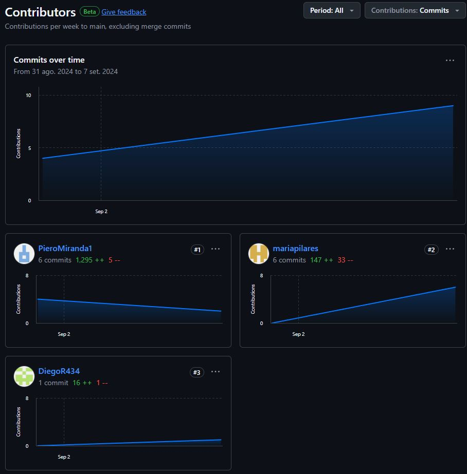

  
  
  
Universidad Peruana de Ciencias Aplicadas  
  
Carrera: Ingeniería de Software  
  
Ciclo: 2024-02  
  
Curso: Aplicaciones Web  
  
Sección: SW52  
  
Profesor: Juan Carlos Tinoco Licas  
  
Informe del Trabajo Final  
  
Startup: TechOps  
  
Producto: ZenFlicks  

| Member                                | Code       |
|---------------------------------------|------------|
| Avila Palacios, Aaron         | u201823654 |
| Lastra Trinidad, Georgina       | u201822503 |
| Pilares Pocohuanca, Maria        | u202215528 |
| Miranda Sinarahua, Piero     | u20181g752 |
| Quispe Erasmo, Raúl Ronaldo          | u20211b682 |
| Ramirez Ortega, Diego Miguel          | u202123548 |

  
**Agosto del 2024**

  
---  
# Registro de Versiones del Informe  
  
| Versión | Fecha       | Autor                                  | Descripción de modificaciones |
|---------|-------------|----------------------------------------|-------------------------------|
| 1.0     | 07/09/2024  | Avila Palacios, Aaron                  | Capítulo I                    |
|         |             | Lastra Trinidad, Georgina              | Capítulo II                   |
|         |             | Pilares Pocohuanca, Maria              | Capítulo III                  |
|         |             | Miranda Sinarahua, Piero               | Capítulo IV                   |
|         |             | Quispe Erasmo, Raúl Ronaldo            | Capítulo V                    |
|         |             | Ramirez Ortega, Diego Miguel           |                               |

---  
# Project Report Collaboration Insights  
  
  
---  
# Student Outcome  
El curso contribuye al cumplimiento del Student Outcome ABET: **ABET – EAC - Student Outcome 5**   Criterio: *La capacidad de funcionar efectivamente en un equipo cuyos miembros
juntos proporcionan liderazgo, crean un entorno de colaboración e inclusivo,
establecen objetivos, planifican tareas y cumplen objetivos.*  
  
En el siguiente cuadro se describe las acciones realizadas y enunciados de
conclusiones por parte del grupo, que permiten sustentar el haber alcanzado el logro
del ABET – EAC - Student Outcome 5. 
  
| Criterio específico | Acciones realizadas  | Conclusiones |  
| - | - | - |  
| Trabaja en equipo para proporcionar liderazgo enforma conjunta. | **Avila, Aaron**   ***TB1:*** (TB1)     **Lastra, Georgina**   ***TB1:*** (TB1)     **Pilares, Maria**   ***TB1:***   - Desarrollo del Capítulo 3: User Story / Product Backlog   - Entrevista a creador de contenido   - Desarrollo de Ubiquitous Language   - Elaboración de Class Diagrams   - Elaboración de Class Dictionary   - Elaboración del PPT   ***TB1:*** (TB1)     **Miranda, Piero**   ***TB1:***   - Desarrollo del capitulo 1   - Entrevista a segmento ciudadano   -Desarrollo de Style Guidelines/Information Architecture/Landing Page UI   -Web Application Wireframes & Mock Ups   - Desarrollo del capitulo 5     **Quispe, Raul**   ***TB1:*** (TB1)     **Ramirez, Diego**   ***TB1:***  - Entrevista a Creador de contenido   - Elaboración de los diagramas C4    - Elaboración de los diagramas de flujo de los Wireframes   | **TB1:** A lo largo del desarrollo de nuestro proyecto, trabajamos de manera colaborativa, brindando liderazgo conjunto dentro del equipo. Cada miembro asumió responsabilidades clave para asegurar la correcta ejecución de las tareas, desde la conceptualización hasta el desarrollo de la Landing Page. Esta cooperación nos permitió integrar diversas perspectivas y habilidades, manteniendo una comunicación constante y fluida. El liderazgo compartido facilitó la toma de decisiones estratégicas y nos ayudó a mantener el enfoque en los objetivos comunes, garantizando así el éxito del proyecto. |/*¡¡¡¡¡¡¡¡¡¡AQUÍ EMPIEZA EL OTRO CRITERIOOOOOOOOOOOOOOOOOOOOOOOOOOOO!!!!!!!!!!!*/
| Crea un entorno colaborativo e inclusivo, establece metas,planifica tareas y cumple objetivos. | **Avila, Aaron**   ***TB1:*** (TB1)     **Lastra, Georgina**   ***TB1:*** (TB1)     **Pilares, Maria**   ***TB1:*** (TB1)     **Miranda, Piero**   ***TB1:***    - Desarrollo del capitulo 1   - Entrevista a segmento ciudadano   -Desarrollo de Style Guidelines/Information Architecture/Landing Page UI   -Web Application Wireframes & Mock Ups   - Desarrollo del capitulo 5     **Quispe, Raul**   ***TB1:*** (TB1)     **Ramirez, Diego**   ***TB1:***   - Entrevista a Creador de contenido   - Elaboración de los diagramas C4     - Elaboración de los diagramas de flujo de los Wireframes   | **TB1:** Durante el desarrollo de nuestro proyecto, logramos crear un entorno colaborativo e inclusivo, donde cada integrante del equipo aportó sus ideas y habilidades de manera equitativa. Establecimos metas claras desde el inicio, planificamos las tareas de forma estructurada y distribuimos responsabilidades de manera efectiva. Gracias a esta organización, cumplimos con los objetivos establecidos dentro de los plazos acordados, asegurando que cada fase del proyecto, incluyendo la creación de la Landing Page, se completara de manera eficiente y en armonía con la visión compartida del equipo. |    
  
---  
# Contenido  
## Tabla de contenidos  
  
### [Capítulo I: Introducción]()  
- [1.1. Startup Profile]()  
  - [1.1.1 Descripción de la Startup]()  
  - [1.1.2 Perfiles de integrantes del equipo]()  
- [1.2 Solution Profile]()  
  - [1.2.1 Antecedentes y problemática]()  
  - [1.2.2 Lean UX Process]()  
      - [1.2.2.1. Lean UX Problem Statements]()  
      - [1.2.2.2. Lean UX Assumptions]()  
      - [1.2.2.3. Lean UX Hypothesis Statements]()  
      - [1.2.2.4. Lean UX Canvas]()  
- [1.3. Segmentos objetivo]()  
  
### [Capítulo II: Requirements Elicitation & Analysis]()  
- [2.1. Competidores]()  
  - [2.1.1. Análisis competitivo]()  
  - [2.1.2. Estrategias y tácticas frente a competidores]()  
- [2.2. Entrevistas]()  
  - [2.2.1. Diseño de entrevistas]()  
  - [2.2.2. Registro de entrevistas]()  
  - [2.2.3. Análisis de entrevistas]()  
- [2.3. Needfinding]()  
  - [2.3.1. User Personas]()  
  - [2.3.2. User Task Matrix]()  
  - [2.3.3. User Journey Mapping]()  
  - [2.3.4. Empathy Mapping]()  
  - [2.3.5. As-is Scenario Mapping]()  
- [2.4. Ubiquitous Language]()

  
### [Capítulo III: Requirements Specification]()  
- [3.1. To-Be Scenario Mapping]()  
- [3.2. User Stories]()  
- [3.3. Impact Mapping]()  
- [3.4. Product Backlog]()  
  
  
### [Capítulo IV: Product Design]()  
- [4.1. Style Guidelines]()  
  - [4.1.1. General Style Guidelines]()  
  - [4.1.2. Web Style Guidelines]()  
- [4.2. Information Architecture]()  
  - [4.2.1. Organization Systems]()  
  - [4.2.2. Labeling Systems]()  
  - [4.2.3. SEO Tags and Meta Tags]()  
  - [4.2.4. Searching Systems]()  
  - [4.2.5. Navigation Systems]()  
- [4.3. Landing Page UI Design]()  
  - [4.3.1. Landing Page Wireframe]()  
  - [4.3.2. Landing Page Mock-up]()  
- [4.4. Web Applications UX/UI Design]()  
  - [4.4.1. Web Applications Wireframes]()  
  - [4.4.2. Web Applications Wireflow Diagrams]()  
  - [4.4.3. Web Applications Mock-ups]()  
  - [4.4.4. Web Applications User Flow Diagrams]()  
- [4.5. Web Applications Prototyping]()  
- [4.6. Domain-Driven Software Architecture]()  
  - [4.6.1. Software Architecture Context Diagram]()  
  - [4.6.2. Software Architecture Container Diagrams]()  
  - [4.6.3. Software Architecture Components Diagrams]()  
- [4.7. Software Object-Oriented Design]()  
  - [4.7.1. Class Diagrams]()  
  - [4.7.2. Class Dictionary]()  
- [4.8. Database Design]()  
  - [4.8.1. Database Diagram]()  
  
  
### [Capítulo V: Product Implementation, Validation & Deployment]()  
- [5.1. Software Configuration Management]()  
  - [5.1.1. Software Development Environment Configuration]()  
  - [5.1.2. Source Code Management]()  
  - [5.1.3. Source Code Style Guide & Conventions]()  
  - [5.1.4. Software Deployment Configuration]()  
- [5.2. Landing Page, Services & Applications Implementation]()  
  - [5.2.1. Sprint 1]()  
      - [5.2.1.1. Sprint Planning 1]()  
      - [5.2.1.2. Sprint Backlog 1]()  
      - [5.2.1.3. Development Evidence for Sprint Review]()  
      - [5.2.1.4. Testing Suite Evidence for Sprint Review]()  
      - [5.2.1.5. Execution Evidence for Sprint Review]()  
      - [5.2.1.6. Services Documentation Evidence for Sprint Review]()  
      - [5.2.1.7. Software Deployment Evidence for Sprint Review]()  
      - [5.2.1.8. Team Collaboration Insights during Sprint]()  
  - [5.2.2. Sprint 2]()  
      - [5.2.2.1. Sprint Planning 2]()  
      - [5.2.2.2. Sprint Backlog 2]()  
      - [5.2.2.3. Development Evidence for Sprint Review]()  
      - [5.2.2.4. Testing Suite Evidence for Sprint Review]()  
      - [5.2.2.5. Execution Evidence for Sprint Review]()  
      - [5.2.2.6. Services Documentation Evidence for Sprint Review]()  
      - [5.2.2.7. Software Deployment Evidence for Sprint Review]()  
      - [5.2.2.8. Team Collaboration Insights during Sprint]()  
  - [5.2.3. Sprint 3]()  
      - [5.2.3.1. Sprint Planning 3]()  
      - [5.2.3.2. Sprint Backlog 3]()  
      - [5.2.3.3. Development Evidence for Sprint Review]()  
      - [5.2.3.4. Testing Suite Evidence for Sprint Review]()  
      - [5.2.3.5. Execution Evidence for Sprint Review]()  
      - [5.2.3.6. Services Documentation Evidence for Sprint Review]()  
      - [5.2.3.7. Software Deployment Evidence for Sprint Review]()  
      - [5.2.3.8. Team Collaboration Insights during Sprint]()  
  - [5.2.4. Sprint 4]()  
      - [5.2.4.1. Sprint Planning 4]()  
      - [5.2.4.2. Sprint Backlog 4]()  
      - [5.2.4.3. Development Evidence for Sprint Review]()  
      - [5.2.4.4. Testing Suite Evidence for Sprint Review]()  
      - [5.2.4.5. Execution Evidence for Sprint Review]()  
      - [5.2.4.6. Services Documentation Evidence for Sprint Review]()  
      - [5.2.4.7. Software Deployment Evidence for Sprint Review]()  
      - [5.2.4.8. Team Collaboration Insights during Sprint]()  
- [5.3. Validation Interviews]()  
  - [5.3.1. Diseño de Entrevistas]()  
  - [5.3.2. Registro de Entrevistas]()  
  - [5.3.3. Evaluaciones según heurísticas]()  
- [5.4. Video About-the-Product]()  
  
---  
# Capítulo I: Introducción  
## 1.1. Startup Profile  

### 1.1.1 Descripción de la Startup  

TechOps presenta ZenFlicks, una innovadora aplicación diseñada para ayudar a las personas a aliviar el estrés diario a través de recomendaciones personalizadas de películas, series y documentales. ZenFlicks no solo se enfoca en el bienestar mental de los usuarios, sino que también ofrece una plataforma para que los creadores de contenido promocionen sus obras relacionadas con la salud mental y el bienestar.

**Objetivo:** Proporcionar una plataforma innovadora que ayude a las personas a aliviar el estrés y mejorar su bienestar mental a través de recomendaciones personalizadas de contenido audiovisual, mientras se apoya a los creadores de contenido en la promoción de sus obras relacionadas con la salud mental.

**Misión:** Nuestra misión en TechOps es mejorar la calidad de vida de nuestros usuarios al ofrecerles una experiencia de entretenimiento personalizada que promueva el bienestar mental y emocional. A través de ZenFlicks, buscamos crear una comunidad inclusiva y solidaria donde los usuarios puedan descubrir contenido inspirador, participar en discusiones significativas y acceder a recursos adicionales para su bienestar. Al mismo tiempo, apoyamos a los creadores de contenido en la difusión de sus obras, fomentando un ecosistema de colaboración y crecimiento mutuo. 

### 1.1.2 Perfiles de integrantes del equipo  

<table align="center" border="1" width="70%" style="text-align:center;">
    <tr align="center">
        <td rowspan="3">
             
        </td>
        <td align="left">
            <b>Nombre y Apellido:</b>
             
            Georgina Lastra Trinidad
        </td>
    </tr>
    <tr>
        <td align="left">
            <b>Carrera:</b>
             
            Ingeniería de Software
        </td>
    </tr>
    <tr>
        <td align="left">
            <b>Acerca de:</b>
             
            Soy Georgina Lastra Trinidad, estudiante de Ingeniería de Software. Mi curiosidad y mi entusiasmo por comprender cómo funcionan las cosas me llevaron a elegir este campo como mi camino profesional. Soy una estudiante comprometida y persistente que busca convertirse en una ingeniera innovadora con visión de futuro. Estoy emocionada por contribuir al desarrollo de soluciones tecnológicas impactantes que mejoren la vida de las personas de todo el mundo.
        </td>
    </tr>
    <tr align="center">
        <td rowspan="3">
            
        </td>
        <td align="left">
            <b>Nombre y Apellido:</b>
             
            Maria Pilares Pocohuanca
        </td>
    </tr>
    <tr>
        <td align="left">
            <b>Carrera:</b>
             
            Ingeniería de Software
        </td>
    </tr>
    <tr>
        <td align="left">
            <b>Acerca de:</b>
             
            Soy Maria Pilares, estudio la carrera de Ingeniería de Software en la UPC. Desde niña tuve mucho interés por las matemáticas y la tecnología, motivo por el cual elegí una ingeniería enfocada más a la programación. Me considero una persona perseverante, aunque algo impaciente. Sin embargo, como miembro del equipo me comprometo a colaborar con mis compañeros y realizar todas las indicaciones que se dicten, todo con el fin de presentar un buen proyecto.
        </td>
    </tr>
    <tr align="center">
        <td rowspan="3">
            
        </td>
        <td align="left">
            <b>Nombre y Apellido:</b>
             
            Raúl Ronaldo Quispe Erasmo
        </td>
    </tr>
    <tr>
        <td align="left">
            <b>Carrera:</b>
             
            Ingeniería de Software
        </td>
    </tr>
    <tr>
        <td align="left">
            <b>Acerca de:</b>
             
            Soy Raúl Ronaldo Quispe Erasmo, soy estudiante de la carrera de Ingeniería de Software y tengo 21 años. Desde mi infancia me interesó mucho el mundo de la tecnología y ahora tengo conocimiento de C#, C++, HTML, CSS, SQL Relational y no Relational. Soy responsable de llevar con el equipo a nuestro objetivo.
        </td>
    </tr>
    <tr align="center">
        <td rowspan="3">
            
        </td>
        <td align="left">
            <b>Nombre y Apellido:</b>
             
            Piero Miranda Sinarahua
        </td>
    </tr>
    <tr>
        <td align="left">
            <b>Carrera:</b>
             
            Ingeniería de Software
        </td>
    </tr>
    <tr>
        <td align="left">
            <b>Acerca de:</b>
             
            Me llamo Piero Miranda y actualmente estoy llevando la carrera de Ingeniería de Software. Considero que soy una persona responsable y que puedo aportar al equipo en cualquier aspecto que se requiera. De igual manera, siento que los conocimientos que he ido adquiriendo en ciclos anteriores serán de gran ayuda para llevar a cabo el presente trabajo.
        </td>
    </tr>
    <tr align="center">
        <td rowspan="3">
            
        </td>
        <td align="left">
            <b>Nombre y Apellido:</b>
             
            Diego Miguel Ramirez Ortega
        </td>
    </tr>
    <tr>
        <td align="left">
            <b>Carrera:</b>
             
            Ingeniería de Software
        </td>
    </tr>
    <tr>
        <td align="left">
            <b>Acerca de:</b>
             
            Mi nombre es Diego Ramirez, tengo 21 años y estoy estudiando la carrera de Ingeniería de Software. Tengo conocimiento en C++, Python y edición de vídeo. Estoy comprometido a completar las tareas que se me asignen a tiempo y apoyar en lo que pueda en el proyecto.
        </td>
    </tr>
    <tr align="center">
        <td rowspan="3">
            
        </td>
        <td align="left">
            <b>Nombre y Apellido:</b>
             
            Aaron Alexander Avila Palacios
        </td>
    </tr>
    <tr>
        <td align="left">
            <b>Carrera:</b>
             
            Ingeniería de Software
        </td>
    </tr>
    <tr>
        <td align="left">
            <b>Acerca de:</b>
             
            Soy estudiante de Ingeniería de Software y estoy cursando el quinto ciclo de la carrera. Tengo 23 años. Tengo conocimientos en programación orientada a objetos en lenguaje de programación C++, también en diseño de prototipos de aplicaciones, diseño gráfico, diseño e implementación de páginas web. Todas estas habilidades ayudan al desarrollo del proyecto, dado que son de vital importancia en este curso y en nuestra carrera. Soy capaz de desarrollar de manera eficaz cualquier tarea que se me asigne.
        </td>
    </tr>
</table>
    
 
## 1.2 Solution Profile  

En esta sección se analizarán cuales son los antecedentes y la problemática acerca del estrés y cansancio mental de las personas luego de realizar actividades cotidianas y cómo el entretenimiento audiovisual está involucrado en el tema . Luego, se examinará la raíz del problema, con ayuda de un proceso UX, el cual ayudará a identificar las necesidades que ayuden a encontrar una solución a la problemática mencionada. 

### 1.2.1 Antecedentes y problemática  

* **Quien?** Las personas que estudian, trabajan, o realizan ambas actividades. Se pueden incluir a universitarios que llevan a cabo actividades académicas la mayor parte del día. También se incluyen personas las cuales trabajan arduamente durante el día. O personas que realizan ambas actividades. El rango de personas que cumplen con dichas características suelen variar entre los 18 a 50 años. 
También se toma en cuenta a creadores de contenido relacionados con el bienestar mental, ya sean directores, productores, actores, etc. Estas personas buscarían formas de difundir su contenido en alguna plataforma.

* **Qué?** Los usuarios mencionados presentan cierto nivel de cansancio mental o estrés luego de realizar sus actividades estudiantiles o laborales y no pueden encontrar contenido el cual les ayude no solo a distraerse, sino también a reducir ese nivel de estrés, mejorando así su salud mental. 

* **Dónde?** En la ciudad de Lima-Perú  se puede observar a muchas personas que cumplen con las características descritas. Tanto en las calles como en los mismos hogares se puede evidenciar el nivel de cansancio que presentan estas personas.

* **Por qué?** El deterioro de salud mental provocado por estrés es un problema creciente en la población, el cual muchas veces no se le da la suficiente atención. Existe una demanda en formas para combatir dicho estrés por medio de entretenimiento visual, los cuales tocan temas que ayudan a regular el bienestar mental de las personas. 

* **Cuando?** Se evidencia el problema luego de largas jornadas de trabajo, exámenes, incluso durante tiempos de descanso, ya sean periodos cortos o al momento de retornar a sus hogares.

* **Cómo?** Se cree que ciertos contenidos audiovisuales, como películas, series,documentales, pueden ayudar a contrarrestar el cansancio de las personas,  y así cambiar la mentalidad de los usuarios, al igual que su estado de ánimo. 

* **Cuánto?** Se considera un sistema de suscripciones el cual ayude a financiar una solución óptima que ofrezca alternativas que ayuden a los usuarios a normalizar su bienestar mental

En conclusión, existe una problemática en la ciudad de Lima relacionada con el deterioro de la salud mental de las personas causadas por el cansancio o estrés luego de realizar actividades laborales y/o académicas durante largas jornadas. De igual manera, se tiene en cuenta que existen medios, como contenido audiovisual (películas, series, documentales), los cuales pueden ayudar a mejorar el ánimo de las personas y de cierta forma aliviar la fatiga mental que pueden tener los usuarios

### 1.2.2 Lean UX Process  
#### 1.2.2.1. Lean UX Problem Statements  

Ciudadanos universitarios y/o trabajadores buscan formas de relajarse y reducir el cansancio mental luego de largas jornadas de estudio/trabajo, pero les suele ser difícil encontrar algún contenido que les ayude a desconectar y aliviar dicha fatiga. Debido a esto, muchos experimentan altos niveles de estrés lo cual produce un deterioro de su salud mental con el tiempo. Si bien existe cierto contenido el cual puede ayudar a los usuarios a contrarrestar este agotamiento mental, no se encuentra una plataforma la cual ofrezca contenido personalizado de acuerdo al estado de ánimo del usuario. Si este problema se resuelve, las personas podrían contar con recursos audiovisuales que le alineen a sus necesidades y les permitan relajarse de forma efectiva, logrando así reducir sus niveles de estrés y mejorando su bienestar mental.

#### 1.2.2.2. Lean UX Assumptions  

**Business Assumptions** 

* Lograr aumentar nuestro público objetivo gradualmente con el tiempo.
* Las ganancias iniciales deben compensar el capital invertido para el negocio
* Obtener mayor ganancias con las suscripciones con el fin de aumentar los beneficios para los usuarios. 

**Users**

*Ciudadanos universitarios/trabajadores
*Creadores de contenido

**User Outcomes**

*Ciudadanos universitarios/trabajadores:*

*Desconectar de sus actividades académicas/laborales con el fin de aliviar el estrés. 
*Conocer nuevo contenido audiovisual que los ayuden a cambiar su estado de ánimo.

*Creadores de contenido:*

*Difundir sus producciones y que lleguen a un mayor público.
*Obtener feedback acerca del contenido desarrollado

**Features**

* Contenido personalizado para el usuario en cuanto a películas/series/documentales. 
* Foros en los cuales se compartan opiniones acerca del contenido recomendado. 
* Información acerca de eventos a los cuales los usuarios pueden asistir de manera presencial. 
* Impulso de contenido que promueve el bienestar mental. 

**Business Assumptions**

1. **Creemos que nuestros clientes necesitan** un medio en el cual encontrar recomendaciones de contenido audiovisual el cual le brinde mejoría en su bienestar mental. Para los creadores de contenido, un espacio donde su contenido alcance el público que se plantean.
2. **Estas necesidades se pueden resolver con** una plataforma la cual conozca la situación mental del usuario y le brinde recomendaciones adecuadas a sus necesidades y promueva el contenido relacionado a bienestar mental.
3. **El valor #1 que mi cliente quiere de mi servicio es** efectividad al momento de encontrar una solución para calmar sus problemas. En cuanto a los creadores, que sus producciones lleguen a la mayor cantidad de público objetivo posible.
4. **El cliente también puede obtener beneficios adicionales como** acceso a una gran cantidad de películas, series, documentales, los cuales pueden tomar en cuenta sin importar la situación en la que estén. Además de opiniones de otros usuarios y eventos a los que asistir. Para los creadores, la opción de crear eventos dedicados a personas que quieran ver sus producciones en vivo.
5. **Voy a adquirir la mayoría de mis clientes con** publicidad en redes sociales y grupos en los cuales se hable de temas relacionados con películas/series/documentales.
6. **Haré dinero a través de** distintos niveles de suscripción para poder acceder a la plataforma.
7. **Mi competencia principal en el mercado** aplicaciones que brinden servicios de streaming de películas o que ofrezcan recomendaciones de películas 
8. **Lo venceremos debido a**    nuestra propuesta de valor se relaciona con recomendaciones personalizadas al usuario 
9. **El mayor riesgo es que** existan errores al momento de recomendar el contenido y que el usuario no esté de acuerdo con lo recomendado.
10. **Resolveremos esto a través de** un análisis previo en el cual se conozca las emociones y estado de ánimo actual del usuario. 

**User Assumptions**

**Who is the user?**

* Ciudadanos universitarios/trabajadores que presenten gran cansancio mental luego de largas jornadas de estudio/trabajo
* Creadores de contenido que toquen temas en específico y ayuden a mejorar el ánimo de su público. 

**Where does our product fit in their work or life?**

El aplicativo encaja tanto en las consecuencias del arduo trabajo o estudio del usuario, como en el estado de ánimo actual que tenga el usuario al interactuar con el producto. 

**What problem does our product solve?**

El producto contrarresta el estrés de los usuarios y ayuda a promover el bienestar mental a través de contenido audiovisual

**When and how is our product used?**

El aplicativo podría usarse en un lapso de descanso que tengan los usuarios al igual que en sus días libres . Para los creadores de contenido, se puede emplear al momento de estrenar nuevo contenido audiovisual. 

**What features are important?**

Que el producto cumpla con recomendar las películas/series/documentales más precisas de acuerdo a la necesidad del usuario que lo requiera.

**How should our product look and behave?**

El producto debe verse amigable con el usuario, funcional y simple de usar, esto con el objetivo que cualquier persona que lo requiera pueda usar la aplicación, sin importar que esté familiarizado con otras plataformas similares o no. 

#### 1.2.2.3. Lean UX Hypothesis Statements  

* **Creemos que**  el sistema de recomendación de contenido propuesto por nuestra plataforma hacia nuestros usuarios logrará elevar el estado de ánimo de las personas y aliviará el agobio mental que puedan estar atravesando al momento. **Sabremos que esto es cierto cuando** el porcentaje de usuarios activos en la aplicación aumente en un 20% durante los primeros meses.

* **Creemos que** el impacto que tendría un sistema por el cual los usuarios compartan opiniones acerca de nuestra aplicación será considerable tomando en cuenta la competencia .**Sabremos que hemos tenido éxito cuando** leamos los comentarios positivos por parte de los usuarios publicados en los foros incluidos en la misma plataforma virtual.

* **Creemos que** la ciudadanía en general dará mayor importancia a la salud mental y tomará en cuenta métodos audiovisuales para calmar sus angustias .**Sabremos que hemos tenido éxito cuando** interactuamos con los usuarios y evidenciamos que realizan sus actividades cotidianas con buena actitud

#### 1.2.2.4. Lean UX Canvas  

## 1.3. Segmentos objetivo  

Nuestra propuesta de solución está dirigida hacia 2 segmentos objetivos, los cuales son: 

* **Ciudadano universitario/trabajador promedio:** se considera a un usuario, en el rango de edades de 18 a 50 años aproximadamente, el cual presenta problemas relacionados con cansancio mental a raíz del estrés académico o laboral. 

* **Creador de contenido de salud mental:** personas involucradas en la creación de películas/series/documentales en los cuales se desarrollan temas que contribuyan en cambiar la mentalidad de las personas y mejorar su bienestar mental.

# Capítulo II: Requirements Elicitation & Analysis  
## 2.1 Competidores  

|EMPRESA|DESCRIPCIÓN|IMAGEN|
|-----|-----|----|
|**Calm**| Calm es una aplicación de bienestar que incluye contenido audiovisual, como historias para dormir y videos relajantes, que contribuyen al alivio del estrés y la mejora del bienestar. ||
|**Headspace**| Headspace es una aplicación que ofrece series y documentales enfocados en el bienestar mental, lo que podría hacerla un competidor indirecto. ||
|**Happify**| Happify es una plataforma dedicada al bienestar emocional y mental que utiliza actividades científicamente respaldadas, juegos y contenido multimedia para ayudar a los usuarios a reducir el estrés y mejorar su bienestar. ||

### 2.1.1. Análisis Competitivo  

<table>
<tr>
<th colspan="7">Competitive Analysis Landscape</th>
</tr>
<tr>
<td colspan="2" rowspan="2">¿Por qué llevar a cabo este análisis?</td>
<td colspan="5">Escriba en el recuadro la pregunta que busca responder o el objetivo de este análisis.</td>
</tr>
<tr>
<td colspan="5"></td>
</tr>
<tr>
<td colspan="3">(En la cabecera colocar por cada competidor nombre y logo)</td>
<td>ZenFlicks  </td>
<td>Calm  </td>
<td>Headspace  </td>
<td>Happify  </td>
</tr>
<tr>
<td rowspan="2">PERFIL</td>
<td colspan="2">Overview</td>
<td>Es una aplicación que combina el entretenimiento y el bienestar mental, proporcionando recomendaciones personalizadas de películas, series y documentales para aliviar el estrés. Además, ofrece una plataforma para que los creadores de contenido promuevan sus obras relacionadas con la salud mental y el bienestar. </td>
<td>Es una aplicación líder en meditación y sueño que ofrece una amplia gama de herramientas para mejorar la salud mental, incluyendo meditaciones guiadas, historias para dormir, música relajante y ejercicios de respiración. </td>
<td>Es una aplicación de meditación y bienestar que ofrece una amplia gama de recursos para ayudar a los usuarios a reducir el estrés, mejorar su concentración y dormir mejor, a través de meditaciones guiadas y contenido audiovisual. </td>
<td>Es una plataforma de bienestar emocional que ofrece actividades, juegos y programas basados en la ciencia para ayudar a los usuarios a reducir el estrés, mejorar su estado de ánimo y desarrollar resiliencia. </td>
</tr>
<tr>
<td colspan="2">Ventaja competitiva ¿Qué valor ofrece a los clientes?</td>
<td>Ofrece una combinación única de entretenimiento y bienestar, centrada en contenido audiovisual que no solo entretiene, sino que también promueve la salud mental. Esto lo diferencia de otras plataformas de streaming tradicionales. </td>
<td>Ofrece amplia variedad de contenido orientado al bienestar, con un enfoque particular en mejorar el sueño, lo que lo diferencia de otros competidores en el mercado. </td>
<td>Es pionera en el mercado de meditación digital, con una marca bien establecida y una extensa biblioteca de contenido diseñado por expertos. </td>
<td>Ofrece de acuerdo a la ciencia del comportamiento y la psicología positiva para crear actividades interactivas que promuevan el bienestar emocional de una manera entretenida y accesible. </td>
</tr>
<tr>
<td rowspan="2">PERFIL DE MARKETING</td>
<td colspan="2">Mercado objetivo</td>
<td>Usuarios que buscan reducir el estrés y mejorar su bienestar mental a través del entretenimiento, así como creadores de contenido que producen obras relacionadas con el bienestar mental. </td>
<td>Usuarios que buscan mejorar su salud mental y calidad de sueño, desde principiantes en meditación hasta aquellos que desean reducir la ansiedad y el estrés. </td>
<td>Usuarios interesados en mejorar su bienestar mental a través de la meditación y el mindfulness, desde principiantes hasta practicantes avanzados. </td>
<td>Usuarios que buscan mejorar su bienestar emocional y reducir el estrés mediante métodos interactivos y basados en la ciencia. </td>
</tr>
<tr>
<td colspan="2">Estrategias de marketing</td>
<td>Marketing digital a través de redes sociales y blogs especializados. </td>
<td>Publicidad en plataformas digitales, colaboraciones con celebridades, promociones en eventos relacionados con la salud y el bienestar. </td>
<td>Colaboraciones con empresas para ofrecer Headspace a empleados, campañas de marketing digital, publicidad en medios de comunicación relacionados con la salud y el bienestar. </td>
<td>Campañas de marketing digital, colaboraciones con profesionales de la salud mental, programas de bienestar corporativo. </td>
</tr>
<tr>
<td rowspan="3">PERFIL DE PRODUCTO</td>
<td colspan="2">Productos & Servicios</td>
<td>Recomendaciones personalizadas de películas, series y documentales centrados en el bienestar mental.</td>
<td>Meditaciones guiadas, historias para dormir, música para relajación, programas de mindfulness. </td>
<td>Meditaciones guiadas, programas de mindfulness, contenido para mejorar el sueño y series audiovisuales sobre bienestar mental. </td>
<td>Actividades interactivas, juegos y programas personalizados de bienestar emocional. </td>
</tr>
<tr>
<td colspan="2">Precios & Costos</td>
<td>Suscripción 3.99, 5.99 y 9.99 dólares como estándar, premium y platinum respectivamente. Para las funciones adicionales, eventos personalizables y acceso a foros. </td>
<td>Suscripción mensual o anual, con opciones gratuitas limitadas. </td>
<td>Suscripción mensual o anual, con opciones de prueba gratuita. </td>
<td>Modelo freemium con opciones de suscripción para acceder a contenido premium. </td>
</tr>
<tr>
<td colspan="2">Canales de distribución (Web y/o Móvil)</td>
<td>Plataforma web y aplicación móvil.</td>
<td>Plataforma web y aplicación móvil.</td>
<td>Plataforma web y aplicación móvil.</td>
<td>Sitio web y aplicación móvil.</td>
</tr>
<tr>
<td rowspan="5">ANÁLISIS SWOT</td>
<td colspan="6">Realice esto para su startup y sus competidores. Sus fortalezas deberían apoyar sus oportunidades y contribuir a lo que ustedes definen como su posible ventaja competitiva.</td>
</tr>
<tr>
<td colspan="2">Fortalezas</td>
<td>Interfaz amigable y fácil de usar.</td>
<td>Variedad de contenido enfocado en mejorar el sueño y reducir el estrés; colaboraciones con celebridades que aumentan la visibilidad de la marca. </td>
<td>Marca fuerte y reconocida; contenido creado por expertos en meditación; amplia base de usuarios. </td>
<td>Uso de la psicología positiva y el enfoque basado en la ciencia; alta interactividad y personalización. </td>
</tr>
<tr>
<td colspan="2">Debilidades</td>
<td>Competencia fuerte en el mercado de streaming; dependencia de la percepción de los usuarios sobre la efectividad del contenido en el bienestar.</td>
<td>Competencia directa con otras aplicaciones de bienestar; costos de suscripción pueden ser una barrera para algunos usuarios. </td>
<td>Dependencia de un modelo de suscripción; competencia creciente en el mercado de bienestar digital. </td>
<td>Puede ser percibido como más orientado a la gamificación que al bienestar profundo; competencia en el mercado de bienestar emocional. </td>
</tr>
<tr>
<td colspan="2">Oportunidades</td>
<td>Aumento en la demanda de soluciones de bienestar mental; posibilidad de expandir la oferta de contenido.</td>
<td>Expansión en nuevos mercados y segmentos demográficos; integración con dispositivos inteligentes para un seguimiento más personalizado. </td>
<td>Expansión en mercados internacionales; integración con wearables y dispositivos de salud. </td>
<td>Expansión en el sector corporativo como herramienta de bienestar para empleados; desarrollo de nuevas funcionalidades basadas en avances en psicología y neurociencia. </td>
</tr>
<tr>
<td colspan="2">Amenazas</td>
<td>Nuevos entrantes en el mercado de bienestar digital; cambios en las preferencias de los consumidores.</td>
<td>Aumento en la competencia en el mercado de bienestar digital; cambios en las preferencias de los consumidores hacia nuevas tecnologías de bienestar. </td>
<td>Nuevos competidores en el espacio de bienestar digital; cambios en las tendencias de meditación y mindfulness. </td>
<td>Competencia creciente en el mercado de aplicaciones de bienestar; posible saturación del mercado con soluciones similares. </td>
</tr>
</table>

### 2.1.2. Estrategias y táticas frente a competidores

Nuestras principales estrategias y tácticas que lanzaríamos como startup, estarían:

<li>Ofrecer recomendaciones de contenido audiovisual que fomentan el bienestar mental, a diferencia de sus competidores que se enfocan en meditación o técnicas específicas para el manejo del estrés. Su estrategia se centra en destacar cómo la plataforma combina entretenimiento con salud mental. Las campañas publicitarias promoverán cómo series, películas y documentales pueden ayudar a los usuarios a desconectarse, reducir el estrés y mejorar su bienestar. Además, se incluirán testimonios de usuarios que han experimentado beneficios al integrar el entretenimiento con prácticas de bienestar.</li>

<li>Competidores como Headspace, Calm y Happify destacan en meditación, mindfulness y seguimiento del bienestar mental. ZenFlicks busca diferenciarse ofreciendo una experiencia centrada en entretenimiento. La estrategia incluye proporcionar recomendaciones de contenido personalizadas basadas en el estado de ánimo, hábitos de visualización y objetivos de bienestar del usuario. Además, se desarrollará una biblioteca exclusiva con contenido relacionado con la salud mental, que incluirá documentales y películas seleccionadas por expertos en bienestar.</li>

<li>Abordar las debilidades como ofertas limitadas centrada principalmente en meditación y terapias breves, y una falta de conexión emocional con usuarios que buscan entretenimiento relajante, ofreciendo una gama variada de contenido audiovisual que trate el bienestar mental desde perspectivas diversas, como comedia, ficción y documentales. La táctica será incluir películas y series sobre salud mental, junto con otros géneros como comedias y aventuras para proporcionar relajación y entretenimiento. Además, se buscarán colaboraciones con creadores de contenido especializados en salud mental, ofreciendo un espacio exclusivo en ZenFlicks para sus trabajos.</li>

## 2.2. Entrevistas  

En esta sección se aborda la investigación tomando como base la recolección de información en base a entrevistas a representantes de los segmentos objetivo. Es decir, entrevistaremos a nuestro público objetivo para asi tener más de cerca algunos testimonios y poder trabajar en base a ellos.

### 2.2.1. Diseño de entrevistas  

A continuación, encontrarás un diseño de una lista de preguntas principales y adicionales para las entrevistas, adaptadas a cada grupo identificado. Estas preguntas nos ayudarán a recopilar datos importantes sobre las características y comportamientos de las personas:

<strong>Preguntas Principales para Ciudadano Universitario/Trabajador Promedio:</strong>

<ul>
    <li><strong>Preguntas personales:</strong> 
        <ul>
            <li>¿Cuál es su nombre completo?</li>
            <li>¿Cuál es su edad?</li>
            <li>¿Dónde reside actualmente?</li>
            <li>¿Cuál es su estado civil?</li>
            <li>¿A qué se dedica profesionalmente o qué estudia?</li>
            <li>¿cómo estás emocionalmente en esta semana?</li>
        </ul>
    </li>
    <li><strong>Preguntas centrada al tema:</strong> 
        <ul>
            <li>¿Qué actividades realizas para aliviar el estrés y mejorar tu bienestar mental?</li>
            <li>¿Con qué frecuencia ves contenido audiovisual? (Ejemplo: películas, series, documentales, etc)</li>
            <li>¿Qué tipo de contenido te resulta más relajante o cómoda para tu bienestar mental?</li>
            <li>¿Has utilizado alguna aplicación o plataforma que ofrezca contenido enfocado en la salud mental? ¿Cuál?</li>
            <li>¿Cuáles son tus principales frustraciones al momento de buscar contenido que te ayude a reducir el estrés?</li>
            <li>¿Cómo prefieres consumir contenido audiovisual: en tu computadora, celular, o TV?</li>
            <li>¿Participarías en una comunidad online que te ofrezca recomendaciones personalizadas de contenido para mejorar tu bienestar mental?</li>
        </ul>
    </li>
</ul>

<strong>Preguntas Principales para Creador de Contenido de Salud Mental:</strong>

<ul>
    <li><strong>Preguntas personales:</strong> 
        <ul>
            <li>¿Cuál es su nombre completo?</li>
            <li>¿Cuál es su edad?</li>
            <li>¿Dónde reside actualmente?</li>
            <li>¿Cuál es su estado civil?</li>
            <li>¿A qué se dedica profesionalmente?</li>
            <li>¿Qué dispositivos utilizas principalmente para crear y distribuir tu contenido?</li>
        </ul>
    </li>
    <li><strong>Preguntas centrada al tema:</strong> 
        <ul>
            <li>¿Qué tipo de contenido relacionado con la salud mental creas? (Ejemplo: videos, artículos, podcasts, etc)</li>
            <li>¿Cuáles son los temas de salud mental que más te interesa promover y por qué?</li>
            <li>¿Qué desafíos enfrentas usualmente al dar tu contenido?</li>
            <li>Cuáles son las plataformas específicas para promocionar tu contenido?</li>
            <li>¿Qué tipo de apoyo o recursos consideras necesarios para mejorar la difusión de tu contenido?</li>
            <li>¿Cómo te beneficiarías de una plataforma que promueva contenido de bienestar mental entre su audiencia?</li>
            <li>¿Qué molestia te encontraste en tu experiencia de crear contenidos de salud mental y compartir a las personas que le interesa en ese tema?</li>
        </ul>
    </li>
</ul>

### 2.2.2. Registro de entrevistas  

Para cada segmento objetivo, se realizó 3 entrevistas, A continuación verás resúmenes de las entrevistas en cuadros:

<ul><strong>Entrevistado 1:</strong>
    <li><strong>Información del Entrevistado:</strong>
        <ul>
            <li>Nombre completo: Manuel Alexis Vargas Quispe. </li>
            <li>Edad: 20 años. </li>
            <li>Distrito de residencia: San Juan de Miraflores. </li>
            <li>Estado Civil: Soltero. </li>
            <li>Dedicación profesional o estudio: Ingeniería de Software. </li>
        </ul>
    </li>
    <li><strong>Registro en Video:</strong> 
        <ul>
            
            <a href="https://upcedupe-my.sharepoint.com/:v:/g/personal/u20211b682_upc_edu_pe/EeRCW6bXU9NFiei3vhTfiOoBl4XIOkhyLMBiDM3aIREuCQ?nav=eyJyZWZlcnJhbEluZm8iOnsicmVmZXJyYWxBcHAiOiJTdHJlYW1XZWJBcHAiLCJyZWZlcnJhbFZpZXciOiJTaGFyZURpYWxvZy1MaW5rIiwicmVmZXJyYWxBcHBQbGF0Zm9ybSI6IldlYiIsInJlZmVycmFsTW9kZSI6InZpZXcifX0%3D&e=QJfLvn">https://upcedupe-my.sharepoint.com/:v:/g/personal/u20211b682_upc_edu_pe/EeRCW6bXU9NFiei3vhTfiOoBl4XIOkhyLMBiDM3aIREuCQ?nav=eyJyZWZlcnJhbEluZm8iOnsicmVmZXJyYWxBcHAiOiJTdHJlYW1XZWJBcHAiLCJyZWZlcnJhbFZpZXciOiJTaGFyZURpYWxvZy1MaW5rIiwicmVmZXJyYWxBcHBQbGF0Zm9ybSI6IldlYiIsInJlZmVycmFsTW9kZSI6InZpZXcifX0%3D&e=QJfLvn</a>
            <li>00:00 minutos hasta 06:50 minutos.</li>
        </ul>
    </li>
    <li><strong>Resumen de la Entrevista:</strong> 
        <ul>
            <li>Manuel, en general, se siente bien aunque ha estado lidiando con estrés por sus actividades universitarias y personales, manteniendo una actitud positiva. Para aliviar el estrés, escucha música y sale a caminar, encontrando estas actividades efectivas. Dada su agenda ocupada, consume principalmente podcasts, y aunque le gustan películas y series, no las ve por más de una hora a la vez. Prefiere contenido auditivo como música y podcasts para relajarse, recomendándolos a su entorno cercano. Aunque no ha usado aplicaciones específicas para la salud mental, está interesado en explorarlas y cree que cada persona tiene diferentes necesidades para manejar el estrés. Su mayor frustración es encontrar contenido que le guste, ya que el contenido no adecuado puede ser contraproducente. Utiliza principalmente su computadora y celular para consumir contenido audiovisual y está interesado en unirse a comunidades online que ofrezcan recomendaciones personalizadas para mejorar el bienestar mental, dispuesto a compartir su experiencia.</li>
            <li>A pesar del estrés de su vida universitaria y personal, mantiene una actitud positiva y proactiva, buscando maneras efectivas de manejar el estrés y abierto a nuevas herramientas y plataformas. Su preferencia por podcasts y música indica una afinidad por plataformas de contenido auditivo de calidad, y su interés en aplicaciones para la salud mental muestra una disposición a explorar innovaciones en este campo. Utiliza principalmente su computadora y celular para consumir contenido, dado que estos dispositivos se adaptan bien a su rutina diaria. Manuel interactúa a través de plataformas de podcasts y servicios de música en línea y está interesado en explorar opciones que ofrezcan recomendaciones personalizadas para la salud mental. Aunque no se menciona un navegador específico, es probable que use navegadores comunes como Google Chrome o Safari.</li>
        </ul>
    </li>
</ul>

<ul><strong>Entrevistado 2:</strong>
    <li><strong>Información del Entrevistado:</strong>
        <ul>
            <li>Nombre completo: Sergio Licas</li>
            <li>Edad: 40 años</li>
            <li>Distrito de residencia: San Borja, Lima</li>
            <li>Estado Civil: Casado</li>
            <li>Dedicación profesional o estudio: Cocinero</li>
        </ul>
    </li>
    <li><strong>Registro en Video:</strong> 
        <ul>
            
            <a href="https://upcedupe-my.sharepoint.com/:v:/g/personal/u20211b682_upc_edu_pe/EeRCW6bXU9NFiei3vhTfiOoBl4XIOkhyLMBiDM3aIREuCQ?nav=eyJyZWZlcnJhbEluZm8iOnsicmVmZXJyYWxBcHAiOiJTdHJlYW1XZWJBcHAiLCJyZWZlcnJhbFZpZXciOiJTaGFyZURpYWxvZy1MaW5rIiwicmVmZXJyYWxBcHBQbGF0Zm9ybSI6IldlYiIsInJlZmVycmFsTW9kZSI6InZpZXcifX0%3D&e=QJfLvn">https://upcedupe-my.sharepoint.com/:v:/g/personal/u20211b682_upc_edu_pe/EeRCW6bXU9NFiei3vhTfiOoBl4XIOkhyLMBiDM3aIREuCQ?nav=eyJyZWZlcnJhbEluZm8iOnsicmVmZXJyYWxBcHAiOiJTdHJlYW1XZWJBcHAiLCJyZWZlcnJhbFZpZXciOiJTaGFyZURpYWxvZy1MaW5rIiwicmVmZXJyYWxBcHBQbGF0Zm9ybSI6IldlYiIsInJlZmVycmFsTW9kZSI6InZpZXcifX0%3D&e=QJfLvn</a>
            <li>07:05 hasta 12:30 minutos.</li>
        </ul>
    </li>
    <li><strong>Resumen de la Entrevista:</strong> 
        <ul>
            <li>Sergio disfruta de su empleo, aunque el trabajo en la cocina puede ser muy estresante, lo que le dificulta encontrar tiempo para desconectar y descansar. Para aliviar el estrés, le gusta ver películas, series o documentales, pero a veces le cuesta encontrar contenido que realmente le ayude debido a la abundancia de opciones en las plataformas. Aunque no ha usado aplicaciones específicas para la salud mental, considera que podrían ser beneficiosas, ya que cree que muchas personas no les dan la importancia que merecen. Su principal frustración es la dificultad para encontrar contenido adecuado entre la gran cantidad de opciones disponibles en las plataformas de streaming.</li>
            <li>Sergio, a pesar de disfrutar de su trabajo, enfrenta desafíos relacionados con el estrés y la falta de tiempo para relajarse. Busca aliviar el estrés a través de contenido audiovisual, aunque a veces se siente abrumado por la gran cantidad de opciones disponibles en las plataformas de streaming. Aunque no menciona marcas específicas, su interés en películas, series y documentales sugiere que está familiarizado con estos servicios y muestra apertura hacia plataformas enfocadas en la salud mental, considerando que podrían ser útiles. Utiliza plataformas de streaming para su contenido, pero encuentra difícil navegar entre la amplia oferta. No ha usado aplicaciones específicas para la salud mental, pero está dispuesto a explorar nuevas herramientas para el bienestar. Aunque no se especifica un navegador, es probable que utilice opciones comunes como Google Chrome o Firefox. Se infiere que usa dispositivos como computadora, tablet o smart TV para consumir contenido en streaming.</li>
        </ul>
    </li>
</ul>

<ul><strong>Entrevistado 3:</strong>
    <li><strong>Información del Entrevistado:</strong>
        <ul>
            <li>Nombre completo: Edery Abanto</li>
            <li>Edad: 24</li>
            <li>Distrito de residencia: Lima, San Martin de Porres</li>
            <li>Estado Civil: Soltero</li>
            <li>Dedicación profesional o estudio: Asistente administrativo</li>
        </ul>
    </li>
    <li><strong>Registro en Video:</strong> 
        <ul>
            
            <a href="https://upcedupe-my.sharepoint.com/:v:/g/personal/u20211b682_upc_edu_pe/EeRCW6bXU9NFiei3vhTfiOoBl4XIOkhyLMBiDM3aIREuCQ?nav=eyJyZWZlcnJhbEluZm8iOnsicmVmZXJyYWxBcHAiOiJTdHJlYW1XZWJBcHAiLCJyZWZlcnJhbFZpZXciOiJTaGFyZURpYWxvZy1MaW5rIiwicmVmZXJyYWxBcHBQbGF0Zm9ybSI6IldlYiIsInJlZmVycmFsTW9kZSI6InZpZXcifX0%3D&e=QJfLvn">https://upcedupe-my.sharepoint.com/:v:/g/personal/u20211b682_upc_edu_pe/EeRCW6bXU9NFiei3vhTfiOoBl4XIOkhyLMBiDM3aIREuCQ?nav=eyJyZWZlcnJhbEluZm8iOnsicmVmZXJyYWxBcHAiOiJTdHJlYW1XZWJBcHAiLCJyZWZlcnJhbFZpZXciOiJTaGFyZURpYWxvZy1MaW5rIiwicmVmZXJyYWxBcHBQbGF0Zm9ybSI6IldlYiIsInJlZmVycmFsTW9kZSI6InZpZXcifX0%3D&e=QJfLvn</a>
            <li>12:31 hasta 17:07 minutos.</li>
        </ul>
    </li>
    <li><strong>Resumen de la Entrevista:</strong> 
        <ul>
            <li>Edery se siente estresado por su trabajo, pero logra distraerse y liberar el estrés pasando tiempo con su familia. Para relajarse después del trabajo, disfruta ver películas, documentales de naturaleza y series, actividades que le ayudan a reducir el estrés. No está familiarizado con aplicaciones específicas para la salud mental y le resulta difícil encontrar herramientas útiles para este propósito. Su principal frustración es la dificultad para encontrar contenido específico que realmente le ayude a aliviar el estrés.</li>
            <li>Aunque estresado por su trabajo, busca maneras de relajarse y desconectar, valorando el tiempo con su familia y disfrutando de contenido audiovisual como películas, documentales de naturaleza y series. Aunque no menciona marcas específicas, su interés en estos contenidos sugiere que está familiarizado con plataformas de streaming que ofrecen una amplia variedad. Aunque está abierto a la tecnología, no ha explorado aplicaciones específicas para la salud mental y no ha encontrado herramientas útiles para reducir el estrés. Utiliza servicios de streaming para consumir contenido y se apoya en el tiempo familiar para aliviar el estrés. Es probable que use navegadores comunes como Google Chrome o Firefox para acceder a estas plataformas y dispositivos como computadora, tablet o smart TV para ver el contenido.</li>
        </ul>
    </li>
</ul>

<ul><strong>Entrevistado 4:</strong>
    <li><strong>Información del Entrevistado:</strong>
        <ul>
            <li>Nombre completo: Leonardo Lopez</li>
            <li>Edad: 32</li>
            <li>Distrito de residencia: Surquillo, Lima</li>
            <li>Estado Civil: Soltero</li>
            <li>Dedicación profesional o estudio: Creador de Contenido de salud mental</li>
        </ul>
    </li>
    <li><strong>Registro en Video:</strong> 
        <ul>
            
            <a href="https://upcedupe-my.sharepoint.com/:v:/g/personal/u20211b682_upc_edu_pe/EeRCW6bXU9NFiei3vhTfiOoBl4XIOkhyLMBiDM3aIREuCQ?nav=eyJyZWZlcnJhbEluZm8iOnsicmVmZXJyYWxBcHAiOiJTdHJlYW1XZWJBcHAiLCJyZWZlcnJhbFZpZXciOiJTaGFyZURpYWxvZy1MaW5rIiwicmVmZXJyYWxBcHBQbGF0Zm9ybSI6IldlYiIsInJlZmVycmFsTW9kZSI6InZpZXcifX0%3D&e=QJfLvn">https://upcedupe-my.sharepoint.com/:v:/g/personal/u20211b682_upc_edu_pe/EeRCW6bXU9NFiei3vhTfiOoBl4XIOkhyLMBiDM3aIREuCQ?nav=eyJyZWZlcnJhbEluZm8iOnsicmVmZXJyYWxBcHAiOiJTdHJlYW1XZWJBcHAiLCJyZWZlcnJhbFZpZXciOiJTaGFyZURpYWxvZy1MaW5rIiwicmVmZXJyYWxBcHBQbGF0Zm9ybSI6IldlYiIsInJlZmVycmFsTW9kZSI6InZpZXcifX0%3D&e=QJfLvn</a>
            <li>17:08 hasta 20:49 minutos.</li>
        </ul>
    </li>
    <li><strong>Resumen de la Entrevista:</strong> 
        <ul>
            <li>Leonardo crea videos educativos, podcasts y artículos sobre salud mental, abordando temas como la gestión del estrés, la prevención del burnout y el autocuidado, utilizando diversos dispositivos para desarrollar su contenido. Enfrenta desafíos como la saturación de información y la dificultad de tratar temas sensibles, que impactan la creación y difusión de su trabajo. Promociona su contenido a través de YouTube, Spotify, blogs e Instagram. Necesita apoyo en marketing digital, análisis de datos y colaboraciones con otros profesionales de la salud mental para mejorar su alcance y efectividad. Leonardo cree que una plataforma dedicada podría ayudarle a alcanzar una audiencia más amplia y enfocada, mejorando así la visibilidad y monetización de su trabajo.</li>
            <li>Leonardo es un profesional apasionado por la salud mental, comprometido con educar y apoyar a otros a través de su contenido. Consciente de los desafíos en su campo, busca mejorar la visibilidad y el impacto de su trabajo. Aunque no menciona marcas específicas, su actividad en plataformas como YouTube, Spotify y blogs indica una influencia significativa en el ámbito de la salud mental, y está al tanto de diversas tendencias y herramientas digitales. Utiliza varios dispositivos para crear y compartir contenido, mostrando su adaptabilidad a diferentes tecnologías y plataformas digitales. Promociona su trabajo a través de YouTube, Spotify, blogs e Instagram para llegar a audiencias variadas y formatos diversos. Aunque no se especifica un navegador, es probable que utilice opciones comunes como Google Chrome o Firefox. Su equipo incluye computadoras, cámaras, micrófonos y teléfonos inteligentes, adaptándose a las necesidades de cada tipo de contenido.</li>
        </ul>
    </li>
</ul>

<ul><strong>Entrevistado 5:</strong>
    <li><strong>Información del Entrevistado:</strong>
        <ul>
            <li>Nombre completo: Hernán Tapia</li>
            <li>Edad: 24 años</li>
            <li>Distrito de residencia: Barranco, Lima</li>
            <li>Estado Civil: Soltero</li>
            <li>Dedicación profesional o estudio: creador de Contenido de salud mental</li>
        </ul>
    </li>
    <li><strong>Registro en Video:</strong> 
        <ul>
            
            <a href="https://upcedupe-my.sharepoint.com/:v:/g/personal/u20211b682_upc_edu_pe/EeRCW6bXU9NFiei3vhTfiOoBl4XIOkhyLMBiDM3aIREuCQ?nav=eyJyZWZlcnJhbEluZm8iOnsicmVmZXJyYWxBcHAiOiJTdHJlYW1XZWJBcHAiLCJyZWZlcnJhbFZpZXciOiJTaGFyZURpYWxvZy1MaW5rIiwicmVmZXJyYWxBcHBQbGF0Zm9ybSI6IldlYiIsInJlZmVycmFsTW9kZSI6InZpZXcifX0%3D&e=QJfLvn">https://upcedupe-my.sharepoint.com/:v:/g/personal/u20211b682_upc_edu_pe/EeRCW6bXU9NFiei3vhTfiOoBl4XIOkhyLMBiDM3aIREuCQ?nav=eyJyZWZlcnJhbEluZm8iOnsicmVmZXJyYWxBcHAiOiJTdHJlYW1XZWJBcHAiLCJyZWZlcnJhbFZpZXciOiJTaGFyZURpYWxvZy1MaW5rIiwicmVmZXJyYWxBcHBQbGF0Zm9ybSI6IldlYiIsInJlZmVycmFsTW9kZSI6InZpZXcifX0%3D&e=QJfLvn</a>
            <li>20:50 hasta 24:40 minutos.</li>
        </ul>
    </li>
    <li><strong>Resumen de la Entrevista:</strong> 
        <ul>
            <li>Hernán enfrenta estrés relacionado con su trabajo y maneja esta situación realizando actividades como ejercicio, escuchando música y, especialmente, viendo contenido audiovisual. Su principal forma de relajación es ver películas y series casi a diario, con una preferencia por documentales sobre naturaleza y comedias ligeras. Aunque ha utilizado recursos de meditación en YouTube, no ha encontrado una plataforma que combine entretenimiento con salud mental de manera efectiva. Su mayor frustración es la dificultad para encontrar contenido que se ajuste a su estado de ánimo, y prefiere recibir recomendaciones personalizadas que se alineen mejor con sus necesidades emocionales. Hernán estaría dispuesto a unirse a una comunidad online que ofrezca recomendaciones personalizadas para mejorar su bienestar mental.</li>
            <li>Busca maneras efectivas de manejar el estrés relacionado con su trabajo. Valora el contenido audiovisual como su principal método de relajación y está en busca de soluciones personalizadas que se adapten a sus estados de ánimo. Aunque no menciona marcas específicas, su preferencia por documentales de naturaleza y comedias ligeras sugiere que sigue plataformas de streaming con una amplia oferta en estos géneros. Su interés en recursos de meditación en YouTube indica que está en contacto con contenido relacionado con la salud mental. Utiliza tecnología para acceder a contenido audiovisual y recursos de meditación, mostrando familiaridad con plataformas digitales y herramientas en línea para la gestión del estrés. Prefiere plataformas de streaming para ver películas y series, y ha utilizado YouTube para meditación, aunque busca una solución que combine entretenimiento y salud mental de manera más efectiva. Aunque no se menciona un navegador específico, es probable que utilice opciones comunes como Google Chrome o Safari. Hernán probablemente usa dispositivos como una computadora, tablet o smart TV para ver contenido, y posiblemente un teléfono inteligente para acceder a recursos de meditación en YouTube.</li>
        </ul>
    </li>
</ul>

<ul><strong>Entrevistado 6:</strong>
    <li><strong>Información del Entrevistado:</strong>
        <ul>
            <li>Nombre completo: Maricielo Mamani</li>
            <li>Edad: 24</li>
            <li>Distrito de residencia: Callao, Lima</li>
            <li>Estado Civil: Soltera</li>
            <li>Dedicación profesional o estudio: Psicóloga y creadora de Contenido de salud mental</li>
        </ul>
    </li>
    <li><strong>Registro en Video:</strong> 
        <ul>
            
            <a href="https://upcedupe-my.sharepoint.com/:v:/g/personal/u20211b682_upc_edu_pe/EeRCW6bXU9NFiei3vhTfiOoBl4XIOkhyLMBiDM3aIREuCQ?nav=eyJyZWZlcnJhbEluZm8iOnsicmVmZXJyYWxBcHAiOiJTdHJlYW1XZWJBcHAiLCJyZWZlcnJhbFZpZXciOiJTaGFyZURpYWxvZy1MaW5rIiwicmVmZXJyYWxBcHBQbGF0Zm9ybSI6IldlYiIsInJlZmVycmFsTW9kZSI6InZpZXcifX0%3D&e=QJfLvn">https://upcedupe-my.sharepoint.com/:v:/g/personal/u20211b682_upc_edu_pe/EeRCW6bXU9NFiei3vhTfiOoBl4XIOkhyLMBiDM3aIREuCQ?nav=eyJyZWZlcnJhbEluZm8iOnsicmVmZXJyYWxBcHAiOiJTdHJlYW1XZWJBcHAiLCJyZWZlcnJhbFZpZXciOiJTaGFyZURpYWxvZy1MaW5rIiwicmVmZXJyYWxBcHBQbGF0Zm9ybSI6IldlYiIsInJlZmVycmFsTW9kZSI6InZpZXcifX0%3D&e=QJfLvn</a>
            <li>24:41 hasta 28:29 minutos.</li>
        </ul>
    </li>
    <li><strong>Resumen de la Entrevista:</strong> 
        <ul>
            <li>Maricielo se dedica a la creación de contenido sobre salud mental, utilizando su teléfono móvil y laptop para desarrollar y distribuir material como podcasts, artículos sobre bienestar emocional y consejos validados por psicólogos. Sus temas clave incluyen el autocuidado, el manejo del estrés y la importancia de la terapia, con el objetivo de ofrecer información útil y basada en evidencia para mejorar el bienestar emocional de sus seguidores. Enfrenta desafíos como la competencia en redes sociales, donde la saturación de contenido puede dificultar la visibilidad, y la necesidad de transmitir mensajes con empatía para conectar efectivamente con su audiencia.</li>
            <li>Maricielo es una psicóloga comprometida con la salud mental, dedicada a crear contenido educativo y útil con un enfoque en la empatía y el bienestar emocional, reflejando su sensibilidad hacia las necesidades de su audiencia. Aunque no menciona marcas específicas, su trabajo en podcasts y artículos sobre salud mental muestra una influencia significativa en el ámbito de la psicología y el bienestar emocional, y está al tanto de las tendencias en la creación de contenido digital para la salud mental. Utiliza su teléfono móvil y laptop para crear y distribuir su contenido, adaptándose a herramientas digitales comunes en la creación de contenido multimedia y gestión de redes sociales. Maricielo emplea canales como podcasts y artículos en línea para ofrecer información detallada y accesible sobre temas de salud mental. Aunque no se especifica un navegador, es probable que use opciones comunes como Google Chrome o Safari. Sus dispositivos, un teléfono móvil y una laptop, le permiten combinar portabilidad con la funcionalidad necesaria para desarrollar y publicar su trabajo en diversas plataformas.</li>
        </ul>
    </li>
</ul>

### 2.2.3. Análisis de entrevistas  

|**`SEGMENTO OBJETIVO: Ciudadano Universitario/Trabajador Promedio`**|
|---|
|**`Manuel Vargas`**|
|Manuel Alexis Vargas Quispe, un estudiante de Ingeniería de Software de 20 años, enfrenta altos niveles de estrés debido a sus actividades universitarias y personales. Para aliviar el estrés, utiliza música y caminatas, y prefiere consumir podcasts por su conveniencia y capacidad para integrarse con otras actividades. Considera que la música y los podcasts son efectivos y recomendables para relajarse. Su principal frustración es la dificultad para encontrar contenido adecuado y está interesado en comunidades online que ofrezcan recomendaciones personalizadas para la salud mental. Manuel presenta una clara preferencia por actividades que permitan una desconexión activa y por contenido auditivo, indicando una necesidad de herramientas de recomendación más eficaces.|
|**`Sergio Licas`**|
|Sergio Licas, un trabajador de 40 años en el ámbito de la cocina, enfrenta un entorno laboral estresante y encuentra difícil encontrar tiempo para descansar. Para aliviar el estrés, prefiere ver películas y series, aunque a veces tiene dificultades para encontrar contenido adecuado. Aunque no ha utilizado aplicaciones específicas para la salud mental, está abierto a explorar estas herramientas. Sergio enfrenta frustraciones en la búsqueda de contenido útil para reducir el estrés, lo que sugiere una necesidad de plataformas más efectivas o personalizadas para la gestión del estrés.|
|**`Edery Abanto`**|
|Edery Abanto, un asistente administrativo con horarios ocupados, busca métodos rápidos para relajarse debido al estrés laboral. Su principal forma de alivio es ver contenido audiovisual, prefiriendo documentales de naturaleza y comedias. Aunque no está familiarizado con aplicaciones específicas para la salud mental, enfrenta dificultades para encontrar contenido adecuado que se ajuste a su estado de ánimo. Edery necesita recomendaciones personalizadas para mejorar su experiencia de relajación.|

|**`SEGMENTO OBJETIVO: Creador de Contenido de Salud Mental`**|
|---|
|**`Leonardo Lopez`**|
|Leonardo Lopez, un creador de contenido especializado en salud mental de 34 años, enfrenta desafíos relacionados con la saturación de información y la competencia en su campo. Utiliza plataformas como YouTube, Spotify, blogs e Instagram para promover su trabajo. Necesita apoyo en marketing digital y análisis de datos para mejorar la visibilidad y monetización de su contenido, y busca colaboraciones con otros profesionales de la salud mental. Enfrenta dificultades con la visibilidad y la competencia, lo que refuerza su necesidad de apoyo en marketing y colaboraciones para superar estos retos.|
|**`Hernán Tapia`**|
|Hernán Tapia, un arquitecto de 24 años, está estresado por su trabajo y busca métodos específicos para relajarse. Su principal forma de alivio es ver películas y series, especialmente documentales de naturaleza y comedias ligeras, casi todos los días. Aunque ha probado recursos de meditación en YouTube, no ha encontrado una plataforma que le satisfaga completamente. Hernán enfrenta dificultades para encontrar contenido que se ajuste a su estado de ánimo y está interesado en unirse a comunidades online que ofrezcan recomendaciones personalizadas para mejorar su relajación.|
|**`Maricielo Mamani`**|
|Maricielo Mamani Cuti, psicóloga y creadora de contenido de 24 años, está enfocada en mejorar la visibilidad y la calidad de su trabajo en salud mental. Utiliza su teléfono móvil y laptop para crear y distribuir contenido como podcasts, artículos sobre bienestar emocional y consejos validados por psicólogos. Enfrenta desafíos relacionados con la alta competencia en redes sociales y la necesidad de transmitir mensajes con empatía. Estos desafíos reflejan su compromiso con la calidad del contenido y la conexión efectiva con su audiencia.|

## 2.3. Needfinding  

En esta sección el equipo explica y presenta los artefactos resultantes del proceso de análisis de la información recolectada. Aquí se incluye secciones internas para User Personas, User Task Matrix, User Journey Maps, Empathy Mapping y As-Is Scenario Mapping:

### 2.3.1. User Personas  

Esta sección del informe presenta perfiles ficticios basados en grupos de interés entrevistados. Contienen información demográfica, personalidad, motivaciones, preferencias, objetivos, desafíos y patrones de comportamiento, respaldados por entrevistas previas y elaborados con UXPressia.

|**`USER PERSONA: Ana Paola Diaz Benavides`**|
|---|
||

|**`USER PERSONA: Jorge Samir Condor Vera`**|
|---|
||

### 2.3.2. User Task Matrix  

En User Task Matrix, hemos identificado las acciones realizadas por nuestros dos grupos y hemos analizado la importancia de cada una de estas actividades para cada grupo:

<table>
    <thead>
        <tr>
            <th>Segmento objetivo</th>
            <th colspan="2">Ana Paola Diaz Benavides - Ciudadano Universitario/Trabajador Promedio</th>
            <th colspan="2">Jorge Samir Condor Vera - Creador de Contenido de Salud Mental</th>
        </tr>
    </thead>
    <tbody>
        <tr>
            <th>Tareas</th>
            <th>Frecuencia</th>
            <th>Importancia</th>
            <th>Frecuencia</th>
            <th>Importancia</th>
        </tr>
        <tr>
            <td>Buscar formas de relajación y alivio del estrés</td>
            <td>A menudo</td>
            <td>Alta</td>
            <td>A veces</td>
            <td>Media</td>
        </tr>
        <tr>
            <td>Investigar sobre temas actuales de salud mental para crear contenido relevante</td>
            <td>Rara vez</td>
            <td>Media</td>
            <td>Siempre</td>
            <td>Alta</td>
        </tr>   
        <tr>
            <td>Seleccionar contenido audiovisual que mejore su bienestar mental</td>
            <td>A menudo</td>
            <td>Alta</td>
            <td>A veces</td>
            <td>Media</td>
        </tr>  
        <tr>
            <td>Producir contenido (videos, artículos, podcasts) sobre salud mental</td>
            <td>Nunca</td>
            <td>Baja</td>
            <td>Siempre</td>
            <td>Alta</td>
        </tr>  
        <tr>
            <td>Participar en actividades físicas o de meditación para reducir el estrés</td>
            <td>A menudo</td>
            <td>Alta</td>
            <td>A veces</td>
            <td>Media</td>
        </tr>  
        <tr>
            <td>Distribuir y promocionar su contenido en diversas plataformas digitales</td>
            <td>Nunca</td>
            <td>Baja</td>
            <td>Siempre</td>
            <td>Alta</td>
        </tr>  
        <tr>
            <td>Interactuar en redes sociales para desconectarse o relajarse</td>
            <td>Siempre</td>
            <td>Media</td>
            <td>A menudo</td>
            <td>Media</td>
        </tr>  
        <tr>
            <td>Ver comentarios y preguntas de la audiencia sobre el contenido interesado</td>
            <td>Nunca</td>
            <td>Baja</td>
            <td>A menudo</td>
            <td>Media</td>
        </tr>  
        <tr>
            <td>Evaluar su nivel de bienestar mental periódicamente</td>
            <td>A menudo</td>
            <td>Alta</td>
            <td>A veces</td>
            <td>Alta</td>
        </tr>      
    </tbody>
</table>  

### 2.3.3. User Journey Mapping  

|**`USER JOURNEY MAPPING: Ciudadano Universitario/Trabajador Promedio`**|
|---|
||

|**`USER JOURNEY MAPPING: Creador de Contenido de Salud Mental`**|
|---|
||

### 2.3.4. Empathy Mapping  

Esta sección presenta el mapeo de empatía para los segmentos de personas interesadas en agricultura y persona con experiencia en cuidado de plantas, ofreciendo una visión detallada de las necesidades, preocupaciones y beneficios desde la perspectiva del usuario.

|**`EMPATHY MAPPING: Ciudadano Universitario/Trabajador Promedio`**|
|---|
||

|**`EMPATHY MAPPING: Creador de Contenido de Salud Mental`**|
|---|
||

### 2.3.5. As-is Scenario Mapping  

En esta sección, el equipo presenta los As-Is Scenario Mapping para cada User Persona, destacando el proceso de preparación, lluvia de ideas individual, revisión y identificación de fases. Se incluyen las filas Phases, Doing, Thinking y Feeling, con áreas positivas, negativas y blank areas para usuarios. El objetivo es proporcionar una visualización detallada del proceso actual y áreas de mejora para cada persona del usuario.

|**`AS-IS SCENARIO MAPPING: Ciudadano Universitario/Trabajador Promedio`**|
|---|
||

|**`AS-IS SCENARIO MAPPING: Creador de Contenido de Salud Mental`**|
|---|
||

## 2.4. Ubiquitous Language  

#### Esta sección consiste en facilitar la comunicación entre los diferentes actores involucrados en el proyecto.

## Términos Clave

### User (Usuario)
- **Definición**: Persona que accede a la plataforma ZenFlicks, ya sea para consumir contenido o para crear y administrar contenido.
- **Contexto de Uso**: Los usuarios pueden ser tanto **Customers** (Clientes) como **Creators** (Creadores).

### Customer (Cliente)
- **Definición**: Usuario que consume contenido en la plataforma ZenFlicks.
- **Contexto de Uso**: Los clientes eligen entre diferentes planes de suscripción y reciben recomendaciones personalizadas de acuerdo con sus preferencias.

### Creator (Creador)
- **Definición**: Usuario que crea y sube contenido a la plataforma ZenFlicks.
- **Contexto de Uso**: Los creadores pueden gestionar sus producciones, ver estadísticas sobre el rendimiento de su contenido y recibir retroalimentación de los usuarios.

### Content (Contenido)
- **Definición**: Material audiovisual disponible en la plataforma, como películas, series o documentales.
- **Contexto de Uso**: El contenido es creado y subido por los **Creators** y consumido por los **Customers**.

### Subscription (Suscripción)
- **Definición**: Relación entre un **Customer** y la plataforma ZenFlicks que permite acceso a contenido premium a cambio de una tarifa.
- **Contexto de Uso**: Los usuarios pueden seleccionar y cambiar entre diferentes planes de suscripción según sus necesidades.

### Transaction (Transacción)
- **Definición**: Proceso financiero en el que un **Customer** realiza un pago para acceder a una suscripción o contenido premium.
- **Contexto de Uso**: Cada transacción se procesa y se registra con un método de pago específico.

### Payment (Pago)
- **Definición**: El método y la cantidad utilizada para completar una **Transaction**.
- **Contexto de Uso**: Los clientes pueden pagar mediante tarjetas de crédito, débito, o servicios de pago en línea como PayPal.

### Review (Reseña)
- **Definición**: Opinión escrita y valoración de un **Customer** sobre un **Content**.
- **Contexto de Uso**: Las reseñas incluyen una puntuación y un comentario sobre la calidad del contenido y ayudan a otros usuarios a tomar decisiones informadas.

### Reminder (Recordatorio)
- **Definición**: Notificación enviada a los **Users** para recordarles sobre eventos, actividades de bienestar o renovaciones de suscripción.
- **Contexto de Uso**: Los recordatorios pueden ser configurados para diversas actividades relacionadas con el bienestar emocional y la gestión de suscripciones.

### Event (Evento)
- **Definición**: Actividad organizada por los **Creators** en la plataforma, como proyecciones en vivo o lanzamientos de contenido.
- **Contexto de Uso**: Los **Customers** pueden inscribirse en estos eventos para participar o asistir.

### Notification (Notificación)
- **Definición**: Mensaje enviado a los **Users** para informarles sobre actualizaciones, recordatorios u otros cambios importantes en la plataforma.
- **Contexto de Uso**: Las notificaciones ayudan a mantener a los usuarios informados sobre eventos relevantes y actualizaciones importantes.

### Comment (Comentario)
- **Definición**: Texto breve que los **Customers** pueden dejar en el **Content** para expresar sus opiniones.
- **Contexto de Uso**: Los comentarios pueden ser editados o eliminados por el usuario y ofrecen una forma adicional de retroalimentación sobre el contenido.

### Preferences (Preferencias)
- **Definición**: Información almacenada sobre los gustos y temas de interés de un **Customer**.
- **Contexto de Uso**: Las preferencias se utilizan para personalizar las recomendaciones de contenido y mejorar la experiencia del usuario en la plataforma.

### Statistics (Estadísticas)
- **Definición**: Datos recolectados sobre el rendimiento de **Content**, incluyendo visualizaciones, interacciones y valoraciones.
- **Contexto de Uso**: Los **Creators** utilizan las estadísticas para evaluar el impacto de su contenido y ajustar sus estrategias.

### Platform (Plataforma)
- **Definición**: El sistema en el que los **Users** acceden para consumir o crear contenido.
- **Contexto de Uso**: La plataforma gestiona todo el contenido, las suscripciones, las notificaciones y las interacciones de los usuarios.

# Capítulo III: Requirements Specification  
## 3.1. To-Be Scenario Mapping  

 continuación, se presenta el To Be Scenario Mapping para los segmentos, con el cual satisfacemos sus necesidades por medio del sitio web ZenFlicks. Esta herramienta refleja cómo Zenflicks abordará y satisfará las necesidades de nuestros usuarios a través de su sitio web. Nuestro compromiso es ofrecer experiencias enriquecedoras y soluciones efectivas a medida que continuamos desarrollando y mejorando nuestros servicios.

|**`TO-BE SCENARIO MAPPING: Ciudadano Universitario/Trabajador Promedio`**|
|---|
||

|**`TO-BE SCENARIO MAPPING: Creador de Contenido de Salud Mental`**|
|---|
||

## 3.2. User Stories  

### 3.2. User Stories

#### Epic 1: Página de Información

| Epic / Story ID | Título | Descripción | Criterios de Aceptación | Relacionado con (Epic ID) |
| --- | --- | --- | --- | --- |
| E01 - US01 | Información General de la Plataforma | Como visitante, quiero ver una sección con información general sobre ZenFlicks para conocer las funcionalidades principales que ofrece. | **Escenario 1: Visualización de la sección de información general**: Dado que el visitante ingresa a la página principal, cuando visualiza la sección principal, entonces debe ver un resumen claro de las funcionalidades de ZenFlicks, como contenido, recomendaciones personalizadas y opciones de suscripción. | 1 |
| E01 - US02 | Sección de Características | Como visitante, quiero ver una sección que destaque las características clave de ZenFlicks para evaluar si se ajusta a mis necesidades. | **Escenario 1: Visualización de características clave**: Dado que el visitante navega por la página de información, cuando llegue a la sección de características, entonces debe ver un resumen con los puntos destacados de la plataforma, como contenido exclusivo, recomendaciones personalizadas y opciones de bienestar emocional. | 1 |
| E01 - US03 | Opiniones de Usuarios | Como visitante, quiero ver testimonios y opiniones de otros usuarios para tener una mejor idea de la calidad del contenido en ZenFlicks. | **Escenario 1: Visualización de testimonios**: Dado que el visitante navega por la página de información, cuando llegue a la sección de opiniones, entonces debe ver testimonios y reseñas de usuarios sobre su experiencia con la plataforma y los contenidos de salud mental. | 1 |
| E01 - US04 | Sección de Preguntas Frecuentes (FAQ) | Como visitante, quiero acceder a una sección de Preguntas Frecuentes para resolver dudas comunes sobre el uso de ZenFlicks. | **Escenario 1: Visualización de la sección de FAQ**: Dado que el visitante tiene dudas sobre la plataforma, cuando llegue a la sección de FAQ, entonces debe encontrar respuestas claras a preguntas frecuentes como métodos de pago, suscripciones, y acceso a contenido. | 1 |

#### Epic 2: Gestión de Cuenta

| Epic / Story ID | Título | Descripción | Criterios de Aceptación | Relacionado con (Epic ID) |
| --- | --- | --- | --- | --- |
| E02 - US05 | Actualización de Información de Perfil | Como usuario registrado, quiero poder actualizar mi información personal en mi perfil para mantener mis datos actualizados. | **Escenario 1: Actualización exitosa de la información**: Dado que el usuario quiere actualizar su información personal, cuando accede a la sección de perfil y modifica sus datos, entonces el sistema debe guardar la información actualizada y mostrar un mensaje de confirmación. **Escenario 2: Error al actualizar la información**: Dado que el usuario ingresa información incorrecta o incompleta, cuando intenta guardar los cambios, entonces el sistema debe mostrar un mensaje de error indicando el campo que falta o está mal ingresado. | 2 |
| E02 - US06 | Cambio de Contraseña | Como usuario registrado, quiero cambiar mi contraseña de manera segura para mejorar la protección de mi cuenta. | **Escenario 1: Cambio exitoso de contraseña**: Dado que el usuario desea cambiar su contraseña, cuando ingresa su contraseña actual y una nueva contraseña válida, entonces el sistema debe aceptar el cambio y mostrar un mensaje de éxito. **Escenario 2: Contraseña no válida**: Dado que el usuario ingresa una contraseña que no cumple con los requisitos, cuando intenta guardar el cambio, entonces el sistema debe rechazar la contraseña e indicar que debe cumplir con los requisitos de seguridad. | 2 |
| E02 - US07 | Gestión de Suscripción | Como usuario registrado, quiero gestionar mi suscripción para cambiar de plan o cancelar mi suscripción cuando lo necesite. | **Escenario 1: Cambio de plan exitoso**: Dado que el usuario desea cambiar su plan de suscripción, cuando selecciona un nuevo plan y confirma el cambio, entonces el sistema debe actualizar su plan y notificar al usuario del cambio. **Escenario 2: Cancelación de suscripción**: Dado que el usuario desea cancelar su suscripción, cuando selecciona la opción de cancelar y confirma, entonces el sistema debe cancelar la suscripción y enviar un correo de confirmación. | 2 |
| E02 - US08 | Revisión del Historial de Actividad | Como usuario registrado, quiero revisar mi historial de actividad en la plataforma para tener control sobre mis acciones y suscripciones pasadas. | **Escenario 1: Visualización del historial**: Dado que el usuario desea revisar sus actividades pasadas, cuando accede a la sección de historial, entonces el sistema debe mostrar una lista de acciones recientes, como cambios en el perfil o suscripción. **Escenario 2: Filtros de historial**: Dado que el usuario desea buscar una acción específica en su historial, cuando utiliza los filtros de fecha o tipo de actividad, entonces el sistema debe mostrar solo las acciones relevantes según los filtros seleccionados. | 2 |

#### Epic 3: Recomendaciones personalizadas

| Epic / Story ID | Título                                | Descripción                                                                 | Criterios de Aceptación                                                                                     | Relacionado con (Epic ID) |
|-----------------|----------------------------------------|-----------------------------------------------------------------------------|-------------------------------------------------------------------------------------------------------------|---------------------------|
| E03 - US09      | Configuración de Preferencias de Contenido | Como usuario, quiero poder configurar mis preferencias de contenido para recibir recomendaciones personalizadas que se ajusten a mis intereses. | Escenario 1: Configuración exitosa de preferencias: Dado que el usuario quiere recibir recomendaciones personalizadas, cuando accede a la sección de preferencias y selecciona sus géneros y temas favoritos, entonces el sistema debe guardar las preferencias y utilizarlas para futuras recomendaciones. Escenario 2: Error al guardar preferencias: Dado que el usuario intenta guardar sus preferencias, cuando no selecciona al menos una opción de preferencia, entonces el sistema debe mostrar un mensaje de error y solicitar una selección válida. | 3                       |
| E03 - US10      | Recomendación de Contenido según Preferencias | Como usuario, quiero recibir recomendaciones de contenido basadas en las preferencias que he configurado para poder descubrir contenido relevante. | Escenario 1: Recomendaciones basadas en preferencias: Dado que el usuario ha configurado sus preferencias, cuando accede a la página de inicio o la sección de recomendaciones, entonces el sistema debe mostrar una lista de contenido recomendada según los géneros seleccionados por el usuario. Escenario 2: Actualización automática de recomendaciones: Dado que el usuario cambia sus preferencias de contenido, cuando modifica sus géneros favoritos, entonces las recomendaciones deben actualizarse automáticamente para reflejar las nuevas selecciones. | 3                       |
| E03 - US11      | Filtrado de Recomendaciones según Estado Emocional | Como usuario, quiero filtrar las recomendaciones de contenido según mi estado emocional para ver contenido que me ayude a reducir el estrés. | Escenario 1: Filtrado de recomendaciones: Dado que el usuario accede a la sección de recomendaciones, cuando selecciona su estado emocional (estrés, relajación, motivación), entonces el sistema debe mostrar contenido que se ajuste a su estado emocional, basado en las preferencias de contenido previamente configuradas. | 3                       |
| E03 - US12      | Recomendaciones Basadas en Historial de Visualización | Como usuario, quiero recibir recomendaciones de contenido basadas en mi historial de visualización para descubrir contenido similar al que ya he visto. | Escenario 1: Recomendaciones según historial: Dado que el usuario ha visualizado contenido en la plataforma, cuando accede a la página de recomendaciones, entonces el sistema debe sugerir contenido similar al que el usuario ha visto anteriormente. Escenario 2: Excluir contenido ya visto: Dado que el usuario ha visto ciertas películas o series, cuando accede a las recomendaciones, entonces el sistema no debe mostrar contenido que el usuario ya haya visualizado completamente. | 3                       |

#### EP04: Carga de contenido

| Epic / Story ID | Título                                | Descripción                                                                 | Criterios de Aceptación                                                                                     | Relacionado con (Epic ID) |
|-----------------|----------------------------------------|-----------------------------------------------------------------------------|-------------------------------------------------------------------------------------------------------------|---------------------------|
| E04 - US13      | Subir Video a la Plataforma            | Como creador de contenido, quiero subir videos a la plataforma para que mis seguidores puedan acceder a ellos.  | Escenario 1: Subida exitosa del video: Dado que el creador de contenido desea subir un video, cuando selecciona un archivo de video y completa los metadatos necesarios (título, descripción, categoría), entonces el sistema debe procesar el video y confirmarle que se ha subido exitosamente. Escenario 2: Error en la subida del video: Dado que el creador intenta subir un archivo de video no compatible o excede el límite de tamaño, cuando realiza la acción de subida, entonces el sistema debe mostrar un mensaje de error explicando el problema y sugiriendo soluciones. | 4                       |
| E04 - US14      | Añadir Recursos Adicionales            | Como creador de contenido, quiero subir recursos adicionales (documentos, guías, PDFs) junto con mis videos para complementar la experiencia de aprendizaje de los usuarios. | Escenario 1: Subida de recursos adicionales: Dado que el creador desea añadir recursos complementarios a su video, cuando seleccione los archivos adicionales y los vincula al contenido del video, entonces el sistema debe permitir la descarga de los recursos para los usuarios. Escenario 2: Visualización de recursos por parte de los usuarios: Dado que un usuario accede al video con recursos adicionales, cuando visualiza el contenido, entonces debe tener la opción de descargar o visualizar los recursos adicionales asociados al video. | 4                       |
| E04 - US15      | Gestión de Contenidos Subidos          | Como creador de contenido, quiero gestionar los videos y recursos que ya he subido para poder modificarlos, eliminarlos o actualizarlos cuando sea necesario. | Escenario 1: Edición de contenido subido: Dado que el creador desea modificar un video o sus metadatos, cuando accede a la sección de gestión de contenidos y selecciona un video, entonces debe poder editar la información del video (título, descripción) o actualizar el archivo. Escenario 2: Eliminación de contenido: Dado que el creador desea eliminar un video de la plataforma, cuando selecciona la opción de eliminar, entonces el sistema debe solicitar confirmación y eliminar el video del catálogo de la plataforma. | 4                       |
| E04 - US16      | Revisión de Estadísticas del Video     | Como creador de contenido, quiero ver estadísticas de rendimiento de mis videos para analizar el impacto que tienen en mi audiencia. | Escenario 1: Visualización de estadísticas: Dado que el creador desea revisar las estadísticas de sus videos, cuando accede a la sección de estadísticas, entonces el sistema debe mostrar datos relevantes como número de visualizaciones, interacciones (comentarios, likes) y tiempo promedio de visualización. Escenario 2: Filtros para las estadísticas: Dado que el creador quiere revisar las estadísticas en diferentes períodos, cuando utiliza los filtros por fecha (última semana, mes, año), entonces el sistema debe mostrar estadísticas ajustadas a los períodos seleccionados. | 4                       |

#### EP05: Estadísticas de contenido

| Epic / Story ID | Título                                 | Descripción                                                                 | Criterios de Aceptación                                                                                     | Relacionado con (Epic ID) |
|-----------------|----------------------------------------|-----------------------------------------------------------------------------|-------------------------------------------------------------------------------------------------------------|---------------------------|
| E05 - US17      | Visualización de Estadísticas Detalladas | Como creador de contenido, quiero ver estadísticas detalladas de mis videos para entender el rendimiento de cada publicación. | Escenario 1: Visualización de estadísticas detalladas: Dado que el creador desea revisar las estadísticas de un video específico, cuando selecciona el video en la sección de estadísticas, entonces el sistema debe mostrar detalles como visualizaciones, interacciones y comentarios por día. Escenario 2: Comparación entre videos: Dado que el creador tiene varios videos subidos, cuando selecciona la opción de comparar, entonces el sistema debe mostrar una comparación visual entre las estadísticas de dos o más videos seleccionados. | 5                       |
| E05 - US18      | Filtro de Estadísticas por Período      | Como creador de contenido, quiero filtrar las estadísticas de mis videos por períodos específicos para analizar el impacto en diferentes intervalos de tiempo. | Escenario 1: Filtrado de estadísticas por período: Dado que el creador quiere revisar estadísticas por período, cuando utiliza los filtros de fecha (última semana, mes, año), entonces el sistema debe ajustar las estadísticas y mostrar los datos correspondientes al período seleccionado. Escenario 2: Comparación de períodos: Dado que el creador quiere analizar el impacto en diferentes períodos, cuando selecciona dos intervalos de tiempo distintos, entonces el sistema debe permitir la comparación de los datos de esos períodos (visualizaciones, interacciones). | 5                       |
| E05 - US19      | Exportar Estadísticas                  | Como creador de contenido, quiero exportar las estadísticas de mis videos en formato CSV o PDF para poder analizar los datos fuera de la plataforma. | Escenario 1: Exportación de estadísticas: Dado que el creador desea exportar las estadísticas de un video o conjunto de videos, cuando selecciona la opción de exportar y elige el formato (CSV, PDF), entonces el sistema debe generar el archivo y permitir su descarga. Escenario 2: Error en exportación: Dado que el creador intenta exportar estadísticas, cuando ocurre un error en el proceso de exportación, entonces el sistema debe mostrar un mensaje de error y ofrecer opciones de solución (e.g., volver a intentar, elegir otro formato). | 5                       |
| E05 - US20      | Informe Resumido de Rendimiento        | Como creador de contenido, quiero generar un informe resumido del rendimiento de mis videos para compartirlo con mi equipo. | Escenario 1: Generación de informe resumido: Dado que el creador desea compartir un resumen de estadísticas, cuando selecciona un video o grupo de videos y elige la opción de generar informe, entonces el sistema debe crear un resumen que incluya las estadísticas clave (visualizaciones, tiempo de visualización, interacciones) y permitir su exportación o envío por correo electrónico. Escenario 2: Personalización del informe: Dado que el creador necesita personalizar el informe, cuando selecciona la opción de personalización, entonces el sistema debe permitir elegir qué datos incluir (por ejemplo, excluir comentarios, incluir solo datos de visualizaciones). | 5                       |

#### Epic 6: Recordatorios de bienestar

| Epic / Story ID | Título                                 | Descripción                                                                 | Criterios de Aceptación                                                                                     | Relacionado con (Epic ID) |
|-----------------|----------------------------------------|-----------------------------------------------------------------------------|-------------------------------------------------------------------------------------------------------------|---------------------------|
| E06 - US21      | Configuración de Recordatorios         | Como usuario, quiero configurar recordatorios para recibir notificaciones de bienestar en momentos específicos del día para mantener una rutina de bienestar emocional. | Escenario 1: Configuración de recordatorios: Dado que el usuario desea configurar un recordatorio, cuando selecciona la opción de recordatorios y elige la hora y frecuencia de las notificaciones, entonces el sistema debe enviar recordatorios según las preferencias establecidas por el usuario. Escenario 2: Edición de recordatorios: Dado que el usuario necesita modificar un recordatorio, cuando accede a la sección de recordatorios y edita la hora o frecuencia, entonces el sistema debe actualizar el recordatorio con los nuevos parámetros. | 6                       |
| E06 - US22      | Recordatorio de Ejercicios de Bienestar | Como usuario, quiero recibir recordatorios diarios de ejercicios de bienestar emocional para integrarlos en mi rutina diaria. | Escenario 1: Envío de recordatorios de ejercicios: Dado que el usuario ha configurado recordatorios de bienestar, cuando llega la hora configurada, entonces el sistema debe enviar una notificación que incluya un ejercicio de bienestar (e.g., meditación, respiración profunda). Escenario 2: Aplazamiento de recordatorios: Dado que el usuario no puede realizar el ejercicio inmediatamente, cuando selecciona la opción de aplazar, entonces el sistema debe enviar un nuevo recordatorio después del intervalo de aplazamiento establecido por el usuario. | 6                       |
| E06 - US23      | Personalización de Recordatorios       | Como usuario, quiero personalizar el tipo de recordatorios de bienestar que recibo (e.g., meditación, respiración, ejercicios físicos) para que se ajusten a mis necesidades. | Escenario 1: Selección de tipo de recordatorios: Dado que el usuario quiere recibir recordatorios personalizados, cuando accede a la sección de personalización y elige el tipo de ejercicio de bienestar (meditación, respiración), entonces el sistema debe enviar notificaciones relacionadas con el tipo seleccionado. Escenario 2: Cambios en la personalización: Dado que el usuario desea cambiar el tipo de recordatorios, cuando modifica la selección de ejercicios, entonces el sistema debe actualizar las notificaciones futuras según la nueva preferencia. | 6                       |
| E06 - US24      | Pausa de Recordatorios                 | Como usuario, quiero pausar los recordatorios de bienestar durante un período de tiempo para no recibir notificaciones en ciertos días o momentos. | Escenario 1: Pausa de recordatorios: Dado que el usuario no desea recibir recordatorios por un período de tiempo, cuando selecciona la opción de pausa y define la duración de la pausa, entonces el sistema debe detener el envío de notificaciones durante el período indicado por el usuario. Escenario 2: Reanudación de recordatorios: Dado que el usuario ha pausado los recordatorios, cuando finaliza el período de pausa, entonces el sistema debe reanudar automáticamente el envío de notificaciones. | 6                       |

#### EP07: Suscripciones

| Epic / Story ID | Título                                 | Descripción                                                                 | Criterios de Aceptación                                                                                     | Relacionado con (Epic ID) |
|-----------------|----------------------------------------|-----------------------------------------------------------------------------|-------------------------------------------------------------------------------------------------------------|---------------------------|
| E07 - US25      | Selección de Plan de Suscripción       | Como usuario, quiero poder seleccionar un plan de suscripción dentro de la plataforma para acceder a contenido premium. | Escenario 1: Visualización de los planes de suscripción: Dado que el usuario está interesado en adquirir un plan, cuando accede a la página de suscripciones, entonces el sistema debe mostrar los diferentes planes disponibles con sus precios y características. Escenario 2: Selección de plan: Dado que el usuario selecciona un plan, cuando confirma la elección y procede al pago, entonces el sistema debe registrar la suscripción y actualizar el perfil del usuario. | 7                       |
| E07 - US26      | Renovación de Suscripción              | Como usuario, quiero poder renovar mi suscripción para continuar disfrutando del contenido exclusivo de la plataforma. | Escenario 1: Aviso de renovación: Dado que la suscripción del usuario está por expirar, cuando faltan 7 días para la fecha de expiración, entonces el sistema debe enviar una notificación invitando al usuario a renovar. Escenario 2: Renovación exitosa: Dado que el usuario desea renovar su suscripción, cuando accede a la sección de suscripción y selecciona renovar, entonces el sistema debe procesar el pago y actualizar la fecha de expiración. | 7                       |
| E07 - US27      | Cancelación de Suscripción             | Como usuario, quiero poder cancelar mi suscripción en cualquier momento para dejar de pagar por el contenido premium. | Escenario 1: Cancelación de suscripción: Dado que el usuario ya no desea continuar con su suscripción, cuando accede a la opción de cancelar, entonces el sistema debe confirmar la cancelación y actualizar el perfil del usuario. Escenario 2: Confirmación de cancelación: Dado que el usuario cancela su suscripción, cuando el proceso es exitoso, entonces el sistema debe mostrar una confirmación y enviar un correo electrónico con los detalles de la cancelación. | 7                       |
| E07 - US28      | Ver Historial de Suscripciones         | Como usuario, quiero ver el historial de mis suscripciones para consultar fechas y detalles de pagos anteriores. | Escenario 1: Visualización del historial: Dado que el usuario desea consultar su historial de suscripciones, cuando accede a la sección de historial de pagos, entonces el sistema debe mostrar los detalles de las suscripciones activas y anteriores, incluyendo fechas y montos pagados. Escenario 2: Exportación de historial: Dado que el usuario desea guardar su historial, cuando selecciona la opción de exportar, entonces el sistema debe generar un archivo en formato PDF o CSV con el historial completo de suscripciones. | 7                       |

#### Epic 8: Desarrollo de Backend API

| Epic / Story ID | Título                                 | Descripción                                                                 | Criterios de Aceptación                                                                                     | Relacionado con (Epic ID) |
|-----------------|----------------------------------------|-----------------------------------------------------------------------------|-------------------------------------------------------------------------------------------------------------|---------------------------|
### Epic 8: Desarrollo de Backend API

| Epic / Story ID | Título                                           | Descripción                                                                                                         | Criterios de Aceptación                                                                                                                                                                                                                                                                 | Relacionado con (Epic ID) |
|-----------------|-------------------------------------------------|---------------------------------------------------------------------------------------------------------------------|-----------------------------------------------------------------------------------------------------------------------------------------------------------------------------------------------------------------------------------------------------------------------------------------|---------------------------|
| E08 - US29      | Implementación de autenticación de usuarios con tokens | Como developer, quiero implementar un sistema de autenticación basado en tokens para asegurar las interacciones de los usuarios en la plataforma.          | **Escenario 1: Solicitud de Autenticación** Dado que el usuario desea iniciar sesión, Cuando envía sus credenciales al endpoint `/api/login`, Entonces el sistema debe verificar las credenciales y devolver un token de acceso si son válidas. HTTP Status: 200 OK.  **Escenario 2: Token Inválido** Dado que el usuario intenta acceder con un token inválido, Cuando envía una solicitud con un token expirado o incorrecto, Entonces el sistema debe devolver un error de autenticación. HTTP Status: 401 Unauthorized.  **Escenario 3: Revocación de Token** Dado que el usuario desea cerrar sesión, Cuando envía una solicitud para cerrar sesión al endpoint `/api/logout`, Entonces el sistema debe invalidar el token de acceso y cerrar la sesión del usuario. HTTP Status: 204 No Content. | 8                         |
| E08 - US30      | Gestión de suscripciones a través de la API      | Como developer, quiero crear un endpoint para la gestión de suscripciones, permitiendo a los usuarios crear, modificar y cancelar sus suscripciones.        | **Escenario 1: Creación de Suscripción** Dado que un usuario desea suscribirse, Cuando envía una solicitud al endpoint `/api/subscribe` con los detalles de la suscripción, Entonces el sistema debe crear una nueva suscripción y devolver una confirmación. HTTP Status: 201 Created.  **Escenario 2: Modificación de Suscripción** Dado que un usuario desea modificar su suscripción, Cuando envía una solicitud al endpoint `/api/subscription/update`, Entonces el sistema debe actualizar la suscripción con los nuevos detalles. HTTP Status: 200 OK.  **Escenario 3: Cancelación de Suscripción** Dado que un usuario desea cancelar su suscripción, Cuando envía una solicitud al endpoint `/api/subscription/cancel`, Entonces el sistema debe cancelar la suscripción y enviar una confirmación. HTTP Status: 204 No Content. | 8                         |
| E08 - US31      | Endpoint para obtener lista de contenidos recomendados | Como developer, quiero tener un endpoint que proporcione una lista de contenidos recomendados en base a las preferencias del usuario.                      | **Escenario 1: Solicitar Contenidos Recomendados** Dado que un usuario solicita contenidos recomendados, Cuando el usuario envía una solicitud GET al endpoint `/api/recommendations`, Entonces el sistema debe devolver una lista de contenidos relevantes según el historial de visualización. HTTP Status: 200 OK. | 8                         |
| E08 - US32      | Endpoint para crear nuevos eventos en la plataforma | Como developer, quiero crear un endpoint que permita a los usuarios agregar nuevos eventos o recordatorios en la plataforma.                               | **Escenario 1: Crear Evento** Dado que un usuario quiere agregar un nuevo evento, Cuando envía una solicitud POST al endpoint `/api/events` con los detalles del evento, Entonces el sistema debe agregar el evento y devolver una confirmación de éxito. HTTP Status: 201 Created.  **Escenario 2: Validación de Datos de Evento** Dado que los detalles del evento no son válidos, Cuando un usuario intenta enviar información incompleta o incorrecta, Entonces el sistema debe devolver un mensaje de error indicando los campos faltantes. HTTP Status: 400 Bad Request. | 8                         |
| E08 - US33      | Endpoint para gestionar valoraciones y reseñas   | Como developer, quiero tener un endpoint que permita a los usuarios agregar y ver reseñas y valoraciones de los contenidos en la plataforma.               | **Escenario 1: Agregar Reseña** Dado que un usuario desea agregar una reseña, Cuando envía una solicitud POST al endpoint `/api/review` con el contenido de la reseña, Entonces el sistema debe agregar la reseña y devolver una confirmación. HTTP Status: 201 Created.  **Escenario 2: Obtener Reseñas** Dado que un usuario desea ver las reseñas de un contenido, Cuando envía una solicitud GET al endpoint `/api/reviews`, Entonces el sistema debe devolver todas las reseñas asociadas a ese contenido. HTTP Status: 200 OK. | 8                         |

## 3.3. Impact Mapping  

El Impact Mapping es una técnica utilizada en la planificación estratégica y desarrollo de productos. Ayuda a conectar los objetivos del negocio con los entregables, identificando quiénes están involucrados, qué necesitan hacer y cómo esos cambios tendrán un impacto positivo. 
 

**Objetivo Principal:** 
Crear una plataforma audiovisual que ayude a reducir el estrés y mejorar el bienestar mental de los usuarios al proporcionar contenido personalizado según su estado de ánimo.

|**`IMPACT MAPPING`**|
|---|
||

Link: https://miro.com/app/board/uXjVKhzAaps=/?share_link_id=45646845266 

Este mapa de impacto conecta el objetivo de mejorar la salud mental de los usuarios con los actores involucrados y los cambios necesarios para lograr ese impacto positivo a través del desarrollo de la plataforma audiovisual.

## 3.4. Product Backlog  

# Product Backlog

| # Orden | User Story ID | Título                                             | Descripción                                                | Story Points | Relacionado con (Epic ID) |
|---------|---------------|----------------------------------------------------|------------------------------------------------------------|--------------|---------------------------|
| 1       | US01           | Página de Información                              | Como visitante, quiero conocer más sobre ZenFlicks para decidir si la plataforma cumple con mis necesidades. | 3            | EP01                      |
| 2       | US02           | Testimonios                                        | Como visitante, quiero leer testimonios de otros usuarios para tener confianza en la plataforma. | 3            | EP01                      |
| 3       | US03           | Funcionalidades                                    | Como visitante, quiero conocer las funcionalidades principales de ZenFlicks para entender cómo puede ser útil para mí. | 5            | EP01                      |
| 4       | US04           | Preguntas Frecuentes                               | Como visitante, quiero ver una sección de preguntas frecuentes para resolver dudas comunes. | 3            | EP01                      |
| 5       | US05           | Acceso a la Cuenta                                 | Como usuario registrado, quiero acceder y gestionar mi cuenta para actualizar mis datos y suscripciones. | 5            | EP02                      |
| 6       | US06           | Personalización de Cuenta                          | Como usuario, quiero personalizar mi cuenta para que se ajuste a mis preferencias personales. | 3            | EP02                      |
| 7       | US07           | Gestión de Suscripciones                           | Como usuario registrado, quiero gestionar mis suscripciones de manera eficiente para no perder beneficios. | 5            | EP02                      |
| 8       | US08           | Actualización de Información de Perfil             | Como usuario, quiero actualizar mi perfil para reflejar mis preferencias actuales. | 3            | EP02                      |
| 9       | US09           | Recomendaciones Personalizadas                     | Como usuario, quiero recibir recomendaciones de contenido basadas en mis preferencias para reducir el estrés. | 5            | EP03                      |
| 10      | US10           | Recomendaciones por Categorías                     | Como usuario, quiero recibir recomendaciones por categorías para elegir contenido relacionado a bienestar emocional. | 5            | EP03                      |
| 11      | US11           | Contenido Destacado                                | Como usuario, quiero ver el contenido más destacado según mis preferencias para ahorrar tiempo de búsqueda. | 3            | EP03                      |
| 12      | US12           | Actualización Automática de Recomendaciones        | Como usuario, quiero que las recomendaciones se actualicen automáticamente en base a mi historial de visualización. | 5            | EP03                      |
| 13      | US13           | Subida de Videos                                   | Como creador de contenido, quiero poder subir videos para llegar a mi audiencia interesada en bienestar emocional. | 5            | EP04                      |
| 14      | US14           | Gestión de Recursos                                | Como creador de contenido, quiero subir documentos y recursos adicionales para enriquecer el contenido que ofrezco. | 5            | EP04                      |
| 15      | US15           | Programación de Publicaciones                      | Como creador de contenido, quiero programar mis publicaciones para asegurarme de mantener la consistencia en mi canal. | 3            | EP04                      |
| 16      | US16           | Vista Previa de Publicaciones                      | Como creador de contenido, quiero ver una vista previa de mi publicación antes de que se haga pública para asegurar su calidad. | 5            | EP04                      |
| 17      | US17           | Estadísticas Detalladas                            | Como creador de contenido, quiero ver estadísticas detalladas sobre mis videos para analizar el impacto y ajustar mis publicaciones. | 5            | EP05                      |
| 18      | US18           | Visualización de Reproducciones                    | Como creador de contenido, quiero ver el número de reproducciones de cada uno de mis videos para evaluar su rendimiento. | 3            | EP05                      |
| 19      | US19           | Estadísticas por Categoría                         | Como creador de contenido, quiero ver estadísticas clasificadas por categoría de videos para identificar cuáles son los más populares. | 5            | EP05                      |
| 20      | US20           | Análisis de Engagement                             | Como creador de contenido, quiero ver el nivel de engagement de mis videos (likes, comentarios) para mejorar mi estrategia de contenido. | 5            | EP05                      |
| 21      | US21           | Recordatorios de Prácticas de Bienestar            | Como usuario, quiero recibir recordatorios para practicar ejercicios de bienestar emocional para incluir estas prácticas en mi rutina diaria. | 3            | EP06                      |
| 22      | US22           | Personalización de Recordatorios                   | Como usuario, quiero personalizar la frecuencia de recordatorios para ajustarlos a mi horario. | 3            | EP06                      |
| 23      | US23           | Notificaciones de Bienestar                        | Como usuario, quiero recibir notificaciones sobre nuevas prácticas de bienestar emocional para mantenerme motivado. | 5            | EP06                      |
| 24      | US24           | Histórico de Recordatorios                         | Como usuario, quiero ver un historial de recordatorios completados para analizar mi progreso. | 3            | EP06                      |
| 25      | US25           | Suscripción a Contenido Exclusivo                  | Como usuario, quiero suscribirme a contenido exclusivo de salud mental para acceder a recursos premium. | 5            | EP07                      |
| 26      | US26           | Gestión de Planes de Suscripción                   | Como usuario, quiero gestionar mis suscripciones y cambiar de plan cuando sea necesario para acceder a otros beneficios. | 3            | EP07                      |
| 27      | US27           | Renovación Automática de Suscripciones             | Como usuario, quiero que mis suscripciones se renueven automáticamente para no perder acceso a los contenidos. | 5            | EP07                      |
| 28      | US28           | Cancelación de Suscripciones                       | Como usuario, quiero poder cancelar mi suscripción fácilmente para dejar de recibir contenido exclusivo si ya no lo necesito. | 3            | EP07                      |
| 29      | US29           | Implementación de Autenticación con Tokens         | Como developer, quiero implementar autenticación de usuarios con tokens para garantizar la seguridad de las cuentas. | 8            | EP08                      |
| 30      | US30           | Gestión de Suscripciones mediante API              | Como developer, quiero gestionar suscripciones a través de la API para crear, modificar o cancelar suscripciones de usuarios. | 8            | EP08                      |
| 31      | US31           | Endpoint para Contenidos Recomendados              | Como developer, quiero crear un endpoint que devuelva una lista de contenidos recomendados para los usuarios basados en sus preferencias. | 8            | EP08                      |
| 32      | US32           | Creación de Nuevos Eventos en la Plataforma        | Como developer, quiero implementar un endpoint para crear nuevos eventos en la plataforma para mantener la información actualizada. | 8            | EP08                      |
| 33      | US33           | Gestión de Valoraciones y Reseñas a través de API  | Como developer, quiero crear un endpoint para gestionar valoraciones y reseñas de los contenidos para mejorar la retroalimentación del usuario. | 8            | EP08                      |

# Capítulo IV: Product Design  
## 4.1. Style Guidelines  
## 4.2. Information Architecture  
## 4.3. Landing Page UI Design  
## 4.4. Web Applications UX/UI Design  
### 4.4.1. Web Applications Wireframes  
### 4.4.2. Web Applications Wireflow Diagrams  
### 4.4.3. Web Applications Mock-ups  
### 4.4.4. Web Applications User Flow Diagrams  
## 4.5. Web Applications Prototyping  
## 4.6. Domain-Driven Software Architecture  
### 4.6.1. Software Architecture Context Diagram  
### 4.6.2. Software Architecture Container Diagrams  
### 4.6.3. Software Architecture Components Diagrams  
## 4.7. Software Object-Oriented Design  
### 4.7.1. Class Diagrams  
### 4.7.2. Class Dictionary  
## 4.8. Database Design  
### 4.8.1. Database Diagram  
# Capítulo V: Product Implementation, Validation & Deployment  
## 5.1. Software Configuration Management  

En esta sección se mencionan las decisiones y convenciones las cuales permitirán mantener una consistencia durante el desarrollo del proyecto. 

### 5.1.1. Software Development Environment Configuration  

**Project Management:**

La gestión de los proyectos tiene como objetivo mejorar los procesos y su entorno para alcanzar los resultados esperados.

* **Trello:** Es una herramienta visual que permite gestionar cualquier tipo de proyecto y el flujo de trabajo que el equipo desarrollador seguirá para implementar correctamente las tareas de código para el Landing Page y el web Application.

<table>
    <tbody>
        <tr>
            <td>Link de referencia: </td>
            <td>https://trello.com/es </td>
        </tr>
    </tbody>
</table>

**Requirements Management:**

Es el proceso de garantizar que una organización documente verifique y satisfaga las necesidades, expectativas de sus clientes con las partes interesadas internas o externas.

* **Pivotal Tracker:** Esta herramienta se define como una plataforma en la que se realiza la gestión de user stories, agrupándolos en epics y clasificando su presencia en el programa, por puntaje. Se usó porque permite que cada miembro del equipo comparta la misma vista en tiempo real de lo que está sucediendo con cada proyecto, ya sea aportando con diferentes secciones o corrigiendo el flujo del proyecto.

<table>
    <tbody>
        <tr>
            <td>Link de referencia: </td>
            <td>https://www.pivotaltracker.com/  </td>
        </tr>
    </tbody>
</table>

**Product UX/UI Design:**

Nos permite desarrollar el modelo en nuestro producto de manera digital y forme parte de la vida del consumidor. En este caso realizar un modelo de sitio web para computadoras y celulares.

* **Uxpressia:** es una herramienta en línea para el mapeo de la trayectoria del cliente que crea mapas de impacto y personas. Sus herramientas nos permitieron establecer las bases del modelado de User Persona, Empathy Map y Journey Map

<table>
    <tbody>
        <tr>
            <td>Link de referencia: </td>
            <td>https://uxpressia.com/ </td>
        </tr>
    </tbody>
</table>

* **MIRO:** es una pizarra digital colaborativa en línea, que puede ser usada para la investigación, la ideación, la creación de lluvias de ideas, mapas mentales y una variedad de otras actividades colaborativas.

<table>
    <tbody>
        <tr>
            <td>Link de referencia: </td>
            <td>https://www.miro.com/</td>
        </tr>
    </tbody>
</table>

* **Figma:** es una herramienta de prototipo web y editor de gráficos vectorial, que, a diferencia de las otras herramientas, se aloja en la web, permitiendo establecer los modelos para versión en Web Browser y Landing Page.

<table>
    <tbody>
        <tr>
            <td>Link de referencia: </td>
            <td>https://www.figma.com/ </td>
        </tr>
    </tbody>
</table>

* **LucidChart:** es una herramienta de diagramación basada en la web, que permite a los usuarios colaborar y trabajar juntos en tiempo real, creando diseños UML, mapas mentales, prototipos de software y muchos otros tipos de diagrama. 

<table>
    <tbody>
        <tr>
            <td>Link de referencia: </td>
            <td>https://www.lucidchart.com </td>
        </tr>
    </tbody>
</table>

* **Structurizr:** es una herramienta de diseño que soporta el modelo C4, para visualizar la arquitectura de software de nuestra solución. 

<table>
    <tbody>
        <tr>
            <td>Link de referencia: </td>
            <td>https://structurizr.com/ </td>
        </tr>
    </tbody>
</table>

**Software Development:**

Es una estructura aplicada al desarrollo de un producto de software. Se utiliza para el establecimiento de un proceso para el desarrollo de software, cada uno de los cuales describe un enfoque diferente para diferentes actividades que tienen lugar durante el proceso. 

* **Github:** Es un repositorio comunitario cuya función es almacenar los avances de un proyecto elaborado por un grupo de personas.

<table>
    <tbody>
        <tr>
            <td>Link de referencia: </td>
            <td> https://github.com/  </td>
        </tr>
    </tbody>
</table>

* **WebStorm:** Es un entorno de JetBrains, empresa desarrolladora de Software. Este nos ofrece facilidad en probar nuestro entorno web en navegadores web. Para el proyecto se implementará la ayuda de los lenguajes HTML, CSS y Javascript.

<table>
    <tbody>
        <tr>
            <td>Link de referencia: </td>
            <td> https://www.jetbrains.com/webstorm/ 
            </td>
        </tr>
    </tbody>
</table>

* **HTML:** Es un lenguaje que sirve como desarrollador de plataformas web que trabaja con hipertextos, que enlace a otros documentos. Este lenguaje ofrece herramientas para el diseño del sitio web.

<table>
    <tbody>
        <tr>
            <td>Link de referencia: </td>
            <td> https://www.jetbrains.com/help/webstorm/editing-html-files.html 
             </td>
        </tr>
    </tbody>
</table>

* **CSS:** Es un lenguaje de diseño para el entorno web. Permite elaborar el interfaz de usuario diseñada anteriormente, agregando colores, tamaños entre otros elementos. 

<table>
    <tbody>
        <tr>
            <td>Link de referencia: </td>
            <td> https://www.jetbrains.com/help/webstorm/style-sheets.html#ws_css_completion 
             </td>
        </tr>
    </tbody>
</table>

* **Javascript:** Lenguaje de programación, dialecto del estándar ECMAScript, que se usa para desarrollar páginas web.

<table>
    <tbody>
        <tr>
            <td>Link de referencia: </td>
            <td> https://262.ecma-international.org/ 
             </td>
        </tr>
    </tbody>
</table>

* **Vue:** Framework de JavaScript de código abierto utilizado para la construcción de interfaces de usuario y aplicaciones de una sola página(SPA, Single Page Application).

<table>
    <tbody>
        <tr>
            <td>Link de referencia: </td>
            <td> https://es.vuejs.org/ 
             </td>
        </tr>
    </tbody>
</table>
  
### 5.1.2. Source Code Management  

En esta sección se presenta la gestión de código fuente o como es conocido por sus siglas en inglés SCM (Source Code Management). Su función principal es realizar un seguimiento de las modificaciones que el equipo realizará a lo largo del desarrollo de sus proyectos en los repositorios de código fuente. Se emplea como un sistema de control de versiones que permite dar seguimiento a los cambios que cada integrante o desarrollador realice en el proyecto. Asimismo, cabe resaltar que para el sistema de control de versiones emplearemos GitHub.

<table>
    <tbody>
        <tr>
            <td>Link al repositorio de la Organización: </td>
            <td>   https://github.com/TechOpsUPC   </td>
        </tr>
    </tbody>
</table>

<table>
    <tbody>
        <tr>
            <td>Link al repositorio del Landing page </td>
            <td>  https://github.com/TechOpsUPC/Landing-Page
             </td>
        </tr>
    </tbody>
</table>
  
### 5.1.3. Source Code Style Guide & Conventions  

**GitFlow**

Es el modelo alternativo de creación de ramas en Git que en los últimos años se ha vuelto una herramienta indispensable para muchos desarrolladores. Este flujo de trabajo de control de versiones utiliza ramas y fue publicado y popularizado por Vincent Driessen. Su principal función es ayudar en la organización de la versión de un código, permitiendo la creación de nuevos Features y Hotfixes de manera organizada.

**Main Branches:**

* **main:** es la rama principal, a partir de ella se recorrerán todas las ramas y contendrá la última versión y las anteriores creadas por los desarrolladores.

* **Develop:** Esta rama puede ser creada a partir de la rama main(master) y contará con todos los Features estables. Esto significa que a través de esta rama el equipo podrá integrar las funciones.

**Support Branches:**

* **Feature:** se ramifica de developer y al finalizar debe fusionarse de nuevo en develop. Se emplea para desarrollar nuevas funciones que se integrarán en versiones posteriores. 

* **Release:** también se ramifica de develop, es la rama que admite la preparación de una nueva versión de producción. 

* **Hotfix:** también está destinado a una nueva versión de producción, pero esta se ramifica de main. Su función es reparar rápidamente las publicaciones de producción.

**Conventional Commits:**

Son una convención para nombrar mensajes de commit en Git de forma estructurada, clara y semántica.

* feat: Se añade una nueva funcionalidad.
* fix: Se corrige un error.
* docs: Cambios en la documentación.
* style: Cambios de formato o estilo de código (sin impacto en la lógica).
* refactor: Mejoras en el código que no añaden nuevas funcionalidades ni corrigen errores.
* test: Añadir o modificar tests.
* chore: Cambios menores sin impacto en el código de producción (actualización de dependencias, configuración, etc.).
  
### 5.1.4. Software Deployment Configuration  

Como se mencionó previamente, la gestión de nuestro código fuente se realizará a través de GitHub. Asimismo, se utilizará GitHub Pages para la publicación y despliegue de la página. 

Para el desarrollo del Landing Page de ZenFlicks se han usado las siguientes herramientas:

* HTML: lenguaje con el cual está estructurado nuestro landing page.

* CSS: diseño y formato para el html desarrollado.

El despliegue de nuestro landing page es posible gracias a la herramienta de Github Pages. El cual es un servicio que nos permite alojar nuestro landing directamente desde el 
repositorio de GitHub. 

Para lograr el despliegue seguimos lo siguientes pasos:

1. Dirigirnos al repositorio de la página y entrar en la sección de configuración. 

2. Ir a la opción de “Pages”, donde se encontrarán todas las opciones de publicación de página.

3. Se debe seleccionar la rama la cual se va a publicar en el vínculo. También se debe seleccionar la carpeta donde se localizara la publicación. 

4. Finalmente, el link vínculo de nuestra página aparecerá en la parte superior. 

<table>
    <tbody>
        <tr>
            <td>Link </td>
            <td>  https://techopsupc.github.io/Landing-Page/   
             </td>
        </tr>
    </tbody>
</table>

5. Evidencia de deployment

  
## 5.2. Landing Page, Services & Applications Implementation  
### 5.2.1. Sprint 1  
#### 5.2.1.1. Sprint Planning 1  

<table>
    <thead>
        <tr>
            <td>Sprint #</td>
            <td>Sprint 1</td>
        </tr>
        <tr>
            <td colspan="2">Sprint Planning Background</td>
        </tr>
    </thead>
    <tbody>
        <tr>
            <td>Date</td>
            <td> 03 - 09 - 24 </td>
        </tr>
        <tr>
            <td>Time</td>
            <td> 20:00 PM  </td>
        </tr>
        <tr>
            <td>Location</td>
            <td> Llamada por Meet  </td>
        </tr>
        <tr>
            <td>Prepared By</td>
            <td> TechOps Team </td>
        </tr>
        <tr>
            <td>Attendees (to planning meeting)</td>
            <td> Aaron Avila, Georgina Lastra, Maria Pilares,Piero Miranda, Raul Quispe, Diego Ramirez
	 </td>
        </tr>
        <tr>
            <td>Sprint n  Review Summary</td>
            <td> Para esta entrega no hubo un sprint anterior, por lo que no hay un resumen de sprint.  </td>
        </tr>
        <tr>
            <td>Sprint n Retrospective Summary</td>
            <td> Para esta entrega no hubo un sprint anterior, por lo que no hay un resumen de sprint.  </td>
        </tr>
        <tr>
            <td colspan="2">Sprint Goal & User Stories</td>
        </tr>
        <tr>
            <td>Sprint 1 Goal</td>
            <td> Diseñar e implementar el Landing Page con el objetivo de dar a conocer nuestra propuesta de valor.  </td>
        </tr>
        <tr>
            <td>Sprint 1 Velocity</td>
            <td> 5 </td>
        </tr>
        <tr>
            <td>Sum of Story Points</td>
            <td> 13 </td>
        </tr>
    </tbody>
</table>
  
#### 5.2.1.2. Sprint Backlog 1  

<table>
    <thead>
            <tr>
            <td>Sprint #:</td>
            <td colspan="7">Sprint 1</td>
            </tr>
            <tr>
                <td colspan="2">User Story</td>
                <td colspan="6">Work-Item / Task</td>
            </tr>
            <tr>
                <td>ID</td>
                <td>Title</td>
                <td>ID</td>
                <td>Title</td>
                <td>Description</td>
                <td>Estimation (Hours)</td>
                <td>Assigned to</td>
                <td>Status (To-Do/In-Process/To-Review/Done)</td>
            </tr>
    </thead>
    <tbody>
            <tr>
                <td> US01 </td>
                <td> Información General de la Plataforma </td>
                <td> 01 </td>
                <td> Información General de la Plataforma </td>
                <td> Como visitante, quiero ver una sección con información general sobre ZenFlicks para conocer las funcionalidades principales que ofrece. </td>
                <td> 3 hr </td>
                <td> Piero Miranda </td>
                <td> Done </td>
            </tr>
	    <tr>
               <tr>
                <td> US02 </td>
                <td> Sección de Características </td>
                <td> 02 </td>
                <td> Sección de Características </td>
                <td> Como visitante, quiero ver una sección que destaque las características clave de ZenFlicks para evaluar si se ajusta a mis necesidades. </td>
                <td> 2hr </td>
                <td> Piero Miranda </td>
                <td> Done </td>
            </tr>
	    <tr>
                <tr>
                <td> US03 </td>
                <td> Opiniones de Usuarios </td>
                <td> 03 </td>
                <td> Opiniones de Usuarios </td>
                <td> Como visitante, quiero ver testimonios y opiniones de otros usuarios para tener una mejor idea de la calidad del contenido en ZenFlicks. </td>
                <td> 2 hr </td>
                <td> Diego Ramirez </td>
                <td> Done </td>
            </tr>
	    <tr>
                <tr>
                <td> US04 </td>
                <td> Sección de Preguntas Frecuentes (FAQ) </td>
                <td> 04 </td>
                <td> Sección de Preguntas Frecuentes (FAQ) </td>
                <td> Como visitante, quiero acceder a una sección de Preguntas Frecuentes para resolver dudas comunes sobre el uso de ZenFlicks. </td>
                <td> 2 hr </td>
                <td> Maria Pilares </td>
                <td> In-Process </td>
            </tr>
            </tr>
    </tbody>
</table>
  
#### 5.2.1.3. Development Evidence for Sprint Review  

<table>
    <thead>
            <tr>
                <td><strong>Repository</strong></td>
                <td><strong>Branch</strong></td>
                <td><strong>Commit ID</strong></td>
                <td><strong>Commit Message</strong></td>
                <td><strong>Commit Message Body</strong></td>
                <td><strong>Commited on (Date)</strong></td>
            </tr>
    </thead>
    <tbody>
            <tr>
                <td> https://github.com/TechOpsUPC/Landing-Page  </td>
                <td> Develop </td>
                <td> c8163f6 </td>
                <td> chore: Initial commit </td>
                <td> chore: Initial commit </td>
                <td> 07-09-24 </td>
            </tr>
	   <tr>
                <td> </td>
                <td> Develop </td>
                <td> ed387f1 </td>
                <td> feat: added html structure </td>
                <td> feat: added html structure </td>
                <td> 07-09-24 </td>
            </tr>
	    <tr>
                <td> </td>
                <td> Develop </td>
                <td> f55f993 </td>
                <td> feat: added styles.css for layout </td>
                <td> feat: added styles.css for layout  </td>
                <td> 07-09-24 </td>
            </tr>
	    <tr>
                <td> </td>
                <td> Develop </td>
                <td> baf4fcc </td>
                <td> feat: added images folder for landing page </td>
                <td> feat: added images folder for landing page </td>
                <td> 07-09-24 </td>
            </tr>
	    <tr>
                <td> </td>
                <td> Develop </td>
                <td> ae179b2 </td>
                <td> feat(LandingPage): added copyright section in the footer </td>
                <td> feat(LandingPage): added copyright section in the footer </td>
                <td> 08-09-24 </td>
            </tr>
	    <tr>
                <td> </td>
                <td> Main </td>
                <td> 4fff6bd </td>
                <td> fix(html): fixed members </td>
                <td> fix(html): fixed members </td>
                <td> 09-09-24 </td>
            </tr>
	    <tr>
                <td> </td>
                <td> Main </td>
                <td> 57a007c </td>
                <td> fix(css): fixed members </td>
                <td> fix(css): fixed members </td>
                <td> 09-09-24 </td>
            </tr>
    </tbody>
</table>
  
#### 5.2.1.4. Testing Suite Evidence for Sprint Review  

Para este sprint no se ha usado ningún servicio de Testing aún, por lo que no se presentan ejemplos de Unit test, Integration Test ni Acceptance Test para los servicios Web.
  
#### 5.2.1.5. Execution Evidence for Sprint Review  

* **Vista principal implementada**

  
#### 5.2.1.6. Services Documentation Evidence for Sprint Review  

De momento no se desarrolló este punto ya que aún no se implementan servicios dentro de lo presentado.
  
#### 5.2.1.7. Software Deployment Evidence for Sprint Review  

Vistas del Landing Page desplegado en Github Pages:

* **Home:**

  
* **Beneficios:**

  
* **Testimonios:**

  
* **Membresias:**

  
* **Equipo de Trabajo:**

  
* **Contactanos:**

Link a pagina web desplegada: https://techopsupc.github.io/Landing-Page/  
  
#### 5.2.1.8. Team Collaboration Insights during Sprint  

  
# Conclusiones  
### Conclusiones y recomendaciones  
### Video About-the-Team  
  
